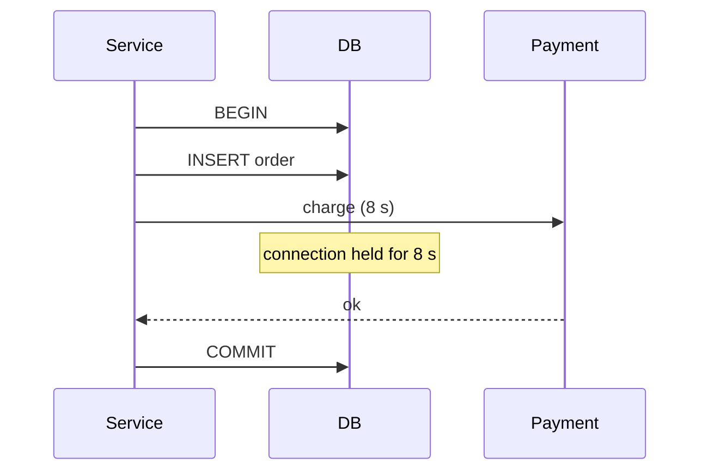

# Documentation Conventions (MkDocs Portal)

`docs/` is the canonical home of all prose and is served as a MkDocs Material site — an
interactive **Senior Java Backend Engineering Handbook**. The portal is an essential deliverable,
not optional tooling.

## 1. Tooling

- MkDocs, Material for MkDocs, PyMdown Extensions, Mermaid via `pymdownx.superfences`
- `requirements-docs.txt` with **pinned** versions
- `mkdocs build --strict` must pass: no broken links, no nav warnings
- Do not customise CSS/JS unless there is a real learning benefit

```bash
python -m venv .venv && source .venv/bin/activate
pip install -r requirements-docs.txt
mkdocs serve            # local preview
mkdocs build --strict   # CI verification
```

## 2. Site structure

```text
docs/
├── index.md                    # dashboard / start here
├── roadmap.md                  # suggested study order
├── interview-checklist.md      # one checklist per topic
├── progress.md                 # module progress table
├── architecture.md             # how the repository itself is built
│
├── spec/                       # this specification (nav section "Contributing")
│
├── topics/<slug>/              # one folder per baseline module, page set from module-conventions.md §5
│
├── tracks/                     # delta docs per track (tracks.md §3)
│   ├── index.md                # what tracks are, baseline-vs-track comparison matrix
│   ├── java25-boot4/           # index, whats-new-java, whats-new-spring-boot, migration, <slug>/
│   └── kotlin/                 # index, kotlin-for-java-engineers, spring-with-kotlin, <slug>/
│
├── issues/                     # global issue catalogue (issue-format.md §6)
│
├── questions/                  # interview questions by area
│   ├── index.md
│   ├── java.md · jvm.md · concurrency.md · spring.md · database.md
│   ├── security.md · messaging.md · distributed-systems.md · system-design.md
│
├── scenarios/                  # production incident walkthroughs
│   ├── index.md
│   ├── hikari-exhaustion.md
│   ├── duplicate-message.md
│   ├── cache-stampede.md
│   ├── order-processing.md
│   └── production-incident-template.md
│
└── reference/
    ├── annotations.md          # Spring annotation cheat-sheet
    ├── spring-request-flow.md
    ├── java-memory-model.md
    ├── http-status-codes.md
    └── messaging-comparison.md
```

## 3. Home page (`docs/index.md`)

Dashboard-style entry point:

```text
Senior Java / Spring Interview Lab

Start Here
├── Learning Roadmap
├── Interview Checklist
├── Topics
├── Issue Catalogue
├── Production Scenarios
├── Interview Questions
└── Progress
```

and the study loop:

```text
1. Read the concept
2. Read the interview questions
3. Open the broken implementation
4. Try to identify the issues yourself
5. Reveal the documented issues
6. Study the corrected implementation
7. Run its tests
8. Answer the senior follow-up questions
```

## 4. Two navigation styles (both required)

**Topic-first:** Topics → Spring Transactions → concepts → internals → broken examples.

**Problem-first:** Issues → Connection pool exhaustion → long transaction → remote call →
`@Transactional` → HikariCP → redesign.

`mkdocs.yml` uses `navigation.tabs` with top-level tabs: Start · Topics · Tracks · Issues ·
Scenarios · Questions · Reference · Contributing.

**Track pages** always open with a Delta admonition so the reader knows what to skip:

```markdown
!!! info "Delta from baseline"
    Unchanged: proxy mechanism, propagation, isolation → [baseline](../../topics/spring-transactions/index.md)
    Changed: ...
    New: ...
```

Baseline topic pages link to their track counterparts in `## Related` (e.g. "Java 25 / Boot 4
delta", "Kotlin delta") when those exist.

## 5. Embedding code — single source of truth

Code shown in docs is always included from `modules/` via `pymdownx.snippets`, never pasted:

```markdown
```java title="OrderService.java (broken)"
--8&lt;-- "modules/07-spring-transactions/broken-examples/external-call-in-transaction/OrderService.java"
```
```

Configure `pymdownx.snippets` with `base_path: [".", "docs"]` and `check_paths: true` so a
missing file fails `--strict`. Use `pymdownx.snippets` section markers
(`--8<-- "file:start:end"` or `; --8<-- [start:name]` / `[end:name]` markers) to embed a
method rather than a whole file when the whole file would be noise.

Link to files on the repository host with `repo_url` + `edit_uri` configured so relative links
such as `[OrderService.java](../../modules/…)` are not used — they break under `--strict`.

### Question reveal contract

Every question in `docs/topics/<slug>/questions.md` shows only the question. The complete answer
sits inside one collapsed `??? question "Reveal answer"` admonition; its example is a second,
independently collapsed admonition nested inside it:

```markdown
### Q: Why must equal objects have equal hash codes?

??? question "Reveal answer"

    **Short Answer:** Hash-based collections choose a bucket before checking equality. Equal
    objects with different hashes may never be compared.

    ??? example "Example"

        ```java
        --8&lt;-- "modules/NN-<slug>/src/examples/java/<package>/<Example>.java"
        ```
```

The nested example is compiled or tested source included via `pymdownx.snippets` — from
`src/examples/java` (package `lab.<topic>.examples`), `src/main/java`, or a clean broken review
target — or a shell command block for JVM diagnostics; it is never pasted (see
module-conventions.md §6). The page initially shows no answer text, hints or code; opening the
answer still leaves its example collapsed.

Verification counts `###` question headings, `??? question "Reveal answer"` blocks and nested
`??? example "Example"` blocks per module; all three counts must match.

## 6. Code review page flow (`docs/topics/<slug>/code-review.md`)

One section per broken example:

1. Short context (what the code is supposed to do).
2. The clean code, embedded from the review target.
3. The review prompt (dimensions to consider), taken from `REVIEW.md`.
4. The reveal, collapsed:

```markdown
??? warning "Reveal issues"

    ### Transaction issue — external call inside transaction
    ...
```

5. Link to the correct implementation section in `solutions.md`.

The developer must be encouraged to investigate before revealing. Never show the annotated
code above the fold.

## 7. Before / after comparisons

For important issues show both implementations side by side with tabs:

```markdown
=== "Broken"

    ```java
    --8&lt;-- "modules/07-spring-transactions/broken-examples/external-call-in-transaction/OrderService.java"
    ```

=== "Correct"

    ```java
    --8&lt;-- "modules/07-spring-transactions/src/main/java/lab/springtransactions/externalcall/OrderService.java"
    ```
```

Then explain the differences.

## 8. Issue pages and cross-linking

- Every documented issue follows `issue-format.md` §5, in topic docs and in `docs/issues/`.
- Category strings are identical in source comments, `SOLUTION.md`, topic docs and the catalogue
  so a search for `Transaction issue` returns everything relevant.
- Each issue catalogue entry lists every place the problem appears (back-links).
- Every page ends with `## Related` linking concepts, issues, scenarios and questions.
- One canonical page per concept; other pages link, they do not re-explain.

## 9. Interview question navigation (`docs/questions/`)

Questions are written once in `docs/topics/<slug>/questions.md` and surfaced by area under
`docs/questions/` via snippet includes (never duplicated by hand).

- Each question displays its question title visible, collapses the complete answer behind `??? question "Reveal answer"`, and nests a collapsed `??? example "Example"`.
- Each question embeds a **dedicated compilable example class** under `modules/<NN-slug>/src/examples/java/lab/<topic>/questions/` with trailing inline result comments (e.g. `// true`, `// "expected"`).
- Each question links to:

```text
→ Concept page
→ Broken example (code-review.md anchor)
→ Correct example (solutions.md anchor)
→ Diagram, if any
→ Related questions
```

## 10. Production scenario pages (`docs/scenarios/`)

Structure — guide reasoning, do not give the answer first:

```text
Symptoms → Metrics → Logs → Initial hypotheses → Root cause → Broken code
→ Investigation → Fix → Verification → Prevention → Interview questions
```

Example opening:

```text
API p95 jumps from 100 ms → 9 s.
Hikari: active = 20, idle = 0, pending = 75. Database CPU = 20 %.

Why can the connection pool be exhausted while database CPU is low?
```

Answer sections are collapsed with `??? note "Root cause"` admonitions.

## 11. Diagrams

Use Mermaid for flows and failures — especially: Spring request lifecycle, bean lifecycle,
transaction proxies, Kafka consumer flow, RabbitMQ routing, Saga, outbox, cache flow,
authentication flow, retry/circuit breaker, distributed tracing, JVM memory, thread pools.
Show the broken flow and the corrected flow when illustrating an issue:



## 12. Writing style

- Concise but deep: Concept → Example → Failure → Fix → Trade-off → Interview question.
- No generic walls of text; prefer lists, tables, diagrams, short paragraphs.
- Depth ladder for every topic: What is X? → How does it work? → Why does it behave that way?
  → What can go wrong? → How do you diagnose it? → How do you fix it? → Trade-offs? → At scale?
- Consistent terminology so search works: `@Transactional`, self invocation, Hikari, N+1,
  deadlock, idempotency, Kafka duplicate, RabbitMQ NACK, SQL injection, cache stampede.
- Admonitions: `note` for context, `tip` for production advice, `warning` for reveals/pitfalls,
  `question` for interview prompts.

## 13. `mkdocs.yml` baseline

```yaml
site_name: Senior Java / Spring Interview Lab
repo_url: <set when the repository is published>
edit_uri: edit/main/docs/
docs_dir: docs
strict: true

theme:
  name: material
  features:
    - navigation.tabs
    - navigation.sections
    - navigation.indexes
    - navigation.top
    - navigation.footer
    - content.code.copy
    - content.code.annotate
    - content.tabs.link
    - content.tooltips
    - search.highlight
    - search.share
    - search.suggest

markdown_extensions:
  - abbr
  - admonition
  - attr_list
  - def_list
  - footnotes
  - md_in_html
  - tables
  - toc:
      permalink: true
      permalink_title: Anchor link to this section for reference
  - pymdownx.arithmatex:
      generic: true
  - pymdownx.betterem
  - pymdownx.blocks.caption
  - pymdownx.caret
  - pymdownx.details
  - pymdownx.emoji:
      emoji_index: !!python/name:material.extensions.emoji.twemoji
      emoji_generator: !!python/name:material.extensions.emoji.to_svg
  - pymdownx.highlight:
      anchor_linenums: true
      linenums: true
      linenums_style: pymdownx-inline
      pygments_lang_class: true
  - pymdownx.inlinehilite
  - pymdownx.keys
  - pymdownx.mark
  - pymdownx.smartsymbols
  - pymdownx.snippets:
      base_path: [".", "docs"]
      check_paths: true
  - pymdownx.superfences:
      custom_fences:
        - name: mermaid
          class: mermaid
          format: !!python/name:pymdownx.superfences.fence_code_format
  - pymdownx.tabbed:
      alternate_style: true
      combine_header_slug: true
  - pymdownx.tasklist:
      custom_checkbox: true
  - pymdownx.tilde
```

## 14. Documentation Definition of Done (per module)

```text
[ ] Topic overview (index.md) with links to all pages and to modules/NN-<slug>/
[ ] Core theory and internal mechanism pages
[ ] Questions at all four levels, linked to concept + code
[ ] Code review page: embedded clean code, review prompt, collapsed reveal per broken example
[ ] Solutions page: correct implementation, why it works, broken vs correct tabs, trade-offs
[ ] Tests page (code modules): what the tests prove, how to run
[ ] Production page: problems, diagnostics, checklist; at least one scenario linked or embedded
[ ] Exercises page with collapsed solutions
[ ] Every issue registered in docs/issues/ with back-link
[ ] Related sections on every page
[ ] mkdocs.yml nav updated; mkdocs build --strict green
```

## 15. CI

Both pipelines must pass for any change:

```text
Java:    ./gradlew build  +  ./gradlew integrationTest  +  ./gradlew compileBrokenExamples
Tracks:  ./gradlew buildTracks   (each track: build + compileBrokenExamples on its own toolchain)
Docs:    pip install -r requirements-docs.txt  +  mkdocs build --strict
```

A change is not complete if valid Java fails to compile, tests fail, docs fail to build,
documented code no longer matches the implementation (snippets make this automatic), or nav
links are broken.
