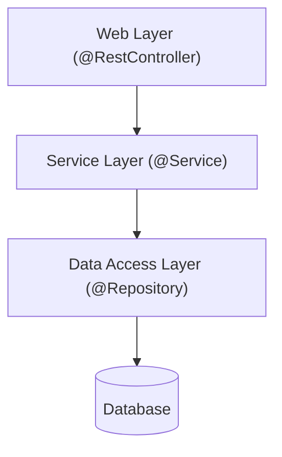
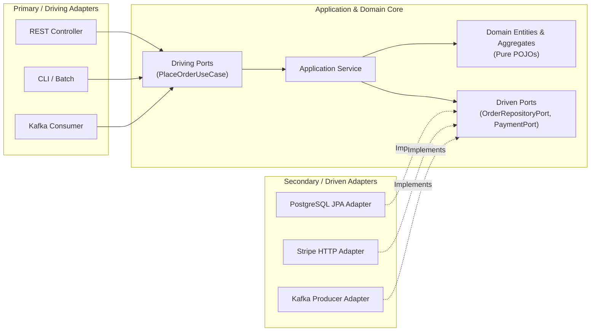
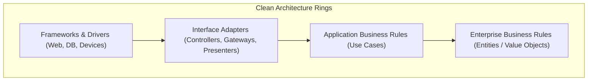
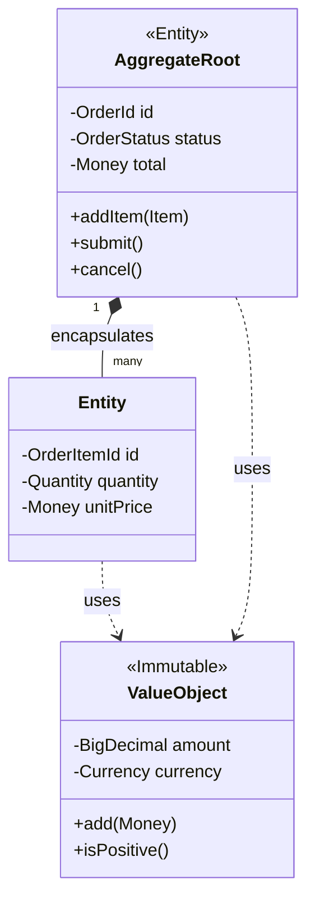
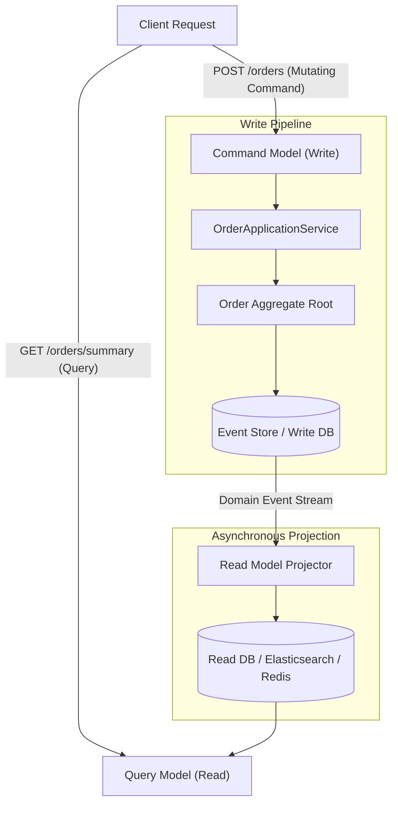

# Software Architecture Concepts

Deep dive into architectural styles, domain-driven design, modular monolith principles, CQRS, and event sourcing.

---

## 1. Architectural Styles Compared

### Traditional Layered Architecture

- **Characteristics**: Top-to-bottom dependency flow. Each layer depends directly on the layer below it.
- **Benefits**: Intuitive, easy to bootstrap in Spring Boot, standard mental model for juniors.
- **Failure Modes & Pitfalls**:
  - **Database-Driven Design**: The database schema is defined first; domain classes mirror tables; business logic becomes anemic and procedural.
  - **Transitive Infrastructure Leaks**: If the persistence layer changes (e.g. switching from JPA to DynamoDB), service and web layers often break.
  - **Bypassed Logic**: Controllers frequently bypass services to query repositories directly for read operations, scattering validation.

---

### Hexagonal Architecture (Ports and Adapters)

Invented by Alistair Cockburn, Hexagonal Architecture places the business domain at the center, isolating it completely from external technology:

- **Driving Ports (Inbound)**: Interfaces exposing what the system can do (e.g. `PlaceOrderUseCase`). Driven by external actors (REST controllers, CLI, message listeners).
- **Driven Ports (Outbound)**: Interfaces declaring what the system needs from the outside world (e.g. `OrderRepositoryPort`, `PaymentPort`). Defined by the domain; implemented by infrastructure adapters.
- **The Golden Rule**: The hexagon knows **nothing** about the outside world. Adapters depend on ports; the domain never depends on adapters.

---

### Clean Architecture & Onion Architecture

Uncle Bob’s Clean Architecture and Jeffrey Palermo’s Onion Architecture formalize Hexagonal Architecture into concentric rings governed by the **Dependency Rule**:

$$\text{Source code dependencies must point strictly inward toward higher-level policies.}$$

- **Inner Rings**: Pure domain logic and business rules. Completely framework-agnostic.
- **Outer Rings**: Delivery mechanisms, databases, and third-party frameworks. They can be replaced or upgraded without modifying inner ring business logic.

---

## 2. Modular Monolith vs Microservices

| Architectural Dimension | Modular Monolith | Microservices Architecture |
|---|---|---|
| **Deployment Model** | Single deployable artifact (JAR/WAR, single Docker container). | $N$ independently deployed services across Kubernetes pods. |
| **Communication** | In-memory method invocations, Spring events (sub-microsecond latency). | Network calls: REST/JSON, gRPC, Kafka (1ms–100ms latency). |
| **Data Consistency** | Local database transactions, modular schema schemas, outbox events. | Distributed transactions, Saga patterns, eventual consistency. |
| **Operational Overhead** | Low: single CI/CD pipeline, unified logging, simple local debugging. | High: service mesh, distributed tracing, Kubernetes ingress, multi-repo CI/CD. |
| **Failure Mode** | Process crash affects entire application unless bulkheaded. | Partial failures: graceful degradation, circuit breaking required. |
| **Best Used When** | Domain boundaries are evolving; small-to-medium teams ($< 50$ engineers). | High organizational scale; disparate teams needing independent release cycles. |

---

## 3. Domain-Driven Design (DDD)

### Strategic Design

1. **Ubiquitous Language**: A shared, rigorous vocabulary co-created by domain experts and software engineers, reflected identically in conversations and Java source code.
2. **Bounded Context**: An explicit linguistic and architectural boundary within which a domain model applies consistently. For example, in an e-commerce platform:
   - In the **Ordering Context**, a "Customer" is a buyer with shipping addresses and payment methods.
   - In the **Identity Context**, a "User" is an authenticated principal with passwords and roles.
   - In the **Support Context**, a "Customer" is a ticket submitter with communication logs.
3. **Context Mapping**:
   - **Shared Kernel**: Shared subset of domain code and database tables (high coupling risk).
   - **Customer-Supplier**: Upstream team provides data needed by downstream team.
   - **Anti-Corruption Layer (ACL)**: A translation adapter translating external/upstream models into the clean internal Ubiquitous Language of the downstream context.

---

### Tactical Design

- **Aggregate & Aggregate Root**:
  - An Aggregate is a cluster of associated objects treated as a single unit for data changes.
  - The **Aggregate Root** is the sole external entry point into the aggregate. Outside callers cannot reference internal child entities directly.
  - **Rule of Thumb**: One transaction should modify exactly **one** aggregate instance. Inter-aggregate coordination happens via Domain Events and eventual consistency.
- **Entity vs Value Object**:
  - **Entity**: Defined by identity that spans time and state mutations (e.g. `Customer`, `Order`).
  - **Value Object**: Defined solely by its attributes. Immutable, concept-rich, and compared by value (e.g. `Money`, `Address`, `Quantity`). Zero side-effects.
- **Domain Service**:
  - Encapsulates domain logic that does not naturally belong to a single entity or value object (e.g. calculating exchange rates or pricing rules across multiple aggregates). Does not perform I/O.
- **Application Service**:
  - Orchestrates the use case: opens transaction, loads aggregate from repository, invokes domain methods, persists changes, and dispatches domain events.

---

## 4. CQRS (Command Query Responsibility Segregation)

CQRS separates the system into two distinct operational models:

- **Command Model**: Optimized for invariant validation, transactional integrity, and state mutation. Does not return presentation DTOs.
- **Query Model**: Optimized for high-throughput reads, search, and presentation. Uses denormalized, read-optimized tables or search indexes.
- **Trade-offs**: Extreme read scalability and query flexibility at the cost of eventual consistency and dual-model code maintenance.

---

## 5. Event Sourcing

Traditional databases store only the **current state** of an entity, discarding the historical journey of how that state was reached. **Event Sourcing** persists every change as an immutable, append-only sequence of domain events:

$$\text{Current State} = \text{Initial State} + \sum_{i=1}^{n} \text{Event}_i$$

- **Auditability & Compliance**: Complete, tamper-proof historical audit trail out of the box.
- **Temporal Queries**: Ability to reconstruct the exact system state at any point in the past.
- **Replayability**: New read projections can be generated retroactively by replaying the complete historical event log.
- **Trade-offs**: Increased operational complexity, eventual consistency, schema evolution challenges, and the necessity of point-in-time snapshotting for long-lived aggregates.
