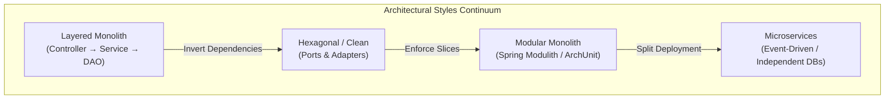
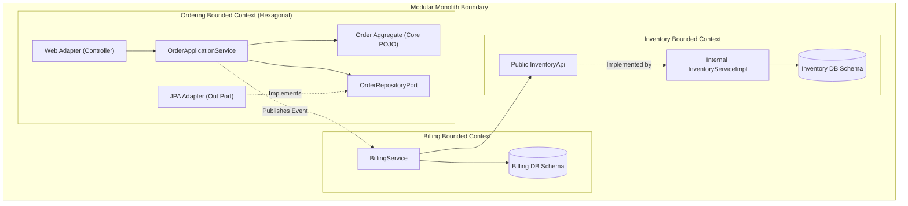

# Software Architecture in Java & Spring

A production-grade engineering laboratory exploring architectural styles, domain-driven design, modular monoliths, hexagonal boundaries, CQRS, and architectural fitness enforcement with ArchUnit.

---

## 1. Overview & Architectural Continuum

Software architecture is the set of significant design decisions that shape a system's structure, boundaries, and trade-offs. Rather than adopting dogmatic patterns, senior backend engineers evaluate architectures along a continuum of complexity, team autonomy, and operational cost:

---

## 2. Core Architectural Invariants

Every production system in this laboratory adheres to four non-negotiable architectural invariants:

1. **The Dependency Inversion Invariant**:
   - Source code dependencies point strictly **inward**. Core business domain models and use case ports have zero knowledge of databases, web frameworks, messaging brokers, or UI controllers.
   - The Domain Core imports **nothing** from Spring, Jakarta Persistence, or external infrastructure libraries.
2. **Bounded Context Autonomy Invariant**:
   - In Domain-Driven Design and Modular Monoliths, each bounded context (`ordering`, `billing`, `inventory`) owns its own persistent storage and data schema.
   - Direct cross-module database table joins or foreign repository injections are strictly prohibited. Inter-module communication flows strictly through public Java API interfaces or asynchronous Domain Events.
3. **Aggregate Invariant Protection**:
   - Entities are not anemic property bags of public getters and setters. Aggregate roots encapsulate state transitions and enforce business invariants at all times.
   - Collections owned by an aggregate root cannot be modified directly from outside; they return unmodifiable views (`Collections.unmodifiableList`).
4. **Architectural Fitness Rule Invariant**:
   - Architectural boundaries are codified as automated tests using **ArchUnit** and run in continuous integration.
   - Boundary drift, cyclic package dependencies, and illegal layer bypasses fail the build immediately before merge.

---

## 3. High-Level Modular Monolith & Hexagonal Topology

---

## 4. Module Navigation

| Section | Focus Areas |
|---|---|
| [Concepts](concepts.md) | Layered vs Hexagonal vs Onion; Modular Monolith vs Microservices; DDD Strategic & Tactical; CQRS; Event Sourcing. |
| [Internals](internals.md) | ArchUnit bytecode inspection engine; Spring ApplicationContext module slicing; Event Sourcing append log & snapshotting mechanics. |
| [Questions](questions.md) | 23 categorized senior interview questions with code examples (8 Basic, 8 Intermediate, 5 Senior, 2 Scenarios). |
| [Code Review](code-review.md) | Hands-on PR reviews: domain depending on infrastructure, anemic domain god service, cross-module database access. |
| [Solutions](solutions.md) | Correct implementations: pure hexagonal domain core, DDD rich aggregates, modular event-driven boundaries. |
| [Tests](tests.md) | Testing architecture: ArchUnit fitness tests, unit-testing rich aggregates without mocks, inter-module slice tests. |
| [Production](production.md) | Incidents: The Leaky Domain Outage, The Cross-Module Schema Lockup; architecture telemetry and checklist. |
| [Exercises](exercises.md) | Hands-on challenges: refactoring anemic god services, crafting ArchUnit fitness suites, designing CQRS read projections. |
