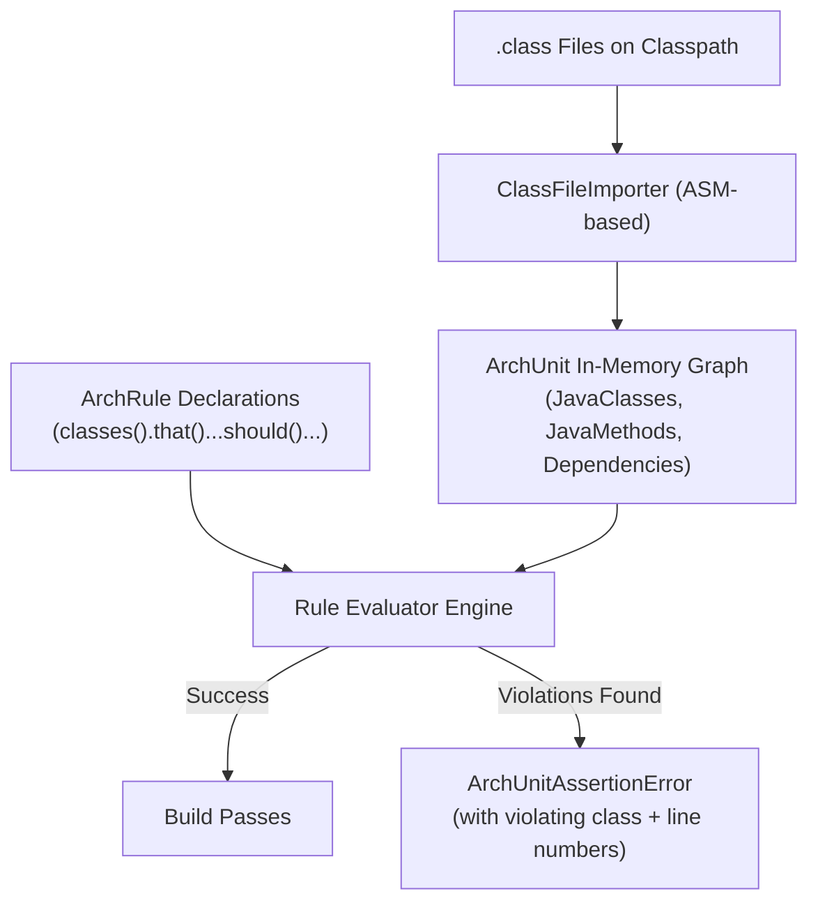
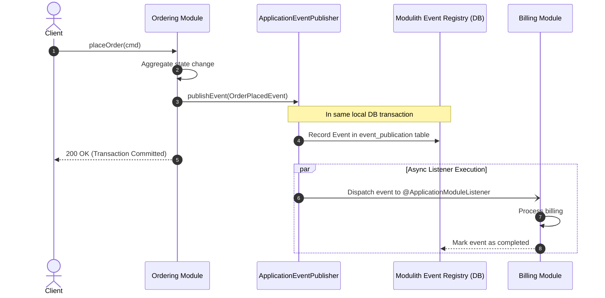
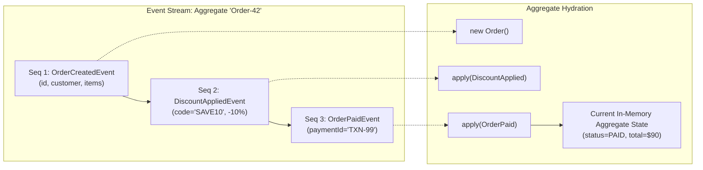

# Architecture Internals & Verification Engines

Technical mechanics of the ArchUnit bytecode inspection engine, Spring Modulith module verification, and Event Sourcing storage internals.

---

## 1. ArchUnit Bytecode Inspection Engine

ArchUnit provides automated architectural fitness functions by analyzing compiled JVM bytecode (`.class` files) rather than parsing raw source code:



### In-Memory Graph Construction
1. **ASM Bytecode Parsing**:
   - `ClassFileImporter` reads `.class` binaries using the ASM framework.
   - For every class, ArchUnit extracts field declarations, method signatures, bytecodes for `invokevirtual`, `invokestatic`, and `invokespecial`, as well as annotation metadata.
2. **Dependency Resolution**:
   - A `Dependency` object connects an origin class `A` to a target class `B`.
   - Dependencies include inheritance (`extends`), interface implementation (`implements`), field types, method parameter and return types, thrown exceptions, and method calls.
3. **Rule Evaluation Pipeline**:
   - A rule is composed of two predicate stages:
     - `DescribedPredicate<JavaClass>`: Selects the classes under evaluation (e.g. `resideInAPackage("..domain..")`).
     - `ArchCondition<JavaClass>`: Evaluates whether the selected classes satisfy the condition (e.g. `onlyDependOnClassesThat(...)`).
   - If a condition is violated, ArchUnit constructs a detailed error trace showing the exact line of code where the illegal dependency occurred.

---

## 2. Spring Modulith Verification & Event Publication Registry

Spring Modulith structures Spring Boot applications into well-defined, modular bounded contexts within a single deployment unit.

### Module Boundary Detection
- By default, every first-level package under the main application package is treated as a **Named Application Module**:
  ```text
  lab.architecture.modularmonolith
  ├── ordering/          ← Module 'ordering'
  ├── billing/           ← Module 'billing'
  └── inventory/         ← Module 'inventory'
  ```
- **Public vs Internal**:
  - Top-level module classes and interfaces are **public API contracts**.
  - Sub-packages (e.g. `ordering.internal`) are **internal implementations** strictly inaccessible to other modules.



### The Outbox-Backed Event Publication Registry
- When an event is published via Spring's `ApplicationEventPublisher`, Spring Modulith's **Event Publication Registry** intercepts the call.
- The event is serialized to JSON and persisted in a local database table (`event_publication`) **within the same active Spring transaction** as the business logic.
- Even if the JVM crashes before an asynchronous listener completes execution, the event publication registry tracks uncompleted listeners and resumes delivery upon server restart, guaranteeing at-least-once delivery between in-process modules.

---

## 3. Event Sourcing Storage & Hydration Mechanics

An Event Sourced persistence engine replaces relational table overwrites with an immutable event append log:



### Event Store Database Schema
```sql
CREATE TABLE event_store (
    event_id UUID PRIMARY KEY,
    aggregate_type VARCHAR(64) NOT NULL,
    aggregate_id VARCHAR(64) NOT NULL,
    sequence_number BIGINT NOT NULL,
    event_type VARCHAR(128) NOT NULL,
    payload JSONB NOT NULL,
    created_at TIMESTAMPTZ NOT NULL DEFAULT NOW(),
    CONSTRAINT uq_aggregate_sequence UNIQUE (aggregate_id, sequence_number)
);
CREATE INDEX idx_event_stream ON event_store (aggregate_id, sequence_number ASC);
```

### Optimistic Concurrency Control via Sequence Numbers
- When an aggregate root is loaded, its current version is recorded: $v = \text{sequence\_number}_{\text{latest}}$.
- When appending a new event, the transaction executes:
  ```sql
  INSERT INTO event_store (event_id, aggregate_type, aggregate_id, sequence_number, event_type, payload)
  VALUES ('...', 'Order', 'ORD-42', 4, 'OrderShippedEvent', '{...}');
  ```
- If another concurrent thread appended sequence 4 first, the database unique constraint `uq_aggregate_sequence` aborts the transaction with an `OptimisticLockingFailureException`. The application retries by re-hydrating from the new head of the stream.

### Snapshotting Engine
As an event stream grows past hundreds of events, replaying the entire stream from sequence 1 degrades read latency. The snapshotting engine mitigates this:

$$\text{Load State} = \text{Snapshot}_{k} + \sum_{i=k+1}^{n} \text{Event}_i$$

1. A background worker or in-line trigger saves an aggregated snapshot every $N$ events (e.g. every 100 events).
2. Hydration queries the snapshot table for the latest snapshot $\le \text{version}$, and then queries `event_store` only for events where `sequence_number > snapshot.version`.
