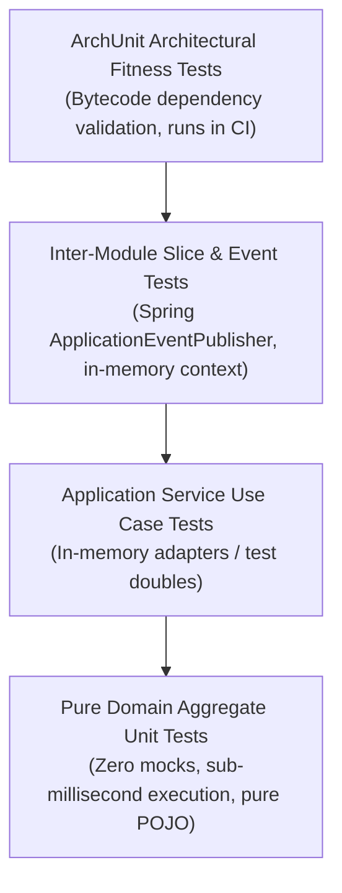

# Architecture Testing & Fitness Functions

Comprehensive guide to testing software architectures: codifying architectural invariants with ArchUnit, testing rich domain aggregates without mocks, and verifying modular monolith event flows.

---

## 1. The Architectural Testing Pyramid



1. **Pure Domain Unit Tests**: Test Aggregate Roots and Value Objects directly using plain JUnit assertions. They require zero mocks, zero Spring containers, and execute in microseconds.
2. **Application Service Tests**: Test use case orchestration using lightweight in-memory stubs for outgoing ports (`InMemoryOrderRepositoryAdapter`, `MockPaymentAdapter`).
3. **Module Slice Tests**: Verify that inter-module domain events are published and consumed cleanly across bounded contexts.
4. **ArchUnit Fitness Tests**: Analyze compiled `.class` files to guarantee that team members do not violate architectural boundaries.

---

## 2. ArchUnit Architectural Fitness Suite

The ArchUnit test suite runs as part of standard `./gradlew test` execution. If an engineer accidentally injects a JPA repository into a domain class or crosses module boundaries, the build immediately fails:

### Implementation: `ArchitectureFitnessTest.java`

--8<-- "modules/28-architecture/src/test/java/lab/architecture/archunit/ArchitectureFitnessTest.java"

### Key Rules Explained

- **Hexagonal Boundary Enforcement**:
  ```java
  noClasses()
      .that().resideInAPackage("..cleanarchitecture.domain..")
      .should().dependOnClassesThat()
      .resideInAnyPackage("..infrastructure..", "..application..", "org.springframework..")
  ```
  Guarantees that the domain model remains completely framework-agnostic.
- **Modular Monolith Slice Isolation**:
  ```java
  noClasses()
      .that().resideInAPackage("..modularmonolith.billing..")
      .should().dependOnClassesThat()
      .resideInAPackage("..modularmonolith.inventory.internal..")
  ```
  Ensures that the `billing` module cannot reach into the internal implementation details of the `inventory` module.
- **Coding Standards Enforcement**:
  ```java
  fields()
      .that().areDeclaredInClassesThat().resideInAPackage("lab.architecture..")
      .should().notBeAnnotatedWith("org.springframework.beans.factory.annotation.Autowired")
  ```
  Enforces constructor injection across the entire project and bans field injection.

---

## 3. Testing Rich Domain Aggregates Without Mocks

Because the rich domain model encapsulates its own rules and invariants, testing it requires no mocking frameworks or reflection:

### Implementation: `OrderAggregateTest.java`

--8<-- "modules/28-architecture/src/test/java/lab/architecture/richdomain/OrderAggregateTest.java"

### Benefits of Zero-Mock Domain Testing
- **Refactoring Resilience**: Tests assert business outcomes rather than method call interactions (`verify(repo).save(...)`).
- **Instant Feedback**: Hundreds of domain tests execute in under 100 milliseconds.
- **Living Documentation**: The tests serve as unambiguous executable specifications of business rules.

---

## 4. Testing Application Services with In-Memory Adapters

### Implementation: `OrderApplicationServiceTest.java`

--8<-- "modules/28-architecture/src/test/java/lab/architecture/cleanarchitecture/OrderApplicationServiceTest.java"

By providing `InMemoryOrderRepositoryAdapter` and `MockPaymentAdapter`, the entire checkout workflow is tested end-to-end without spinning up a database or third-party web server.
