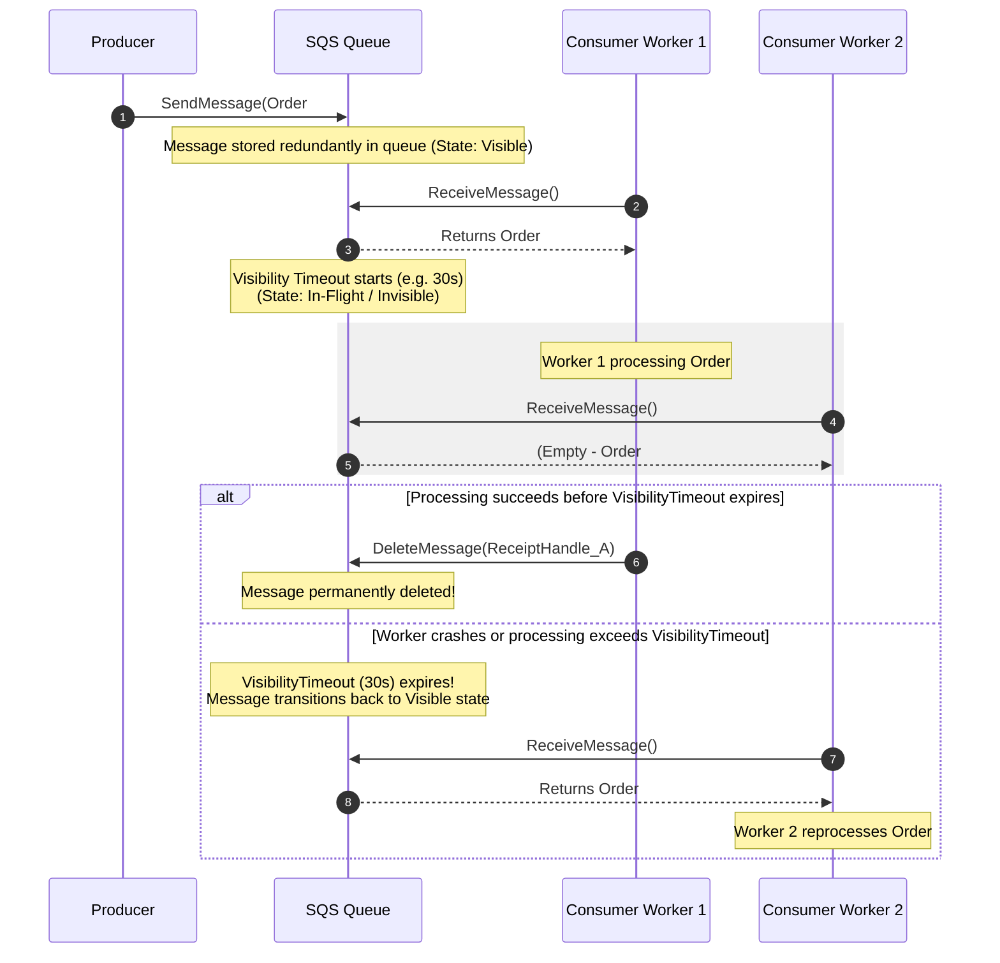
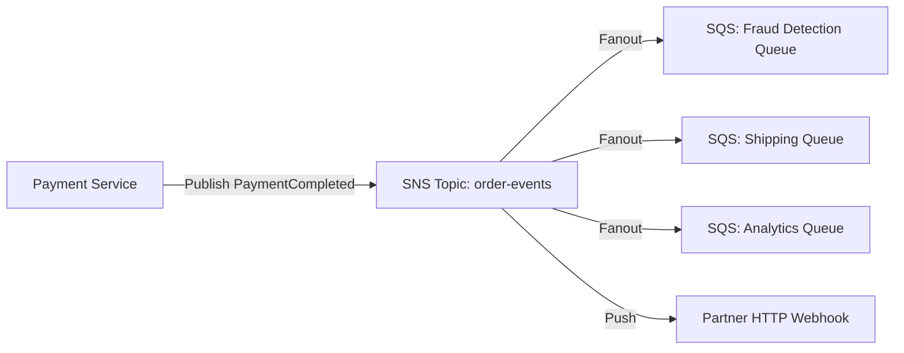

# AWS Messaging Concepts

Deep dive into Amazon Simple Queue Service (SQS), Amazon Simple Notification Service (SNS), and Amazon EventBridge.

---

## 1. Amazon Simple Queue Service (SQS)

Amazon SQS is a fully managed, serverless, distributed message queuing service that decouples application components.

### SQS Standard vs SQS FIFO

| Feature | SQS Standard | SQS FIFO (`.fifo`) |
|---|---|---|
| **Ordering** | Best-effort ordering; messages may arrive out of order | Strict FIFO (First-In, First-Out) ordering within each `MessageGroupId` |
| **Delivery Guarantee** | At-least-once (occasional duplicates) | Exactly-once processing (when deduplication ID is used) |
| **Throughput** | Nearly unlimited transactions per second | Standard: 300 msg/sec (3,000 with batching); High-throughput: up to 70,000 msg/sec |
| **Deduplication** | Application-managed | Automatic 5-minute sliding window via `MessageDeduplicationId` or SHA-256 body hash |
| **Cost** | \$0.40 per million requests | \$0.50 per million requests |
| **Primary Use Cases** | Asynchronous task processing, worker decoupling, batch jobs | Banking transactions, ledger operations, inventory allocation, ordered pipelines |

---

### Visibility Timeout Mechanics

In SQS, messages are **not** removed from the queue when polled by a consumer. Instead, SQS starts a temporary lease called the **Visibility Timeout**:



Key principles of Visibility Timeout:
- **Default**: 30 seconds (configurable up to 12 hours).
- **Lease Extension**: If processing takes longer than expected, consumers can issue `ChangeMessageVisibility(ReceiptHandle, VisibilityTimeoutSeconds)` to extend the lease and prevent duplicate delivery.
- **Rule of Thumb**: For AWS Lambda, set SQS `VisibilityTimeout >= 6 * Lambda Timeout`.

---

### Short Polling vs Long Polling

- **Short Polling (`WaitTimeSeconds = 0`)**: SQS samples a subset of distributed storage servers and returns immediately, even if no messages are found on those sampled servers. This leads to empty responses and high SQS API request costs.
- **Long Polling (`WaitTimeSeconds = 1 to 20`)**: SQS waits up to 20 seconds for messages to arrive on any server before returning an empty response.
  - Reduces empty `ReceiveMessage` responses by $>90\%$.
  - Slashes SQS API request costs.
  - Minimizes delivery latency for incoming messages.

---

### Dead Letter Queues (DLQ) and Redrive Policies

A Dead Letter Queue isolates "poison pill" messages that fail consumer processing repeatedly:

```json
{
  "deadLetterTargetArn": "arn:aws:sqs:us-east-1:123456789012:orders-dlq",
  "maxReceiveCount": 5
}
```

- **`maxReceiveCount`**: The number of times a message can be received by consumers (via `ApproximateReceiveCount`) before SQS automatically forwards it to the DLQ.
- **Redrive Allow Policy**: Placed on the DLQ to restrict which source queues are permitted to dead-letter messages to it.
- **DLQ Redrive**: AWS SQS supports managed DLQ redrive back to the source queue once bugs are fixed.

---

## 2. Amazon Simple Notification Service (SNS)

Amazon SNS is a fully managed publish/subscribe (pub/sub) service enabling one-to-many message fanout.

### SNS Fanout Architecture

Producers publish a single event to an SNS topic. SNS immediately pushes copies to multiple subscribers: SQS queues, AWS Lambda functions, HTTP/S webhooks, and mobile push notifications.



### Subscription Filter Policies

By default, an SNS topic fans out every message to all subscribers. **Subscription Filter Policies** filter events at the SNS edge so subscribers only receive relevant messages:

```json
{
  "eventType": ["PaymentCompleted", "RefundIssued"],
  "amount": [{"numeric": [">=", 100]}],
  "region": ["us-east-1", "eu-west-1"]
}
```

- **`FilterPolicyScope`**: Evaluates filters against either `MessageAttributes` (default) or `MessageBody` (payload JSON).
- Offloads filtering compute and network egress from downstream worker fleets.

---

## 3. Amazon EventBridge

Amazon EventBridge is a serverless, schema-aware event bus designed for event-driven architectures, SaaS partner event ingestion, and scheduled cron jobs.

### Core Primitives

1. **Event Bus**: The ingestion endpoint. AWS provides a `default` bus (for AWS service events like S3, EC2), custom event buses (for application domain events), and partner event buses (e.g. Datadog, Stripe).
2. **Rules**: Evaluate incoming event JSON against pattern filters.
3. **Targets**: Over 30 AWS destinations (SQS, SNS, Step Functions, Lambda, Kinesis, ECS tasks, API Destinations for external HTTP APIs).

### EventBridge Pattern Matching

EventBridge rules match event fields using declarative JSON patterns:

```json
{
  "source": ["ecommerce.orders"],
  "detail-type": ["OrderPlaced"],
  "detail": {
    "status": ["CONFIRMED"],
    "totalAmount": [{"numeric": [">", 250]}],
    "customer": {
      "tier": ["VIP", "PLATINUM"]
    }
  }
}
```

---

## 4. Comprehensive Comparison Matrix

When should an architect select Kafka, RabbitMQ, SQS, SNS, or EventBridge?

| Dimension | Apache Kafka | RabbitMQ | Amazon SQS | Amazon SNS | Amazon EventBridge |
|---|---|---|---|---|---|
| **Paradigm** | Distributed Append-Only Commit Log | Smart Broker / Dumb Consumer Queue & Exchange | Distributed Pull-based Buffer Queue | Managed Push Pub/Sub Topic | Serverless Event Bus with Pattern Rules |
| **Consumption Model** | Pull (Consumer groups, offset cursor) | Push (AMQP Channel dispatch / `basicQos`) | Pull (`ReceiveMessage` polling) | Push (HTTP, SQS, Lambda) | Push to managed targets |
| **Ordering** | Strict order per partition | Strict FIFO per queue | Best-effort (Standard) / Strict FIFO per `MessageGroupId` | No ordering (Standard) / Strict FIFO (`.fifo` topic) | No ordering (Standard) / Strict FIFO (with SQS FIFO target) |
| **Message Replay** | Native (rewind consumer offset indefinitely) | No (messages deleted upon ACK) | No (messages deleted upon `DeleteMessage`) | No (fire-and-forget push) | Native Archive & Replay (time-window replay) |
| **Throughput** | Millions of msg/sec per cluster | 50,000–100,000 msg/sec per node | Unlimited (Standard) / 70k msg/sec (FIFO) | Millions of msg/sec | ~10,000–20,000 events/sec (soft quota, extendable) |
| **Retention** | Days to years (disk bound) | Transient (cleared upon ACK) | Up to 14 days | Transient (pushed immediately) | Up to 14 days (EventBridge Archive) |
| **Filtering Capabilities** | Client-side or Kafka Streams / ksqlDB | AMQP Exchanges (Direct, Topic wildcard, Headers) | None on queue (subscriber pulls all messages) | Subscription Filter Policies (Attributes / Body) | Advanced JSON content matching (prefixes, numeric ranges, existence) |
| **Operational Overhead** | High (ZooKeeper/KRaft, ISR, broker tuning) | Moderate (Erlang VM, clustering, Mnesia/Raft) | Zero (Fully managed serverless) | Zero (Fully managed serverless) | Zero (Fully managed serverless) |
| **Pricing Model** | Provisioned broker nodes / MSK instance hours | Provisioned compute nodes / EC2 | Pay per API request (\$0.40 / million) | Pay per publish / delivery (\$0.50 / million) | Pay per ingested event (\$1.00 / million) |
| **Best Fit** | Real-time stream processing, event sourcing, CDC, log pipelines | Complex routing, low latency microservice RPC, legacy enterprise AMQP | Asynchronous worker queues, batch pipelines, serverless throttling | Fast pub/sub fanout, mobile/email push, SQS broadcast | Cross-account event mesh, SaaS integrations, business workflow triggers |

---

## Related

- [Internals](internals.md)
- [Code Review](code-review.md)
- [Solutions](solutions.md)
- [Production](production.md)
- [Interview Questions](questions.md)
