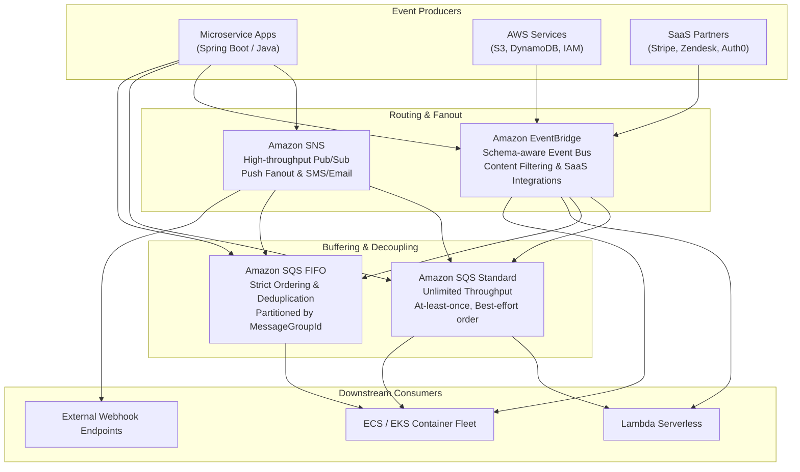
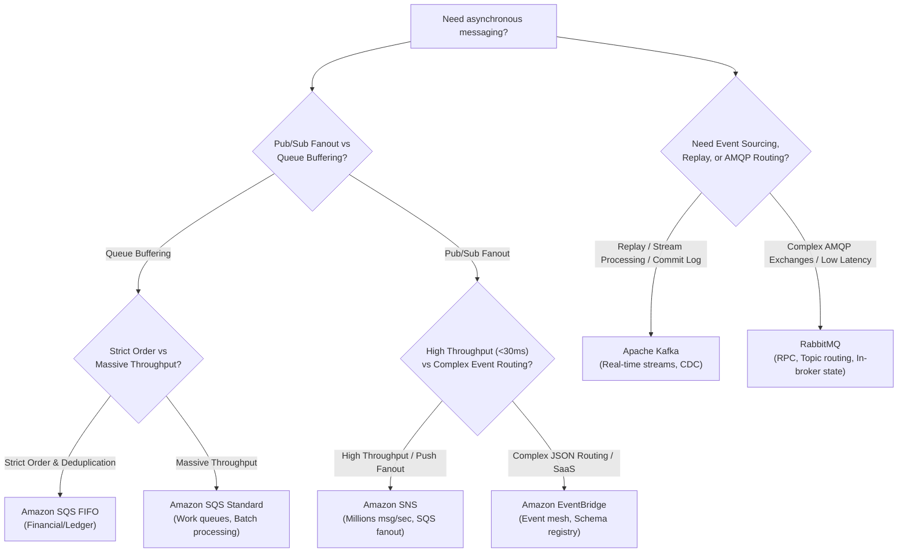

# AWS Messaging

Amazon Web Services offers cloud-native messaging primitives designed for serverless, microservice, and distributed enterprise architectures: **Amazon SQS** (point-to-point queuing), **Amazon SNS** (publish/subscribe push notifications and fanout), and **Amazon EventBridge** (serverless event bus with advanced schema routing).

This topic is a **doc module** focusing on AWS messaging mechanics, queue semantics, architectural trade-offs, operational incident triage, and comprehensive comparison across modern messaging backbones (Kafka, RabbitMQ, SQS, SNS, and EventBridge).

---

## The AWS Messaging Landscape

---

## Architectural Decision Matrix

When should an architect select SQS, SNS, EventBridge, Kafka, or RabbitMQ?

---

## Module Overview

| Resource | Purpose |
|---|---|
| [Concepts](concepts.md) | SQS Standard vs FIFO, Visibility Timeout, Long Polling, DLQ, SNS Fanout, EventBridge Bus & Comprehensive Comparison Matrix |
| [Internals](internals.md) | SQS distributed multi-AZ architecture, lease state machine, receipt handle lifecycle, FIFO partition lanes |
| [Interview Questions](questions.md) | 23 questions across Basic, Intermediate, Senior, and Incident Scenarios |
| [Code Review](code-review.md) | 4 CloudFormation review targets with collapsed issue explanations |
| [Solutions](solutions.md) | Corrected infrastructure templates, design rationales, and trade-offs |
| [Production](production.md) | Incident walkthroughs, CloudWatch metrics, alarms, and production readiness checklist |
| [Exercises](exercises.md) | Hands-on architectural challenges: EventBridge content routing and SQS visibility heartbeat worker |

---

## Related

- [Kafka topic](../kafka/index.md)
- [RabbitMQ topic](../rabbitmq/index.md)
- [Architecture spec](../../spec/curriculum.md)
