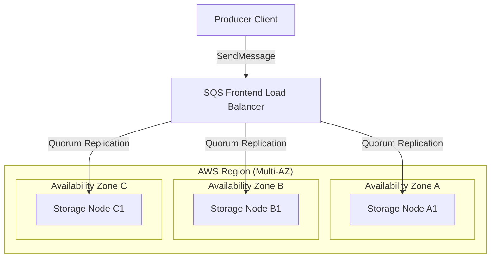
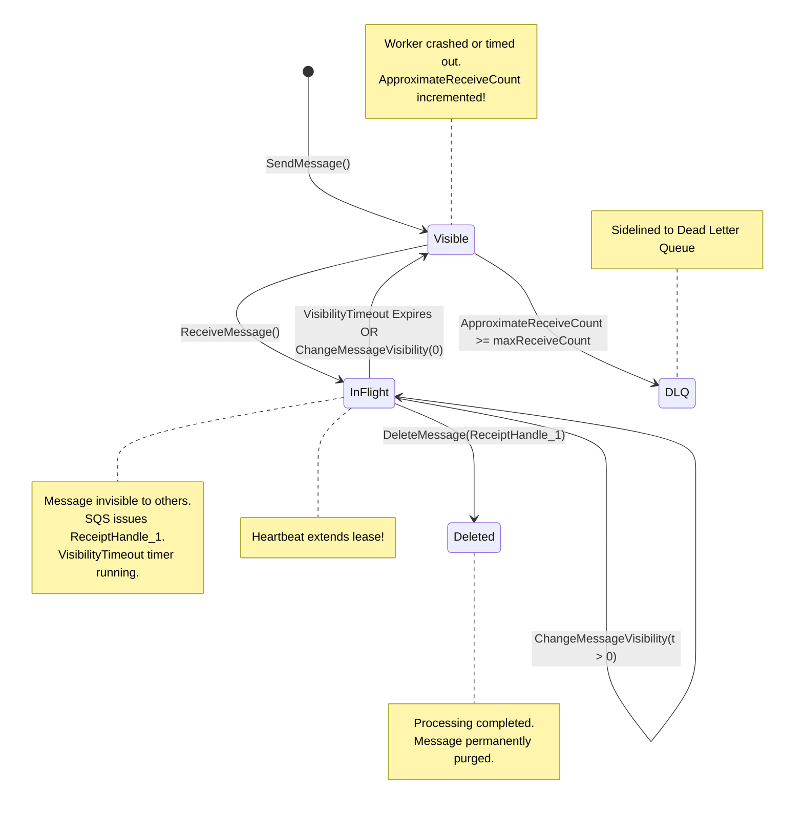
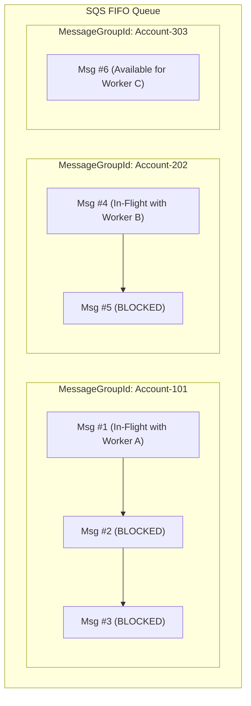

# AWS Messaging Internals

Internal mechanics, distributed state machines, replication topologies, and partition models powering Amazon SQS, SNS, and EventBridge.

---

## 1. Amazon SQS Distributed Queue Architecture

Amazon SQS is built as a massive, multi-tenant distributed system distributed across multiple Availability Zones (AZs) in an AWS Region.

### Redundant Multi-AZ Storage

When a producer calls `SendMessage`:
1. SQS writes the message redundantly across a fleet of storage servers in different AZs.
2. Only after achieving quorum write confirmation across multiple servers does SQS return HTTP 200 with the `MessageId`.
3. Highly distributed, consensus-free storage enables virtually infinite horizontal scale for Standard queues, but introduces fundamental distributed systems trade-offs:
   - **Occasional Out-of-Order Delivery**: Different storage servers may receive or return messages in slightly varying order.
   - **At-Least-Once Delivery**: If a server hosting a copy of a message is temporarily slow to register a deletion, that copy might be returned on a subsequent receive call.

---

## 2. The Visibility Timeout & Receipt Handle State Machine

In SQS, messages are never deleted on receipt. Instead, SQS uses an ephemeral lease mechanism governed by **Receipt Handles**.

### State Machine Transitions

### Receipt Handle Lifecycle

- **Opaque Ephemeral Token**: When `ReceiveMessage` returns a message, SQS generates a unique `ReceiptHandle` tied to that specific delivery attempt.
- **Multiple Receives**: If a message becomes visible again and is received a second time, SQS issues a *new* `ReceiptHandle`. Calling `DeleteMessage` using an old expired receipt handle fails with `ReceiptHandleIsInvalid`.
- **ApproximateReceiveCount**: Every time a message moves from `Visible` to `InFlight`, SQS increments its `ApproximateReceiveCount`. When this value reaches `maxReceiveCount` in the `RedrivePolicy`, SQS moves the message to the DLQ on the next receive attempt.

---

## 3. SQS FIFO Internal Partitioning & Serialization

How does SQS FIFO guarantee strict ordering and exactly-once processing while scaling horizontally?

### The MessageGroupId Partition Lane

In SQS FIFO, `MessageGroupId` is the partition key:

1. **Group Head Blocking**: When Worker A polls and receives `Msg #1` from `MessageGroupId: Account-101`, SQS locks the entire message group `Account-101`. **No consumer can receive `Msg #2` or `Msg #3` until `Msg #1` is deleted or its visibility timeout expires.**
2. **Inter-Group Parallelism**: Messages in `Account-202` and `Account-303` are completely independent and process in parallel on Worker B and Worker C.
3. **High-Throughput Mode**: By setting `DeduplicationScope: messageGroup` and `FifoThroughputLimit: perMessageGroupId`, throughput scales linearly with the number of unique message groups (up to 70,000 msg/sec).

### 5-Minute Deduplication Sliding Window

- SQS maintains an in-memory deduplication cache of all message hashes (`MessageDeduplicationId` or SHA-256 body hash) for exactly **5 minutes (300 seconds)**.
- If a producer sends a message with an identical deduplication ID within 5 minutes, SQS acknowledges receipt successfully (`HTTP 200`) but **drops the duplicate without appending it to the queue**.
- If duplicate messages arrive after 5 minutes, SQS treats them as distinct messages.

---

## 4. Amazon SNS Push Pipeline & Retry Policies

Unlike SQS (which is pull-based), Amazon SNS is a **push delivery pipeline**:

1. **Delivery Attempts**: When a message is published to an SNS topic, the SNS delivery engine resolves all active subscriptions.
2. **Subscription Protocols**:
   - **SQS Endpoints**: SNS writes directly to the destination SQS queue using SQS `SendMessage`. If SQS is throttled or down, SNS retries automatically.
   - **HTTP/S Webhooks**: SNS executes HTTP POST requests with a 4-phase retry policy:
     - **Immediate Retries**: Instant retries without delay (e.g. 3 attempts).
     - **Linear Backoff**: Retries spaced evenly (e.g. every 10 seconds).
     - **Exponential Backoff**: Exponential delays with jitter.
     - **Fallback DLQ**: If all delivery attempts fail, SNS routes the notification to a configured SQS Dead Letter Queue attached to that subscription.

---

## 5. Amazon EventBridge Rule Evaluation Engine

EventBridge uses an asynchronous streaming rule evaluation engine:

1. **Event Ingestion**: Ingests JSON adhering to the OpenAPI 3.0 event envelope format (`id`, `version`, `account`, `time`, `region`, `source`, `detail-type`, `detail`).
2. **Deterministic Pattern Matching**: Evaluates event fields against registered JSON rules using a highly optimized trie-based prefix and predicate tree.
3. **Target Invocation**: Once matched, EventBridge asynchronously invokes targets. For AWS Lambda or Step Functions, EventBridge can batch events or execute single invocations with configurable retry policies and dead-letter queues.

---

## Related

- [Concepts](concepts.md)
- [Code Review](code-review.md)
- [Solutions](solutions.md)
- [Production](production.md)
- [Interview Questions](questions.md)
