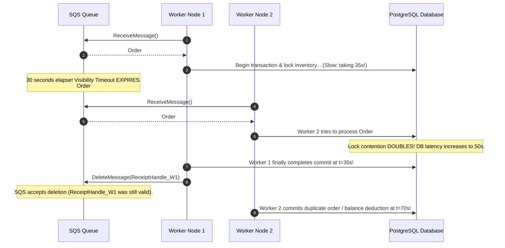

# AWS Messaging in Production

Operational patterns, CloudWatch telemetry, auto-scaling calculations, incident diagnostics, and production readiness for AWS messaging infrastructure.

---

## 1. Production Incident Walkthrough: The Visibility Expiration Cascade

### Incident Context
During a Black Friday promotional surge, checkout order fulfillment latency spiked from 1.5 seconds to 35 seconds due to database lock contention on inventory tables. SQS queue `checkout-orders-queue` was configured with `VisibilityTimeout: 30`.

### Failure Progression



### Root Cause
1. **Visibility Timeout Mismatch**: `VisibilityTimeout` was fixed at 30 seconds, lower than peak database latency.
2. **Missing Lease Heartbeating**: Workers had no mechanism to extend message visibility (`ChangeMessageVisibility`) during long operations.
3. **Non-Idempotent Consumer**: Downstream order fulfillment did not verify whether the order had already been completed before applying payment charges.

### Immediate Remediation
1. **Emergency CLI Patch**: Extended the queue visibility timeout to 300 seconds:
   ```bash
   aws sqs set-queue-attributes \
     --queue-url "https://sqs.us-east-1.amazonaws.com/123456789012/checkout-orders-queue" \
     --attributes VisibilityTimeout=300
   ```
2. **Dynamic Visibility Heartbeating**: Deployed worker updates issuing `ChangeMessageVisibility` every 20 seconds while transactions are active.
3. **Idempotency Guard**: Added unique database constraints on `order_id` in fulfillment ledgers.

---

## 2. CloudWatch Telemetry and Alerting Rules

Monitor these essential AWS SQS and SNS CloudWatch metrics:

| Metric | Namespace | Severity | Alarm Condition | Operational Meaning |
|---|---|---|---|---|
| `ApproximateAgeOfOldestMessage` | `AWS/SQS` | **P1 (Critical)** | `> 300s` for 3 consecutive periods | Critical consumer lag; oldest message breaching SLA |
| `ApproximateNumberOfMessagesVisible` | `AWS/SQS` | **P2 (Major)** | Sustained increase $> 30\text{m}$ | Queue backlog accumulating; workers failing or under-provisioned |
| `ApproximateNumberOfMessagesVisible` (DLQ) | `AWS/SQS` | **P2 (Major)** | `> 0` | Poison pills detected in Dead Letter Queue |
| `ApproximateNumberOfMessagesNotVisible` | `AWS/SQS` | **P3 (Warning)** | Spike with zero message deletions | Worker hangs, deadlocks, or runaway visibility timeouts |
| `NumberOfNotificationsFailed` | `AWS/SNS` | **P1 (Critical)** | `> 0` | SNS failed to deliver messages to SQS/HTTP endpoints |

---

## 3. Worker Fleet Auto-Scaling Calculations

### Why CPU Utilization Fails for SQS Consumers
Consumer workers spending 80% of their time waiting on external HTTP or database responses will show $< 20\%$ CPU utilization even while SQS queue backlogs skyrocket.

### The Correct Formula: Backlog Per Worker

$$\text{Backlog Per Worker} = \frac{\text{ApproximateNumberOfMessagesVisible}}{\text{RunningTaskCount}}$$

Target setting: If a worker can process 10 messages per minute and the target processing SLA is 3 minutes, set the scaling target to **30 messages per worker**.

```yaml
# Target Tracking Scaling Policy on Backlog Per Worker
TargetTrackingScalingPolicy:
  Type: AWS::ApplicationAutoScaling::ScalingPolicy
  Properties:
    PolicyType: TargetTrackingScaling
    TargetTrackingScalingPolicyConfiguration:
      CustomizedMetricSpecification:
        Metrics:
          - Id: backlogPerWorker
            Expression: "visibleMessages / max(runningTasks, 1)"
          - Id: visibleMessages
            MetricStat:
              Metric:
                Namespace: AWS/SQS
                MetricName: ApproximateNumberOfMessagesVisible
                Dimensions:
                  - Name: QueueName
                    Value: orders-work-queue
          - Id: runningTasks
            MetricStat:
              Metric:
                Namespace: ECS/ContainerInsights
                MetricName: RunningTaskCount
                Dimensions:
                  - Name: ClusterName
                    Value: production-cluster
                  - Name: ServiceName
                    Value: order-worker-service
      TargetValue: 30
      ScaleInCooldown: 300
      ScaleOutCooldown: 60
```

---

## 4. Incident Runbooks

### Runbook 1: Redriving Messages from DLQ After a Hotfix

Once the bug causing messages to fail is fixed and deployed, use SQS Managed Redrive to move messages from the DLQ back to the primary queue:

```bash
# Start an SQS redrive task from DLQ to source queue
aws sqs start-message-move-task \
  --source-arn "arn:aws:sqs:us-east-1:123456789012:orders-dlq" \
  --destination-arn "arn:aws:sqs:us-east-1:123456789012:orders-work-queue"

# Check status of the redrive task
aws sqs list-message-move-tasks \
  --source-arn "arn:aws:sqs:us-east-1:123456789012:orders-dlq"
```

### Runbook 2: Unblocking a Wedged SQS FIFO Message Group

If a poison pill message blocks an entire `MessageGroupId` in an SQS FIFO queue:

1. Identify the failing message by polling the queue with a short visibility timeout:
   ```bash
   aws sqs receive-message \
     --queue-url $FIFO_QUEUE_URL \
     --attribute-names All \
     --message-attribute-names All \
     --visibility-timeout 10
   ```
2. Note the `ReceiptHandle` and extract the payload to an archive file.
3. Manually delete the blocking message using its receipt handle:
   ```bash
   aws sqs delete-message \
     --queue-url $FIFO_QUEUE_URL \
     --receipt-handle "$RECEIPT_HANDLE"
   ```
4. Confirm healthy messages for that `MessageGroupId` resume processing immediately.

---

## 5. Production Readiness Checklist

- [ ] **Long Polling Configured**: `ReceiveMessageWaitTimeSeconds: 20` configured on all SQS queues.
- [ ] **Visibility Timeout Sized**: `VisibilityTimeout` set to at least $6 \times$ consumer execution timeout, or dynamic heartbeat extensions implemented.
- [ ] **Dead Letter Queue (DLQ)**: Configured on all production queues with `maxReceiveCount` (3–5).
- [ ] **DLQ CloudWatch Alarm**: Alarm configured for `ApproximateNumberOfMessagesVisible > 0` on every DLQ.
- [ ] **Subscription Filter Policies**: Configured on SNS subscriptions to prevent noisy subscriber fanout.
- [ ] **Idempotent Consumers**: Consumers implement deduplication tokens or idempotent database operations.
- [ ] **Encryption at Rest**: SSE-SQS or AWS KMS key (`alias/aws/sqs`) enabled on all queues and topics.
- [ ] **Backlog-Per-Worker Scaling**: Auto-scaling configured on message backlog per worker instance rather than CPU.
- [ ] **High-Throughput FIFO Mode**: `DeduplicationScope: messageGroup` and `FifoThroughputLimit: perMessageGroupId` enabled for high-volume FIFO queues.

---

## Related

- [Concepts](concepts.md)
- [Internals](internals.md)
- [Code Review](code-review.md)
- [Solutions](solutions.md)
- [Interview Questions](questions.md)
