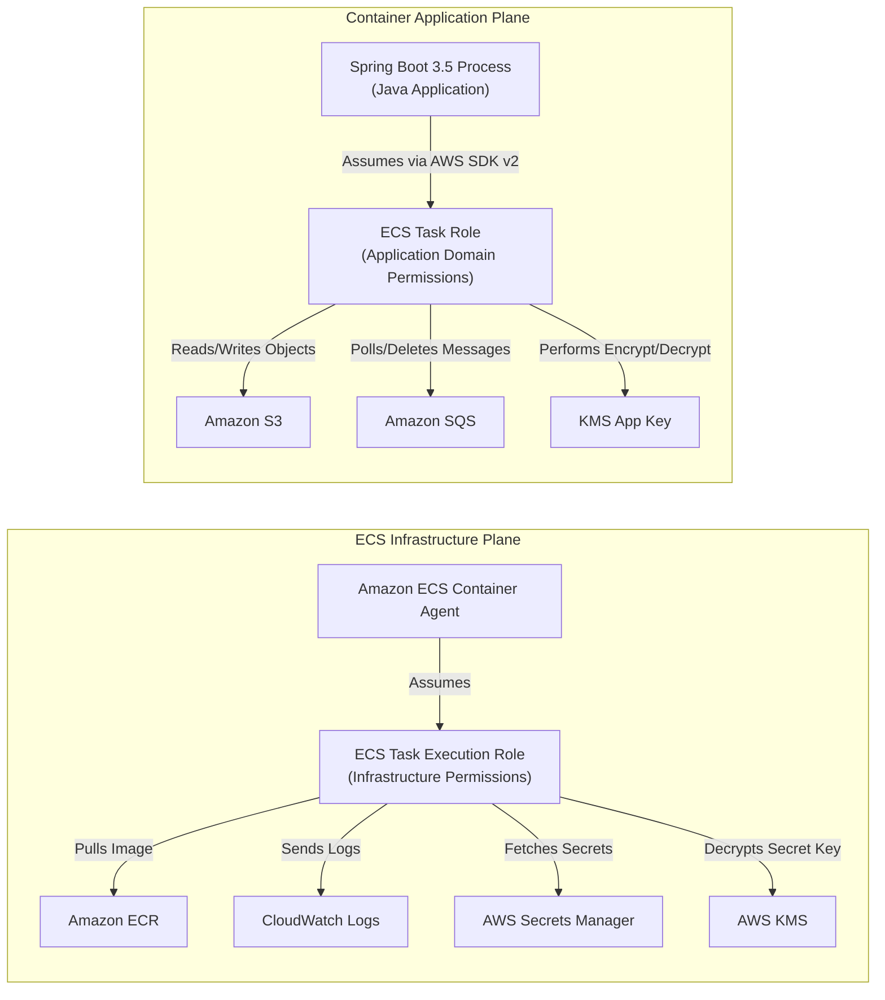
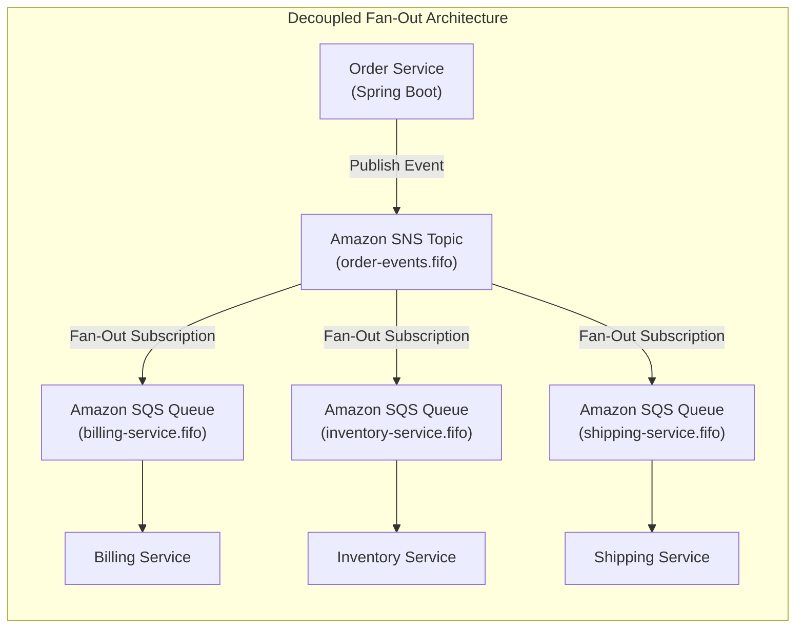

# AWS Architecture Concepts for Backend Engineers

Production backend engineering on AWS requires understanding how cloud infrastructure, managed services, networking boundaries, and security primitives integrate with modern Spring Boot applications.

---

## 1. Compute Paradigms: ECS vs EKS vs Lambda

Modern Java backend services on AWS predominantly deploy onto one of three compute abstractions, each offering distinct operational tradeoffs:

| Dimension | Amazon ECS (Fargate) | Amazon EKS (Kubernetes) | AWS Lambda (Serverless) |
|---|---|---|---|
| **Operational Overhead** | **Low**. AWS manages container orchestration, scheduling, and host patching. | **High**. Requires managing K8s versions, ingress controllers, CNI, CSI, and add-ons. | **Minimal**. Zero infrastructure management; event-driven execution. |
| **Java Startup / Cold Start** | $30-60\text{s}$ container provisioning; warm JVM runtime without cold-start jitter. | $30-60\text{s}$ pod scheduling; warm JVM runtime without cold-start jitter. | Traditional JVM: $2-8\text{s}$ cold start. Reduced to $< 200\text{ms}$ with **AWS Lambda SnapStart**. |
| **Concurrency Model** | Multi-threaded container process handling hundreds of concurrent HTTP requests. | Multi-threaded container process handling hundreds of concurrent HTTP requests. | Single concurrent request per execution environment instance; scales horizontally by spinning up instances. |
| **Cost Profile** | Predictable per-second vCPU and memory allocation; ideal for steady-state workloads. | Higher baseline cost (control plane fee \$0.10/hr + node instances); optimal for multi-tenant microservices. | Pay per execution millisecond; cost-effective for bursty, intermittent, or asynchronous background tasks. |
| **Ecosystem & Tooling** | Deep AWS native integration (Task definitions, CloudWatch, Secrets Manager, ALB). | Cloud-agnostic Kubernetes manifests, Helm charts, GitOps (ArgoCD), and K8s operators. | AWS SAM, Serverless Framework, CDK, EventBridge triggers, SQS/SNS integrations. |

### AWS Lambda SnapStart for Java
Traditional Java runtimes on AWS Lambda suffered from notorious cold-start latencies ($2\text{s} - 8\text{s}$) due to JVM initialization, classloading, JIT tiered compilation, and Spring ApplicationContext initialization. 

**AWS Lambda SnapStart** (powered by Firecracker and Coordinated Restore at Checkpoint / CRaC) solves this:
1. When a function version is published, Lambda initializes the execution environment, loads classes, and runs Spring Boot startup hooks.
2. Lambda takes a snapshot of the memory and disk state of the initialized environment and encrypts/caches it in a multi-tier cache.
3. Upon subsequent function invocations requiring a new execution environment, Lambda restores the snapshot in $< 200\text{ms}$ rather than re-executing cold initialization.
4. **Senior Invariant:** Snapshots capture memory state. Developers must ensure uniqueness (re-seeding secure random generators like `java.security.SecureRandom`) and avoid capturing ephemeral credentials or open socket connections in snapshots via CRaC lifecycle hooks (`beforeCheckpoint` and `afterRestore`).

---

## 2. Storage & Database Resiliency: RDS vs Aurora

### Amazon RDS PostgreSQL
Amazon RDS automates provisioning, patching, backup retention, and storage autoscaling for relational databases.

- **Single-AZ**: The database instance runs on a single EC2 host with an Amazon EBS volume in one Availability Zone. If the host hardware fails or the AZ experiences an outage, RDS must spin up a replacement host and reattach EBS storage ($15-35\text{min}$ MTTR).
- **Multi-AZ Instance Deployment**: RDS provisions and maintains a synchronous standby replica in a distinct Availability Zone within the same AWS Region. Transactions are physically written to both the primary and standby storage before committing ($RPO = 0$). In the event of primary hardware failure, AZ network partition, or OS maintenance, RDS automatically fails over the database DNS endpoint to the standby in $60-120\text{seconds}$ without manual intervention.
- **Read Replicas**: Asynchronous PostgreSQL streaming replicas configured across the same or different regions to offload read-heavy reporting queries. Read replicas incur replication lag ($10\text{ms}-2000\text{ms}$) and must not be used for read-your-own-writes transactional flows.

### Amazon Aurora PostgreSQL
Aurora redesigns the relational storage engine specifically for cloud architectures:
- **Distributed Storage Architecture**: Aurora decouples compute from storage. Database storage is distributed across a shared storage fleet spanning 3 Availability Zones, maintaining 6 copies of all data blocks (2 copies per AZ).
- **Quorum Writes & Self-Healing**: Aurora requires a write quorum of 4 out of 6 nodes to acknowledge a write, and a read quorum of 3 out of 6 nodes. If an entire AZ fails plus one additional node in another AZ, Aurora maintains write availability without data loss.
- **Near-Instant Crash Recovery**: Unlike standard PostgreSQL which replays transaction log WAL records on crash recovery (taking minutes to hours), Aurora processes redo log records asynchronously on the storage layer, allowing compute instances to restart in $< 30\text{seconds}$.
- **Aurora Serverless v2**: Dynamically scales database capacity in fine-grained Aurora Capacity Units (ACUs, increments of 0.5 ACU = 1GB RAM) in fractions of a second without dropping active connections.

### Database Connection Scaling with Amazon RDS Proxy
Spring Boot applications deploying across autoscaled ECS/EKS clusters or thousands of concurrent Lambda functions can easily exhaust PostgreSQL max connections (`max_connections = 100 - 500`).
- **Amazon RDS Proxy** sits between backend microservices and RDS/Aurora.
- It pools and shares established database connections, multiplexing transactions across fewer database connections.
- It reduces failover recovery time by up to 66% for Aurora and Multi-AZ databases by preserving client connections while re-routing internal connections to the new primary.
- Integrates natively with AWS Secrets Manager for IAM database authentication and automated password rotation.

---

## 3. Security, Identity, and Access Management (IAM)

Security in AWS follows the **Principle of Least Privilege**: every identity (user, service, container) must receive only the minimum permissions necessary to execute its intended function.

### Identity-Based vs Resource-Based Policies
- **Identity-Based Policies**: JSON permission documents attached directly to IAM Users, Groups, or Roles specifying what actions the identity can perform on which resources.
- **Resource-Based Policies**: JSON permission documents attached directly to AWS resources (such as Amazon S3 Bucket Policies, Amazon SQS Queue Policies, AWS KMS Key Policies, and AWS Secrets Manager Secret Policies). Resource policies specify *who* (which IAM Principals) can access the resource and under what conditions.

### ECS Task Role vs Task Execution Role
A common source of confusion in container deployments:

- **Task Execution Role (`executionRoleArn`)**: Used by the AWS ECS container infrastructure agent *before* the application container starts. Grants permissions to: pull container images from private Amazon ECR repositories, create CloudWatch log streams (`awslogs`), and retrieve secret parameters from AWS Secrets Manager / SSM Parameter Store.
- **Task Role (`taskRoleArn`)**: Used by the Java / Spring Boot application code running *inside* the container via the AWS SDK v2 default credential provider chain. Grants application-specific domain permissions: querying DynamoDB, publishing to SQS, writing to S3 buckets, or invoking downstream microservices.

### IAM Roles for Service Accounts (IRSA) on Amazon EKS
In Kubernetes environments, running pods should never inherit the IAM role of the underlying EC2 worker node (which would violate tenant isolation). 
- **IRSA** uses OpenID Connect (OIDC) identity federation between the EKS Kubernetes cluster and AWS IAM.
- When an EKS pod specifies a Kubernetes `ServiceAccount` annotated with `eks.amazonaws.com/role-arn`, the EKS Pod Identity Webhook injects an OIDC JSON Web Token (JWT) and sets `AWS_WEB_IDENTITY_TOKEN_FILE` inside the container.
- The AWS SDK v2 automatically exchanges this Kubernetes OIDC token with AWS STS (`AssumeRoleWithWebIdentity`) to obtain temporary 1-hour AWS credentials.

### Envelope Encryption with AWS KMS
Storing sensitive data requires cryptographic isolation:
1. When encrypting a record or file, the application invokes `kms:GenerateDataKey` specifying a Customer Managed Key (CMK) ARN.
2. KMS generates a 256-bit plaintext Data Encryption Key (DEK) alongside a ciphertext copy of the DEK encrypted under the CMK.
3. The application encrypts the customer data locally using AES-GCM-256 with the plaintext DEK, zeroes out the plaintext DEK from memory, and stores the encrypted data alongside the encrypted DEK.
4. When reading data, the application sends the encrypted DEK to `kms:Decrypt`. KMS returns the plaintext DEK, provided the caller's IAM role satisfies the key policy and encryption context constraints.

---

## 4. Asynchronous Messaging: SQS vs SNS vs EventBridge

| Service | Architecture | Ordering & Deduplication | Filtering & Routing | Typical Use Case |
|---|---|---|---|---|
| **Amazon SQS** | Point-to-Point Queue | Standard: Best-effort ordering. FIFO: Strict ordering per `MessageGroupId`. | Pull-based consumers poll messages; visibility timeouts prevent duplicate processing. | Work queues, decoupling producer/consumer processing rates, backpressure buffer. |
| **Amazon SNS** | Pub/Sub Topic | Standard: High throughput. FIFO: Strict ordering across fanout. | Topic subscription filter policies evaluate message attributes to selectively push. | 1-to-many fanout pattern to multiple distinct microservice SQS queues. |
| **Amazon EventBridge** | Event Bus | Standard ordering; asynchronous routing to $>20$ AWS target services. | Advanced content-based pattern matching filtering on JSON payload attributes. | Choreographed enterprise event mesh, SaaS integrations (Datadog, Zendesk, Auth0). |

### SQS Invariants: Visibility Timeout and Long Polling
1. **Long Polling (`WaitTimeSeconds = 20`)**: Rather than returning immediately with empty responses (short polling), long polling keeps the HTTP connection open up to 20 seconds waiting for messages to arrive. This eliminates empty receives, reduces AWS API billing costs by up to 90%, and reduces message delivery latency.
2. **Visibility Timeout**: When a consumer worker receives a message, SQS makes it invisible to other consumer workers for the duration of the Visibility Timeout (e.g., 30s). If the worker crashes or fails to call `DeleteMessage` before the timeout expires, the message becomes visible again for another worker to process.
3. **Dead Letter Queue (DLQ)**: Configured via a Redrive Policy (`maxReceiveCount = 3 - 5`). If a poison message repeatedly causes consumers to crash, SQS automatically routes the message to a designated DLQ after $N$ failed receives, alerting on-call engineers while preventing queue head-of-line blocking.

---

## 5. Resilient Networking: VPC, ALB, and NLB

### Amazon VPC Multi-Tier Subnet Topology
A production VPC must span at least two (ideally three) Availability Zones configured with three distinct tiers of subnets:
1. **Public Subnets**: Contain internet-facing Application Load Balancers (ALB) and NAT Gateways. Direct route table entry pointing `0.0.0.0/0` to the Internet Gateway (`igw`).
2. **Private Application Subnets**: Contain ECS Fargate tasks, EKS worker pods, and backend Spring Boot microservices. Route table points `0.0.0.0/0` to the NAT Gateway located in the corresponding AZ (enabling secure outbound internet egress for third-party APIs without accepting inbound internet connections).
3. **Isolated Database Subnets**: Contain RDS PostgreSQL, Aurora clusters, and ElastiCache Redis nodes. No route to Internet Gateways or NAT Gateways. Traffic is strictly restricted to inbound connections from the Private Application Subnet security groups.

### VPC Endpoints (AWS PrivateLink)
Backend services inside private subnets frequently communicate with AWS services (S3, Secrets Manager, SQS, CloudWatch, KMS).
- Routing traffic across NAT Gateways incurs high hourly fees and data processing egress charges ($0.045/\text{GB}$).
- **Gateway Endpoints** (free of charge): Direct route table entries for Amazon S3 and Amazon DynamoDB traffic keeping packets entirely on the AWS private network backbone.
- **Interface Endpoints (PrivateLink)**: Provisions Elastic Network Interfaces (ENIs) with private IP addresses inside private subnets for services like Secrets Manager, SQS, KMS, and ECR. This guarantees zero public internet traversal and eliminates NAT Gateway bandwidth saturation.

### Application Load Balancer (ALB) vs Network Load Balancer (NLB)
- **Application Load Balancer (Layer 7)**: Operates at the HTTP/HTTPS/gRPC layer. Inspects HTTP headers, paths (`/api/orders`), and host headers for dynamic target group routing. Performs TLS termination, integrates natively with AWS WAF for DDoS/SQLi protection, and executes HTTP health checks (`/actuator/health/liveness`).
- **Network Load Balancer (Layer 4)**: Operates at the transport layer (TCP/UDP). Delivers ultra-low latency (sub-millisecond), handles tens of millions of requests per second, supports static Elastic IPs per AZ, and preserves client source IP addresses without HTTP header mutation.
