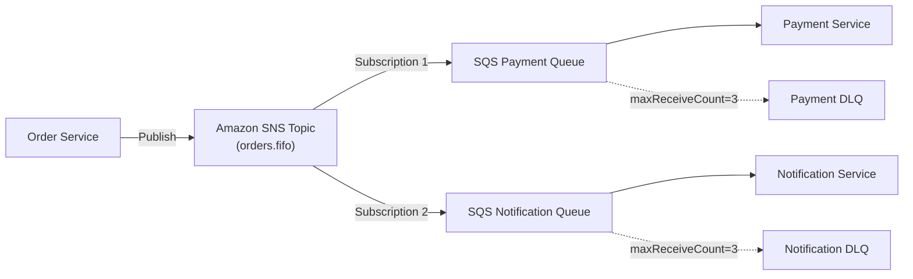

# AWS Architecture Hands-On Exercises

Practical engineering exercises to master least-privilege IAM policy authoring, database disaster recovery drills, and asynchronous event-driven fanout architectures on AWS.

---

## Exercise 1: Authoring a Least-Privilege IAM Policy for a Spring Boot Service

### Objective
Write an IAM JSON policy for an invoice microservice that enforces the Principle of Least Privilege.

### Requirements
1. **S3 Access**:
   - The service may only list and download files from bucket `company-finance-prod` under the prefix `incoming/`.
   - The service may upload generated invoice PDFs only under the prefix `processed-invoices/`.
   - The service must NOT have permissions to delete any objects or modify bucket settings.
2. **KMS Encryption**:
   - The service may only decrypt objects encrypted with KMS Key ARN `arn:aws:kms:us-east-1:123456789012:key/finance-key-id`.
   - The policy must enforce an encryption context condition requiring `"department": "finance"`.
3. **SQS Notification**:
   - The service may publish completion events strictly to queue `arn:aws:sqs:us-east-1:123456789012:invoice-completed.fifo`.

??? question "View solution"
    ```json
    {
      "Version": "2012-10-17",
      "Statement": [
        {
          "Sid": "AllowListIncomingInvoices",
          "Effect": "Allow",
          "Action": "s3:ListBucket",
          "Resource": "arn:aws:s3:::company-finance-prod",
          "Condition": {
            "StringLike": {
              "s3:prefix": [
                "incoming/*"
              ]
            }
          }
        },
        {
          "Sid": "AllowReadIncomingInvoices",
          "Effect": "Allow",
          "Action": "s3:GetObject",
          "Resource": "arn:aws:s3:::company-finance-prod/incoming/*"
        },
        {
          "Sid": "AllowWriteProcessedInvoices",
          "Effect": "Allow",
          "Action": "s3:PutObject",
          "Resource": "arn:aws:s3:::company-finance-prod/processed-invoices/*"
        },
        {
          "Sid": "AllowKMSDecryptWithContext",
          "Effect": "Allow",
          "Action": "kms:Decrypt",
          "Resource": "arn:aws:kms:us-east-1:123456789012:key/finance-key-id",
          "Condition": {
            "StringEquals": {
              "kms:EncryptionContext:department": "finance"
            }
          }
        },
        {
          "Sid": "AllowPublishToInvoiceFifoQueue",
          "Effect": "Allow",
          "Action": "sqs:SendMessage",
          "Resource": "arn:aws:sqs:us-east-1:123456789012:invoice-completed.fifo"
        }
      ]
    }
    ```

---

## Exercise 2: Simulating & Mitigating an RDS Multi-AZ Failover Drill

### Objective
Execute a simulated hardware crash on a Multi-AZ Amazon RDS PostgreSQL instance and verify that your Spring Boot application recovers cleanly within 90 seconds without hanging or throwing unrecoverable database connection errors.

### Step-by-Step Test Procedure

1. **Verify DNS Cache TTL in Spring Boot Container**:
   Ensure your JVM startup command in `Dockerfile` includes:
   ```bash
   java -Dsun.net.inetaddr.ttl=5 -XX:MaxRAMPercentage=75.0 -jar app.jar
   ```
2. **Configure HikariCP Resilient Timeouts**:
   In `application.yml`:
   ```yaml
   spring:
     datasource:
       hikari:
         connection-timeout: 10000
         validation-timeout: 3000
         max-lifetime: 900000
         idle-timeout: 300000
   ```
3. **Execute Forced Failover via AWS CLI**:
   Trigger a forced failover reboot:
   ```bash
   aws rds reboot-db-instance \
       --db-instance-identifier orders-db-production \
       --force-failover
   ```
4. **Monitor Application Logs and Health Probes**:
   - Observe the initial connection drop: HikariCP catches the broken connection and evicts stale sockets.
   - Within 60–90 seconds, RDS updates the canonical CNAME in Route 53.
   - Because `networkaddress.cache.ttl=5` is set, the JVM resolves the new primary IP address in $< 5\text{seconds}$.
   - HikariCP establishes fresh connections to the newly promoted primary without container restarts.

---

## Exercise 3: Decoupled Fan-Out Event Processing with SNS, SQS, and DLQ

### Objective
Design an event pipeline where an order placement event is published once to Amazon SNS and consumed independently by two downstream services with dead-letter queue protections.



### Key Implementation Invariants
1. **FIFO SNS + SQS**: If message sequencing is strictly required per user, both the SNS Topic and SQS Queues must end in `.fifo`.
2. **Redrive Policy**:
   ```json
   {
     "deadLetterTargetArn": "arn:aws:sqs:us-east-1:123456789012:payment-dlq.fifo",
     "maxReceiveCount": 3
   }
   ```
3. **CloudWatch Alarm**: Create an alarm on `payment-dlq.fifo` metric `ApproximateNumberOfMessagesVisible > 0` to notify engineers of poison message buildup immediately.
