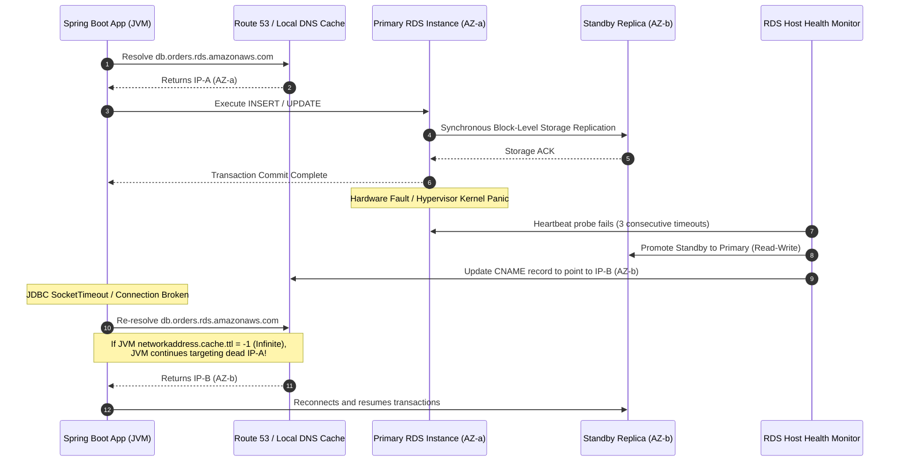
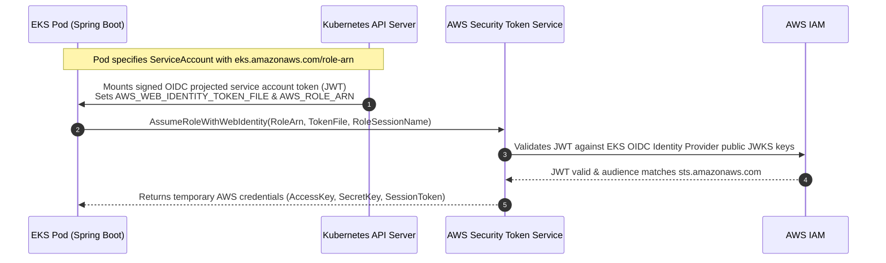
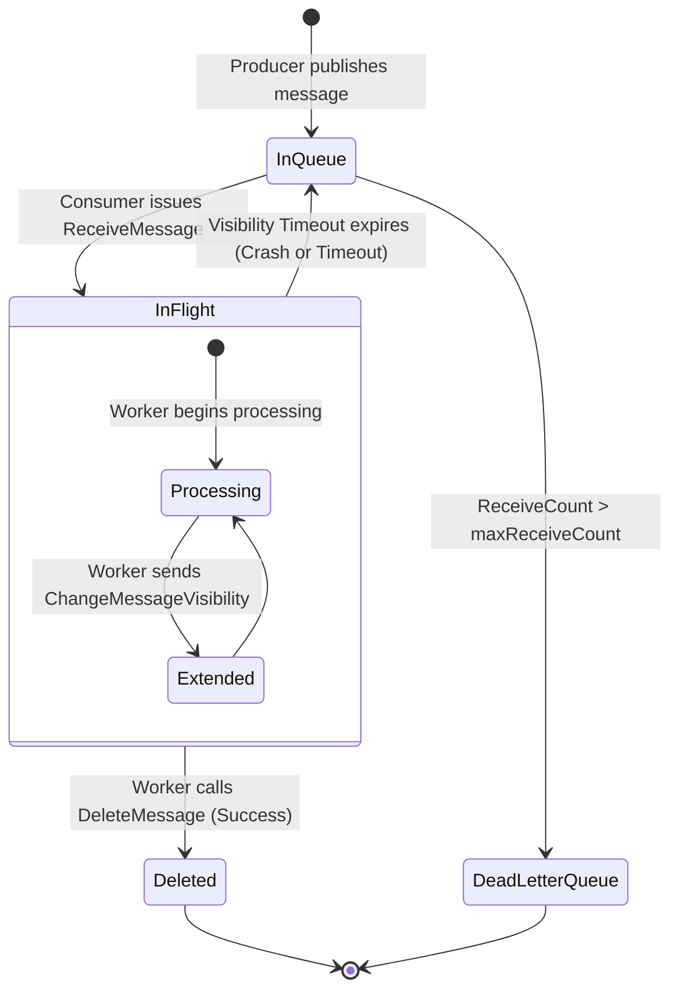
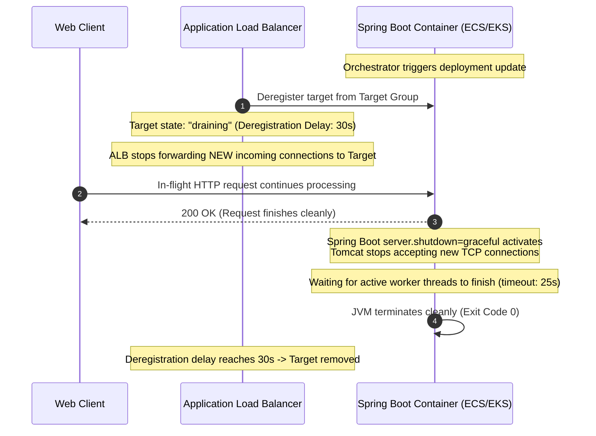

# AWS Architecture Internals for Backend Engineers

Deep dive into the operational mechanics, failure detection algorithms, token exchange protocols, and networking lifecycles underpinning AWS managed infrastructure.

---

## 1. Amazon RDS Multi-AZ Replication & Failover Mechanics

Understanding how Amazon RDS executes automated failovers prevents application connection storms and uncovers hidden client-side JVM DNS caching pitfalls.



### Physical Storage Replication vs Engine Streaming
In standard Amazon RDS Multi-AZ (non-Aurora):
1. Replication operates at the **physical storage volume block level** (synchronous block mirroring similar to DRBD), not PostgreSQL logical or streaming replication.
2. Every disk write issued by the database engine is committed only after the block is acknowledged by both the local primary EBS storage and the remote standby EBS storage across AZ network links.
3. Because replication is synchronous at the storage level, $RPO = 0$ (Zero data loss).
4. The standby database engine operates in recovery/standby mode and **cannot accept read queries** (unlike read replicas).

### The Automated Failover Algorithm
Failover triggers automatically if the primary experiences:
- Loss of network connectivity to the Availability Zone.
- Compute hardware or hypervisor failure.
- Storage failure or EBS volume degradation.
- Planned maintenance (OS patching or database instance class resizing).

When failure is detected (typically within 15–30 seconds via internal health heartbeats):
1. The RDS control plane flips the canonical DNS CNAME record for the database endpoint from the primary's IP address to the standby's IP address.
2. The standby completes crash recovery and mounts its storage in read-write mode.
3. The entire failover process completes in $60-120\text{seconds}$.

### The JVM DNS Caching Trap: `networkaddress.cache.ttl`
By default, the Java Virtual Machine historically cached successful DNS resolutions **forever** (`ttl = -1`) when a SecurityManager was present, or for an operating system default duration.
- During an RDS failover, Route 53 updates the CNAME in $< 5\text{seconds}$ with a 5-second TTL.
- If the Spring Boot JVM retains the old IP address in its internal `InetAddress` cache, connection pools (HikariCP) repeatedly attempt to connect to the dead host, causing indefinite application downtime even after RDS has successfully promoted the standby!
- **Senior Production Fix:** Set JVM network address cache TTL explicitly in application startup:
```java
java.security.Security.setProperty("networkaddress.cache.ttl", "5");
```

---

## 2. IAM Identity Federation & Token Exchange Protocols

Modern containerized applications running on ECS Fargate or EKS never manage static AWS access keys (`AKIA...`). They utilize dynamic STS token exchange.

### Amazon ECS Task Role Credential Vending
How does a Java application in an ECS Fargate container obtain AWS credentials without any configuration files?

1. When an ECS task launches with a configured `taskRoleArn`, the ECS Agent configures a link-local network route to the AWS ECS Task Metadata Endpoint:
   ```bash
   http://169.254.170.2/v2/credentials/{credential-id}
   ```
2. The agent sets the environment variable `AWS_CONTAINER_CREDENTIALS_RELATIVE_URI` inside the container.
3. When the AWS SDK v2 `DefaultCredentialsProvider` initializes inside Spring Boot:
   - It checks environment variables (`AWS_ACCESS_KEY_ID`), system properties, and then inspects `AWS_CONTAINER_CREDENTIALS_RELATIVE_URI`.
   - The SDK issues an HTTP GET request to `http://169.254.170.2$AWS_CONTAINER_CREDENTIALS_RELATIVE_URI`.
   - The link-local metadata service calls AWS Security Token Service (`sts:AssumeRole`) on behalf of the task role and returns temporary credentials: `AccessKeyId`, `SecretAccessKey`, `Token` (session token), and `Expiration`.
4. The SDK caches these credentials in-memory and automatically initiates asynchronous background refresh before they expire (credentials typically have a 6-hour lifespan, refreshed when $< 15\text{minutes}$ remain).

### Amazon EKS IAM Roles for Service Accounts (IRSA)
In EKS, pods authenticate via OpenID Connect (OIDC) identity federation:



- EKS acts as an OpenID Connect (OIDC) identity provider.
- Kubernetes mounts a projected volume containing a cryptographically signed service account token (JWT) at `/var/run/secrets/eks.amazonaws.com/serviceaccount/token`.
- The AWS SDK reads the token and calls `sts:AssumeRoleWithWebIdentity`.
- AWS STS verifies the token against the cluster's OIDC discovery endpoint (`https://oidc.eks.<region>.amazonaws.com/id/...`), checks that the subject claim (`sub`) matches `system:serviceaccount:<namespace>:<serviceaccount-name>`, and issues temporary AWS credentials scoped strictly to that pod.

---

## 3. SQS Message Invisibility, Heartbeats, and Redrive

Amazon SQS is a distributed message queuing service that trades strict single-server FIFO constraints for massive horizontal scalability.

### The Visibility Lifecycle


1. **In-Flight State**: When a worker calls `ReceiveMessage`, SQS assigns the message an in-flight status and starts the **Visibility Timeout** clock (default: 30s). During this window, no other consumer polling the queue will receive this message.
2. **Heartbeat Extension (`ChangeMessageVisibility`)**:
   - If a batch processing task takes longer than the configured visibility timeout (e.g., generating an image or compiling a PDF taking 45 seconds when visibility timeout is 30 seconds), SQS will make the message visible to other workers *while the first worker is still processing*.
   - This results in **duplicate concurrent execution**.
   - **Senior Production Fix:** If processing duration is variable, the consumer must execute an asynchronous background heartbeat thread that periodically calls `ChangeMessageVisibility(receiptHandle, visibilityTimeout + 30)` until the task completes.
3. **Dead Letter Queue (DLQ) Redrive**:
   - Every time a message transitions from in-flight back to the queue because of a consumer crash or processing exception, SQS increments its internal `ApproximateReceiveCount` attribute.
   - When `ApproximateReceiveCount > maxReceiveCount`, SQS automatically diverts the poison message into the configured DLQ.

---

## 4. ALB Target Group Health Checks & Graceful Connection Draining

Deploying zero-downtime updates requires orchestrating the Application Load Balancer's target deregistration delay with Spring Boot's internal graceful shutdown.



### The Synchronization Invariant: `Deregistration Delay` vs `Shutdown Timeout`
When a container is targeted for termination during a rolling update:
1. The orchestrator calls `DeregisterTargets` on the ALB Target Group.
2. The ALB marks the container as `draining`. It **stops sending new incoming requests**, but keeps existing TCP connections open for the duration of the **Deregistration Delay** (default: 300s, production tuned: 20–30s).
3. Simultaneously, the orchestrator sends `SIGTERM` to the container.
4. If the container shuts down immediately (or has `server.shutdown=immediate`), it closes TCP sockets while the ALB still considers existing connections valid, triggering HTTP 502 Bad Gateway errors to clients.
5. **Senior Sizing Formula:**
   $$\text{ALB Deregistration Delay} \ge \text{Spring Graceful Shutdown Timeout} + \text{Max Request Processing Time}$$
   Example configuration:
   - ALB Target Group Deregistration Delay: `30 seconds`
   - Spring Boot `spring.lifecycle.timeout-per-shutdown-phase`: `25 seconds`
   - Orchestrator `stopTimeout` / `terminationGracePeriodSeconds`: `35 seconds`
