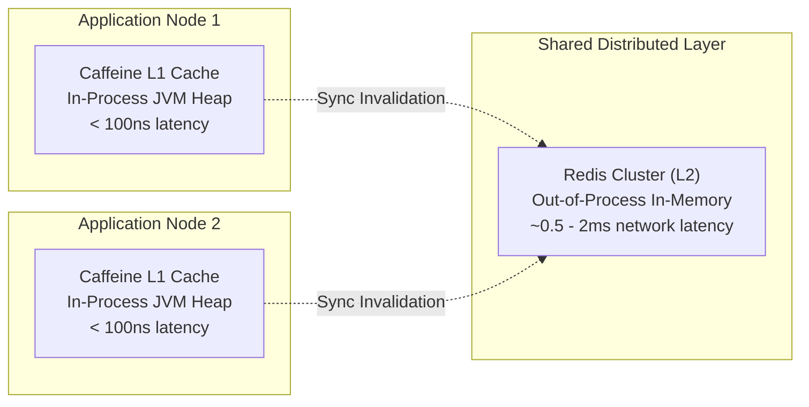

# Caching and Redis Concepts

Core caching principles, architectural access patterns, Spring Cache semantics, and Redis primitives.

---

## 1. Caching Architectural Patterns

Choosing the right caching pattern dictates how data moves between the application, the cache layer, and persistent storage:

| Pattern | Read Path | Write Path | Strengths | Weaknesses |
|---|---|---|---|---|
| **Cache-Aside (Lazy Loading)** | App reads Cache; on miss, App reads DB and populates Cache | App writes DB, then deletes/evicts Cache | Resilient to cache crashes; DB remains primary source of truth | Stale reads possible if eviction fails or during race windows |
| **Read-Through** | App reads Cache; Cache library fetches DB on miss | Delegated to write strategy | Transparent to application logic | Requires cache provider plugin supporting DB integration |
| **Write-Through** | App reads Cache; Cache fetches DB on miss | App writes to Cache; Cache synchronously writes to DB before acknowledging | High consistency; read misses always hit hot cache | Write latency penalty on every update |
| **Write-Behind (Write-Back)** | App reads Cache | App writes to Cache; Cache asynchronously flushes to DB in batches | Highest write throughput; non-blocking database writes | Risk of permanent data loss if cache fails before batch flush |

---

## 2. Local In-Memory vs Distributed Caching



### Caffeine (Local In-Process)
- **Advantages:** Sub-microsecond access times; no network roundtrip; no data serialization/deserialization overhead; zero external infrastructure dependencies.
- **Disadvantages:** Bounded by JVM heap memory; GC pressure on huge caches; data lost on application restart; cache state diverges across horizontal application replicas without a distributed coordination bus.

### Redis (Distributed Out-of-Process)
- **Advantages:** Centralized state shared across hundreds of microservice instances; survives application node restarts; advanced data structures (Sorted Sets, Hashes, Bitmaps, Streams); atomic operations via Lua scripts.
- **Disadvantages:** Network latency (~0.5–2ms); socket network I/O serialization costs; operational cluster management and high availability failover.

---

## 3. Spring Cache Abstraction

Spring Framework decouples caching operations from specific store implementations through annotations and the `CacheManager` SPI:

```java
--8<-- "modules/13-caching-redis/src/examples/java/lab/cachingredis/questions/Q03SpringCacheAnnotations.java"
```

---

## 4. Redis Data Structures & Usage Matrix

Redis is not merely a string key-value store. It provides memory-optimized data structures:

| Data Structure | Primary Commands | Common Production Use Cases |
|---|---|---|
| **String** | `SET`, `GET`, `INCR`, `SETNX` | Object caching (JSON), session tokens, distributed rate limits, atomic sequence counters |
| **Hash** | `HSET`, `HGET`, `HGETALL`, `HINCRBY` | User profiles, cart contents, entity records; saves memory via internal ziplists |
| **List** | `LPUSH`, `RPOP`, `BRPOP` | Message queues, FIFO task processing, recent event timelines |
| **Set** | `SADD`, `SREM`, `SISMEMBER`, `SINTER` | Tagging systems, mutual followers, IP blacklists, unique visitor sets |
| **Sorted Set (ZSet)** | `ZADD`, `ZRANGE`, `ZREVRANK`, `ZREMRANGEBYSCORE` | Gaming leaderboards, sliding-window rate limiters (score = timestamp epoch ms) |
| **Bitmap** | `SETBIT`, `GETBIT`, `BITCOUNT` | Daily user activity/retention tracking (1 bit per active user per day) |
| **HyperLogLog** | `PFADD`, `PFCOUNT`, `PFMERGE` | Massive unique visitor cardinality estimation with fixed 12KB memory consumption |
| **Streams** | `XADD`, `XREADGROUP`, `XACK` | Append-only distributed event log with consumer group acknowledgments |

---

## 5. Cache Failure Modes: Stampede, Penetration, Avalanche

### 1. Cache Stampede (Thundering Herd)
- **Problem:** When a hot, high-traffic key expires, hundreds of concurrent requests encounter a cache miss at the exact same moment. All threads bypass the cache and simultaneously query the database, causing DB CPU saturation and connection exhaustion.
- **Remediation:** Single-flight locking (distributed mutex via `SET lock:key token NX PX 5000`) or Probabilistic Early Expiration (XFetch algorithm).

### 2. Cache Penetration
- **Problem:** Incoming queries search for non-existent keys (e.g. IDs not in the database). Because the data does not exist, neither the cache nor the DB satisfies the read, causing every request to hit the database.
- **Remediation:** Cache a sentinel `NULL` object with a short TTL (e.g. 30–60 seconds), or screen requests using an in-memory Bloom filter.

### 3. Cache Avalanche
- **Problem:** Thousands of keys are configured with the exact same expiration duration and expire simultaneously, or the entire Redis cluster restarts. All subsequent traffic cascades directly into the database.
- **Remediation:** Apply random TTL jitter (+/- 10–20% of base TTL) to distribute expiration timestamps evenly over time.

---

## 6. Redis Eviction Policies (`maxmemory-policy`)

When Redis memory consumption reaches the configured `maxmemory` limit, Redis reclaims memory according to its eviction policy:

| Policy | Eviction Target | Behavior / Best Fit |
|---|---|---|
| `noeviction` | None | Returns OOM error on mutating commands. Default in standalone Redis; protects against data loss. |
| `allkeys-lru` | All keys | Evicts least-recently-used keys regardless of TTL. **Recommended for pure cache deployments.** |
| `volatile-lru` | Expiring keys | Evicts least-recently-used keys only among keys configured with a TTL. |
| `allkeys-lfu` | All keys | Evicts least-frequently-used keys using a logarithmic frequency counter. Ideal when popularity varies. |
| `volatile-lfu` | Expiring keys | Evicts least-frequently-used keys only among keys with an expiration set. |
| `volatile-ttl` | Expiring keys | Evicts keys with the shortest remaining TTL first. |
