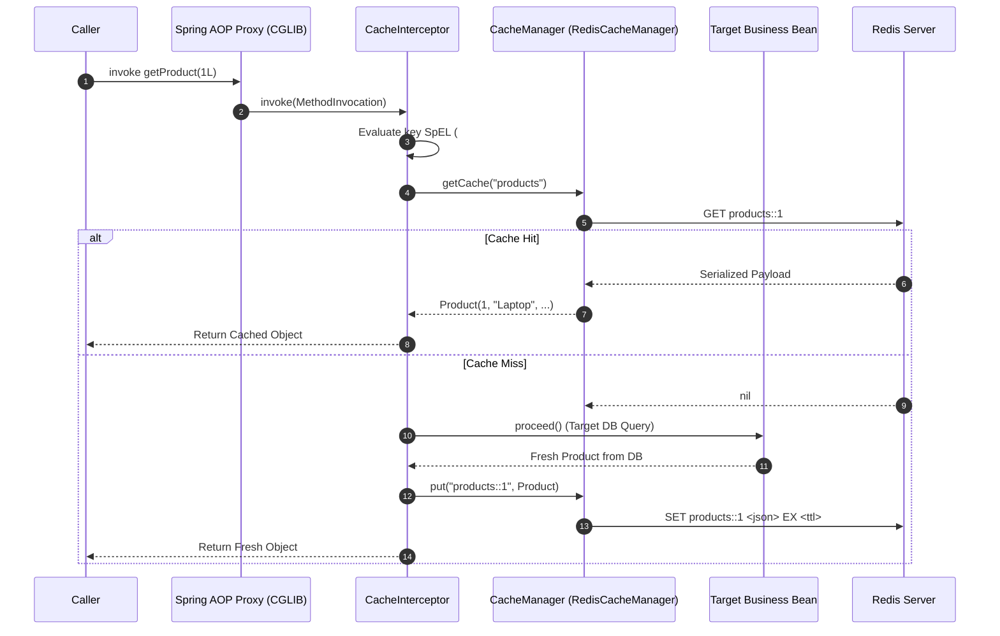
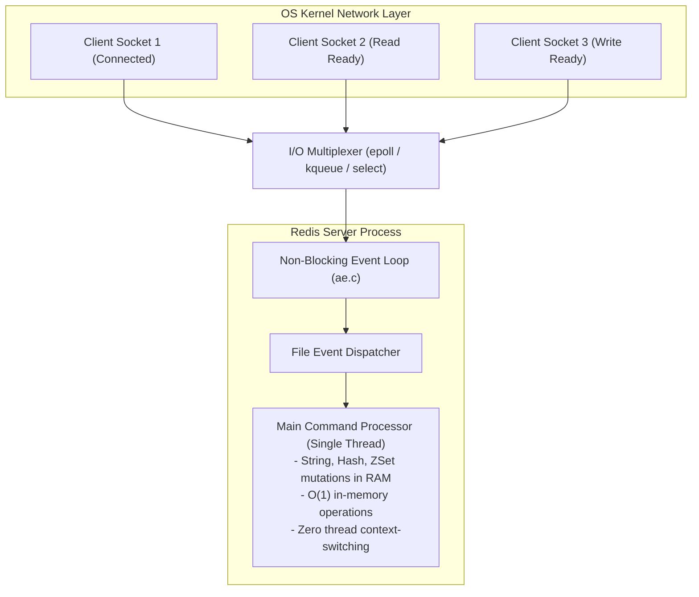
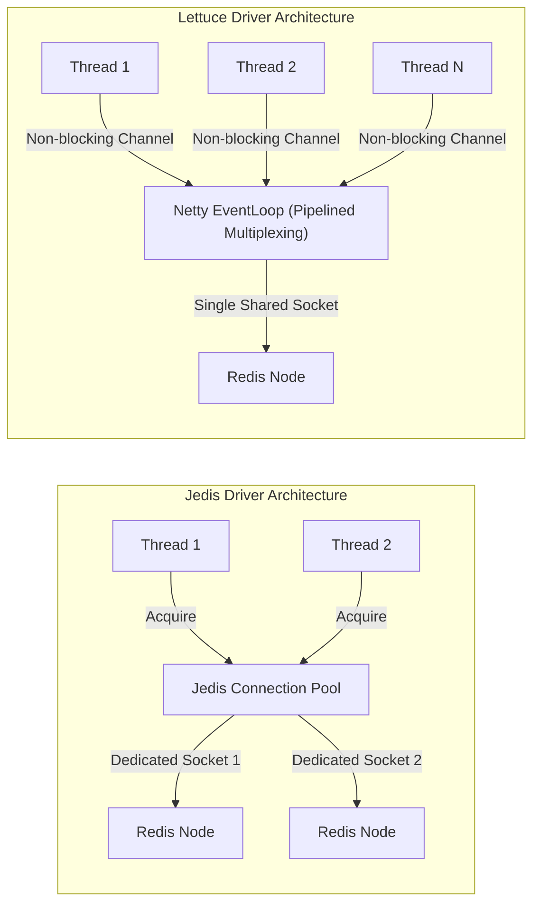
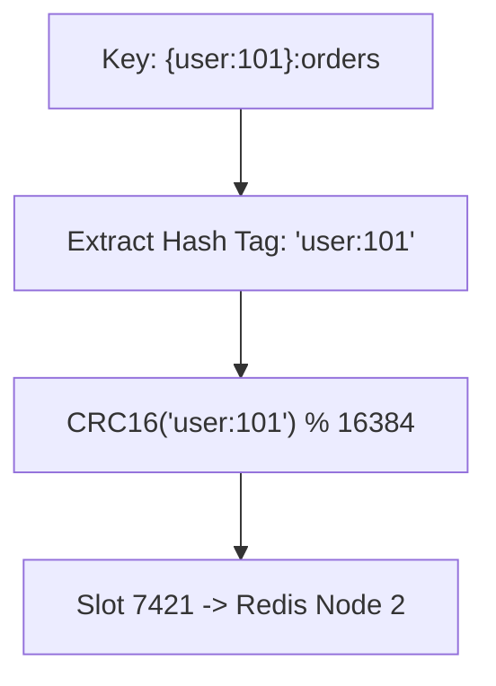
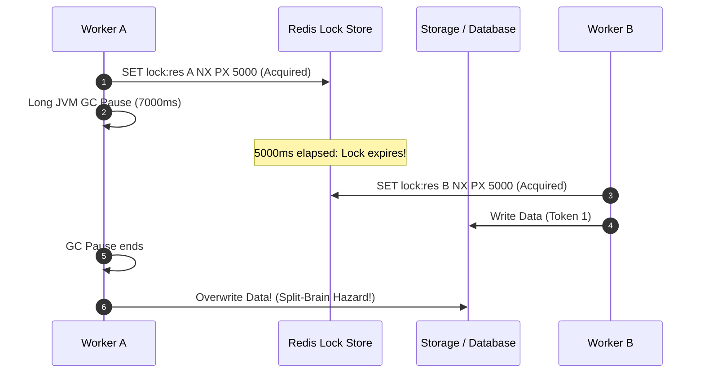

# Caching and Redis Internals

Deep dive into Spring's cache proxy mechanics, Redis event loop architecture, Lettuce Netty multiplexing, and distributed lock consensus.

---

## 1. Spring CacheInterceptor & AOP Proxy Mechanics

Spring declarative caching is implemented via an AOP method interception pipeline driven by `CacheInterceptor`:

### Key Internal Classes
- `CacheAspectSupport`: Base class managing cache operation metadata, key generation, and condition evaluation.
- `CacheOperationSource`: Parses annotations (`@Cacheable`, `@CachePut`, `@CacheEvict`) into runtime `CacheOperation` definitions.
- `KeyGenerator`: Evaluates SpEL expressions or defaults to `SimpleKeyGenerator`.

---

## 2. Redis Single-Threaded Event Loop (Reactor Pattern)

A common question is why Redis delivers >100,000 operations per second despite executing commands on a single main execution thread:

### Why Redis is Fast
1. **In-Memory Storage**: All primary data resides directly in physical RAM. Memory access latency is measured in tens of nanoseconds, bypassing mechanical or SSD storage bottlenecks.
2. **Non-Blocking I/O Multiplexing**: Redis uses OS primitives (`epoll` on Linux, `kqueue` on macOS) to monitor thousands of client socket connections concurrently without spawning dedicated operating system threads.
3. **Zero Lock Contention**: Because core commands execute sequentially on a single thread, data structure mutations require zero mutex locks, condition variables, or synchronized blocks, eliminating lock contention and thread context-switching overhead.
4. **I/O Threading (Redis 6.0+)**: In Redis 6.0+, network socket read/write parsing is offloaded to background I/O threads, while the core command execution logic remains strictly single-threaded.

---

## 3. Client Driver Architecture: Lettuce vs Jedis

### Lettuce (Spring Boot Default)
- Built on **Netty** asynchronous event-driven I/O.
- Shares a single, thread-safe TCP connection across hundreds of concurrent threads.
- Automatically pipelines requests across the shared connection, dramatically reducing socket overhead.
- Under Java 21 Virtual Threads, virtual threads calling synchronous Lettuce methods yield cleanly without pinning carrier threads.

### Jedis
- Synchronous, blocking client.
- Requires dedicated connection pooling (`GenericObjectPool`).
- Each concurrent worker thread must acquire a dedicated physical connection socket.
- Under high concurrent load (e.g. 10,000 virtual threads), connection pool exhaustion causes thread queuing and latency degradation.

---

## 4. Redis Cluster Hash Slot Partitioning

Redis Cluster implements shared-nothing horizontal sharding using **16,384 logical Hash Slots**:

$$\text{Hash Slot} = \text{CRC16}(\text{key}) \pmod{16384}$$

### Hash Tags (`{...}`)
- Multi-key operations (transactions, pipelines, Lua scripts) require all keys to reside on the same cluster node.
- Wrapping a substring in braces `{...}` forces Redis to compute the hash slot using **only the text inside the braces**.
- Example: `{user:101}:profile` and `{user:101}:orders` hash to the exact same slot, allowing atomic multi-key transactions across them without triggering `CROSSSLOT Keys in request don't hash to the same slot`.

---

## 5. Distributed Lock Consensus: Redlock & Fencing Tokens

The naive distributed lock (`SET key value NX PX`) is safe for soft concurrency control, but in safety-critical systems, process pauses create split-brain hazards:

### The Solution: Fencing Tokens
To prevent a paused worker from executing writes after its lease has expired, the lock manager issues a **monotonically increasing fencing token** (e.g. token 31, 32, 33). The primary storage layer rejects any write that presents a token lower than the highest token previously committed.
