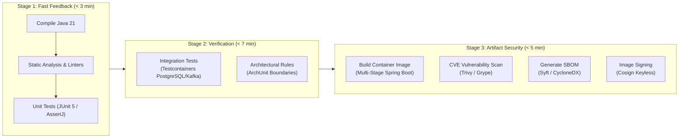
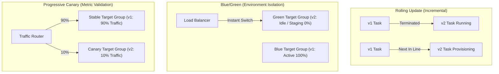

# CI/CD & Deployment Concepts for Backend Engineers

Zero-downtime deployment engineering requires coordinating continuous integration pipelines, container registries, schema migration lifecycles, and traffic routing mechanisms.

---

## 1. The Modern CI Pipeline Architecture

A resilient Continuous Integration pipeline must provide **fast, deterministic feedback** while acting as an unyielding security and quality gate:



### Static Analysis and Architectural Guardrails
- **Linters & Formatters (Spotless / Google Java Format)**: Enforce consistent formatting, eliminating subjective code style debates in code reviews.
- **Compiler-Level Bug Finders (Error Prone)**: Detects subtle concurrency bugs, null pointer dereferences, and incorrect equality comparisons during compilation.
- **Architectural Fitness Functions (ArchUnit)**: Unit tests that verify structural rules in code:
  - Controllers must not directly access repositories.
  - Domain packages must have zero dependencies on Spring Web or external infrastructure frameworks.
  - Entities must never be returned directly from REST controller endpoints.

### Supply Chain Security & Software Bill of Materials (SBOM)
- **Container Vulnerability Scanning (Trivy / Grype)**: Scans base OS packages (Alpine/Debian) and Java dependencies (Maven/Gradle transitive jars) against the National Vulnerability Database (NVD). Pipelines must fail builds on unfixed `CRITICAL` or `HIGH` CVEs.
- **Software Bill of Materials (SBOM)**: A machine-readable inventory (CycloneDX or SPDX format) detailing every third-party jar, direct dependency, and transitive dependency packaged into the release container.
- **Cryptographic Signing (Sigstore Cosign)**: Signs container image digests using OpenID Connect identities, allowing Kubernetes admission controllers (Kyverno, OPA Gatekeeper) to reject unsigned or tampered container images from running in production.

---

## 2. Zero-Downtime Database Migrations & The Expand-Contract Pattern

The single most common cause of production deployment outages in relational database architectures is executing **destructive schema migrations** while application traffic is active.

### The Dual-State Coexistence Invariant
During any zero-downtime deployment (Rolling, Blue/Green, or Canary), **both the old version ($v1$) and the new version ($v2$) of the application run simultaneously and execute queries against the exact same database**:

```text
               ┌───────────────────────────────┐
               │    Production Load Balancer   │
               └──────────────┬────────────────┘
                              │
              ┌───────────────┴───────────────┐
              ▼                               ▼
       [ App Version v1 ]             [ App Version v2 ]
      (Expects column "full_name")  (Expects "first_name", "last_name")
              │                               │
              └───────────────┬───────────────┘
                              ▼
                 [ Amazon RDS PostgreSQL ]
```

If a pipeline executes `ALTER TABLE customers DROP COLUMN full_name` before or during the deployment, running $v1$ instances immediately throw `PSQLException: column "full_name" does not exist`, corrupting transactions and generating HTTP 500 errors.

### The Expand-Contract (Parallel Change) Pattern
To evolve database schemas without downtime or rollback risk, changes must be decomposed into four distinct deployment phases:

| Phase | Deployment | Database Action | Application Code State |
|---|---|---|---|
| **1. Expand** | Release $N$ | Add new columns as **nullable** (`ALTER TABLE customers ADD COLUMN first_name VARCHAR(100)`). Install database triggers to mirror writes. | Version $v1$ continues reading/writing legacy column `full_name`. Triggers populate `first_name` and `last_name` automatically on new writes. |
| **2. Backfill** | Asynchronous Job | Run a background chunked batch job to migrate historical data from `full_name` to `first_name` and `last_name` without table locking. | No application changes. Database updates execute in small batches (e.g., 1,000 rows per transaction). |
| **3. Transition** | Release $N+1$ | Add `NOT NULL` constraints (with validation) once backfill reaches 100%. | Version $v2$ deployed: reads and writes strictly from `first_name` and `last_name`. Rollback to $v1$ remains completely safe! |
| **4. Contract** | Release $N+2$ | Drop legacy triggers and drop legacy column: `ALTER TABLE customers DROP COLUMN full_name`. | Executed weeks after Release $N+1$ when team is confident rollback to $v1$ is no longer required. |

### PostgreSQL Lock Contention and DDL Timeouts
Executing DDL operations (`ALTER TABLE`, `CREATE INDEX`) in PostgreSQL requires an `ACCESS EXCLUSIVE` lock on the target table.
- An `ACCESS EXCLUSIVE` lock blocks all reads (`SELECT`) and writes (`INSERT`, `UPDATE`, `DELETE`).
- If a long-running reporting query or payment transaction holds a lock on the table, the `ALTER TABLE` statement queues behind it, and **all subsequent client queries queue behind the ALTER statement**, quickly exhausting the HikariCP connection pool in $< 10\text{seconds}$!
- **Senior Rule:** Always set a strict `lock_timeout` in migration scripts and build indexes concurrently:
  ```sql
  SET lock_timeout = '3s';
  CREATE INDEX CONCURRENTLY idx_customers_email ON customers(email);
  ```

---

## 3. Modern Deployment Strategies



### 1. Rolling Update
- **Mechanism**: The container orchestrator (ECS / Kubernetes) provisions a new container ($v2$), waits for it to pass readiness probes, registers it with the load balancer, and terminates an old container ($v1$). Repeats until all instances run $v2$.
- **Pros**: Low infrastructure cost (requires only a small surge margin, e.g., 25% extra capacity).
- **Cons**: Slowest rollout; version $v1$ and $v2$ coexist in production for the entire rollout duration; rollback requires executing a reverse rolling update.

### 2. Blue/Green Deployment
- **Mechanism**: Two identical production environments exist. The **Blue** environment runs active production traffic ($v1$). The pipeline deploys $v2$ to the idle **Green** environment, executes full synthetic end-to-end smoke tests, and flips the load balancer listener to target Green.
- **Pros**: Instantaneous traffic cutover; instant one-click rollback by switching the load balancer back to Blue; zero coexistence of $v1$ and $v2$ traffic.
- **Cons**: Doubles compute infrastructure costs during deployment; requires database schema compatibility between both environments.

### 3. Progressive Canary Deployment
- **Mechanism**: Deploys $v2$ to a small subset of instances (e.g., 5% or 10% of total traffic). An automated monitoring controller (AWS CodeDeploy, Argo Rollouts, or Flagger) analyzes real-time application metrics (p99 latency, HTTP 5xx error rate, log exception count) against the baseline. If metrics remain healthy over 10 minutes, traffic increments to 25%, 50%, and finally 100%.
- **Pros**: Minimum blast radius. A critical bug or memory leak impacts only 5% of users before automated rollback triggers.
- **Cons**: Requires sophisticated telemetry, metric instrumentation, and automated traffic shaping infrastructure.

---

## 4. Automated Rollback Mechanisms & Health Gates

A deployment pipeline must never assume a deployment is successful simply because a container started or a command exited with code 0.

### Pre-Deployment and Post-Deployment Health Gates
1. **Actuator Readiness Health Probes (`/actuator/health/readiness`)**:
   - The container orchestrator polls the readiness probe. The application marks itself ready only after:
     - The Spring `ApplicationContext` is fully initialized.
     - Database connection pools (HikariCP) have validated connectivity.
     - Kafka / SQS consumer listeners are successfully bound.
2. **Synthetic Post-Deployment Smoke Tests**:
   - The CD pipeline issues automated HTTP requests against protected internal endpoints validating core end-to-end capabilities (e.g., placing a synthetic test order or reading a test entity) before promoting the deployment.
3. **Automated Rollback Triggers**:
   - If readiness probes fail within 5 minutes, or if CloudWatch / Prometheus alarms detect an error rate exceeding 1% within the canary window, the pipeline executes an automated, unattended rollback.

---

## 5. Feature Flags & Decoupling Deployment from Release

Senior engineering distinguishes between **deployment** (installing new code into production infrastructure) and **release** (making the new functionality visible and active for end users).

### The Feature Flag Lifecycle
- Feature flags (managed via Unleash, LaunchDarkly, or Spring profiles) wrap new code paths in boolean evaluation conditions:
  ```java
  if (featureFlagService.isEnabled("new-payment-gateway", user.getId())) {
      return stripeV2Client.charge(paymentRequest);
  } else {
      return legacyGatewayClient.charge(paymentRequest);
  }
  ```
- **Operational Benefits**:
  - **Dark Launching**: Deploy new features weeks ahead of marketing launch; test functionality in production using internal employee user IDs.
  - **Instant Kill Switch**: If a critical bug manifests, disabling the feature flag takes $< 1\text{second}$ without requiring a full code rollback, rebuild, or container deployment.
  - **Gradual Percentage Rollouts**: Roll out a new feature to 1% $\rightarrow$ 10% $\rightarrow$ 50% $\rightarrow$ 100% of users based on user ID hashing.
- **Senior Maintenance Invariant**: Feature flags introduce technical debt and cyclomatic complexity. Once a feature is 100% rolled out and stable in production, a cleanup ticket must be created to remove the flag and dead legacy code paths within 1–2 sprints.
