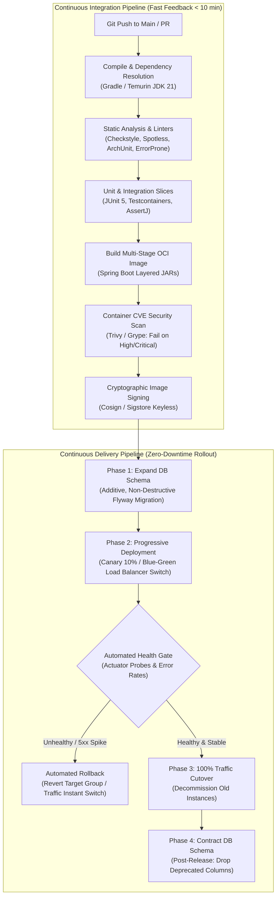

# CI/CD and Zero-Downtime Deployment Engineering

This module covers Continuous Integration, Continuous Delivery, and zero-downtime release engineering for Senior Java / Spring Boot Backend Engineers. Modern backend engineering requires pipelines that guarantee automated verification, supply chain security, immutable artifact distribution, and zero-downtime database and container deployments.

---

## Core Production Invariants

| Invariant | Operational Rationale | Senior Production Standard |
|---|---|---|
| **Immutable Artifacts** | Prevent split-brain autoscaling and environment drift between staging and production. | Build once, deploy everywhere. Tag images strictly with immutable Git commit SHAs (`${GITHUB_SHA::8}`) or semantic versions; never deploy mutable `:latest` tags. |
| **Expand-Contract DB Pattern** | Prevent downtime and broken queries during rolling updates when old ($v1$) and new ($v2$) code coexist. | Never execute destructive schema migrations (`DROP COLUMN`, rename, synchronous non-null constraints) in the same release as code changes. Use the multi-phase Expand-Contract pattern. |
| **Automated Deployment Health Gates** | Detect startup crashes, latency spikes, and runtime regressions before full traffic exposure. | Gate deployments with automated health checks (`/actuator/health/readiness`), synthetic post-deployment smoke tests, and automated metric rollbacks upon HTTP 5xx spikes. |
| **Strict Security & Testing Gates** | Prevent vulnerable dependencies, unverified merge commits, and critical CVEs from reaching production. | Never bypass tests (`-x test`) or suppress vulnerability scanners (`continue-on-error: true`) on deployment branches. Run tests and Trivy blocking scans on every release commit. |
| **Fast Deterministic Feedback** | Maintain developer velocity and trunk-based deployment rhythm without compromising safety. | Optimize CI execution to $< 10\text{minutes}$ using Gradle build caching, test task parallelization, and multi-stage layer caching. |

---

## Module Overview

| Resource | Purpose |
|---|---|
| [Concepts](concepts.md) | Deployment strategies (Rolling, Blue/Green, Canary), pipeline stages, Expand-Contract schema evolution, and GitOps |
| [Internals](internals.md) | Flyway migration locking algorithms, ALB connection draining during Blue/Green switches, and canary traffic shaping |
| [Interview Questions](questions.md) | 23 questions across Basic, Intermediate, Senior, and Production Incident Scenarios |
| [Code Review](code-review.md) | 3 broken review targets (destructive Flyway migration, no rollback pipeline, skipped test CI) with collapsible reveals |
| [Solutions](solutions.md) | Safe Expand-Contract migration scripts, rollback-safe GitHub Actions workflows, and strict security pipelines |
| [Production](production.md) | Incident postmortems (The Column Drop Catastrophe, The Zombie `:latest` Rollout), deployment telemetry, and checklist |
| [Exercises](exercises.md) | Hands-on challenges: Multi-phase zero-downtime database refactoring and writing an automated rollback workflow |

---

## Related

- [Docker](../docker/index.md) — Container images, multi-stage builds, Spring Boot layered JARs, and graceful shutdown
- [AWS](../aws/index.md) — Amazon ECS, EKS, Application Load Balancers, and target group deregistration delays
- [Performance](../performance/index.md) — JMH benchmarking, load testing, and latency SLOs
- [Reliability issue catalogue](../../issues/reliability.md)
- [Security issue catalogue](../../issues/security.md)
- [Curriculum spec](../../spec/curriculum.md)
