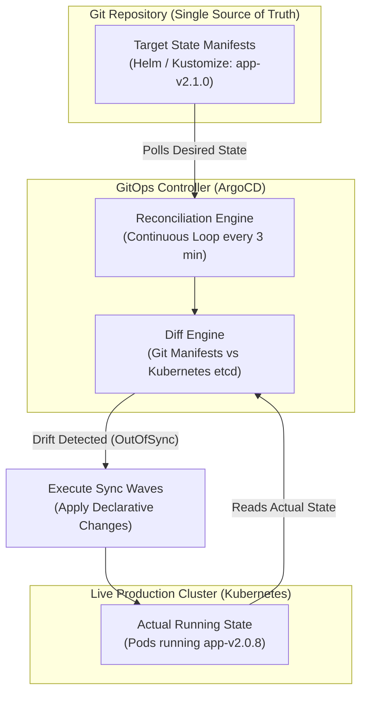

# CI/CD & Deployment Internals for Backend Engineers

Deep dive into the internal algorithms, distributed lock contention protocols, traffic-shaping mechanics, and statistical analysis models that govern production deployments.

---

## 1. Database Schema Migration Engine Internals (Flyway vs Liquibase)

Understanding how Flyway and Liquibase execute migrations under the hood reveals why running migrations inside application startup code causes severe production race conditions.

```mermaid
sequenceDiagram
    autonumber
    participant Pod1 as Container Pod 1
    participant Pod2 as Container Pod 2
    participant DB as PostgreSQL Database
    participant Table as flyway_schema_history

    Note over Pod1,Pod2: Deploying 10 ECS tasks simultaneously with in-app Flyway migration
    Pod1->>DB: BEGIN Transaction
    Pod1->>Table: SELECT * FROM flyway_schema_history FOR UPDATE
    Note over Table: Pod 1 acquires ROW EXCLUSIVE lock on history table
    
    Pod2->>DB: BEGIN Transaction
    Pod2->>Table: SELECT * FROM flyway_schema_history FOR UPDATE
    Note over Pod2,Table: Pod 2 blocks waiting for Pod 1's lock!

    Pod1->>DB: Executes V2__expand_schema.sql (ALTER TABLE ...)
    Note over DB: DDL acquires ACCESS EXCLUSIVE lock on customers table
    Pod1->>Table: INSERT INTO flyway_schema_history (version, checksum, success)
    Pod1->>DB: COMMIT Transaction
    Note over Table: Lock released; Pod 2 unblocks

    Pod2->>Table: Re-reads history table; sees V2 already applied
    Pod2->>DB: COMMIT Transaction (No-op)
```

### Flyway Schema History & Checksum Verification
1. **The Checksum Algorithm**:
   - For every migration script (`V1__init.sql`), Flyway calculates an internal CRC32 / SHA-256 checksum based on file content (normalizing line breaks `\r\n` to `\n`).
   - Before executing pending migrations, Flyway scans `flyway_schema_history` and re-computes the checksum of all previously executed scripts against current files in the jar.
   - If an engineer retroactively alters an already-applied migration script, Flyway throws `FlywayException: Validate failed: Migration checksum mismatch`, aborting the startup.
2. **Transactional DDL Support**:
   - **PostgreSQL**: Supports **transactional DDL**. `ALTER TABLE`, `CREATE TABLE`, and schema changes execute inside an explicit database transaction (`BEGIN ... COMMIT`). If a DDL statement fails halfway through, PostgreSQL rolls back the entire transaction, leaving the database in a clean, consistent state.
   - **MySQL / Oracle**: DDL statements trigger an **implicit commit**! If a migration script contains three `ALTER TABLE` statements and the second one fails, MySQL commits the first statement and aborts the rest. The database is left in a corrupted intermediate state requiring manual surgical repair.
3. **The Danger of In-App Migrations (`spring.flyway.enabled=true`)**:
   - When 50 autoscaled ECS tasks or EKS pods boot up simultaneously during a rolling update, all 50 instances immediately connect to PostgreSQL and contend for the `flyway_schema_history` lock.
   - If a migration statement is slow or blocked by existing read locks, the remaining 49 application instances block their main startup threads, triggering container health check timeouts and cascading pod failure storms.
   - **Senior Standard:** Disable in-app migrations in production (`spring.flyway.enabled=false`). Execute Flyway as a dedicated, standalone, pre-deployment CI/CD pipeline job.

---

## 2. Load Balancer Traffic Shaping & Connection Draining in Blue/Green Deployments

Switching 100% of live production traffic from Blue to Green requires orchestrating load balancer target weights, TCP connection draining, and HTTP keep-alive lifecycles:

```mermaid
sequenceDiagram
    autonumber
    participant Client as Web Client (HTTP Keep-Alive)
    participant ALB as Application Load Balancer
    participant Blue as Blue Target Group (v1)
    participant Green as Green Target Group (v2)

    Note over ALB: Initial State: Blue Weight = 100, Green Weight = 0
    Client->>ALB: HTTP Request 1 (Keep-Alive TCP Connection)
    ALB->>Blue: Forward to Blue (v1)
    Blue-->>Client: 200 OK

    Note over ALB: Pipeline flips weights: Blue Weight = 0, Green Weight = 100
    Client->>ALB: HTTP Request 2 (On existing Keep-Alive TCP connection)
    Note over ALB: ALB evaluates Layer 7 routing per HTTP request!<br/>Request 2 forwarded to Green despite reusing TCP connection!
    ALB->>Green: Forward to Green (v2)
    Green-->>Client: 200 OK

    Note over Blue: Blue Target Group begins Deregistration Delay (30s)
    Note over Blue: Existing in-flight requests finish; idle connections closed
```

### Layer 7 Request Multiplexing vs Layer 4 Connection Pinning
- In an **Application Load Balancer (Layer 7)**, traffic routing rules are evaluated **per HTTP request**, not per TCP connection.
- When an ALB listener rule updates its target group weights from Blue (100%) to Green (100%), clients with existing open HTTP keep-alive TCP connections immediately have their next HTTP request routed to the Green target group.
- In contrast, a **Network Load Balancer (Layer 4)** routes at the TCP layer: existing TCP connections remain pinned to the Blue targets until the client disconnects, delaying full traffic cutover for minutes or hours if clients use long-lived HTTP connection pools.

### The Connection Draining Phase
1. When Blue is phased out, the pipeline initiates deregistration.
2. The ALB marks Blue targets as `draining`:
   - No new HTTP requests are routed to Blue targets.
   - Any HTTP requests currently in-flight on Blue are granted up to the `deregistration_delay.timeout_seconds` to finish processing cleanly.
3. Once all in-flight requests complete or the timeout expires, the ALB terminates the TCP connections to Blue, allowing Blue compute instances to be safely terminated or scaled to zero.

---

## 3. Statistical Progressive Canary Analysis

Modern continuous delivery platforms (Argo Rollouts, Spinnaker, Flagger) automate canary promotions using statistical metric analysis rather than arbitrary human intuition:

```text
Baseline (v1) Metric Stream ────┐
                                 ▼
                     [ Statistical Test Engine ] ──► Pass: Increment Traffic (10% -> 25%)
                                 ▲                   Fail: Auto-Rollback to v1 (0%)
Canary (v2) Metric Stream ───────┘
```

### Statistical Analysis Algorithms: Mann-Whitney U Test
Why does senior engineering avoid comparing simple arithmetic means (e.g. `Canary Error Rate > Baseline Error Rate`)?
- A single burst of network jitter or an isolated external API spike can skew average latency, causing false-positive rollbacks.
- Progressive canary engines employ **non-parametric statistical hypothesis tests** such as the **Mann-Whitney U Test** (Wilcoxon rank-sum test) or the **Kolmogorov-Smirnov Test**:
  1. The engine collects metric samples (e.g., p95 response time sampled every 10 seconds) from both the Baseline ($v1$) and Canary ($v2$) target groups over an evaluation window (e.g., 10 minutes).
  2. It formulates a null hypothesis ($H_0$): the distribution of latency in the Canary is statistically identical to the Baseline.
  3. The test ranks all pooled observations and calculates the $U$ statistic and associated $p$-value.
  4. If the $p$-value falls below a critical threshold ($\alpha = 0.05$) and the median shift indicates degradation, the engine **rejects the null hypothesis**, halts the rollout, and triggers an automated rollback.

---

## 4. GitOps Reconciliation Loop Architecture (ArgoCD)

In enterprise Kubernetes and container ecosystems, **GitOps** replaces push-based CI/CD scripts with declarative pull-based reconciliation loops:



### The Three GitOps Invariants
1. **Declarative Desired State**: The complete infrastructure, container image version, replica count, and configuration are declared in Git. No engineer manually runs `kubectl apply` or `aws ecs update-service`.
2. **Automated Drift Detection & Self-Healing**: If a rogue engineer or accidental manual intervention modifies a running pod or service in production, the GitOps controller detects the divergence (`OutOfSync`) and automatically reconciles the live cluster back to match the Git commit.
3. **Sync Waves & Hooks**: Multi-tier deployments are orchestrated using Sync Waves (`argocd.argoproj.io/sync-wave: "1"`, `"2"`):
   - **Wave 1 (Pre-Sync)**: Execute database expand migrations.
   - **Wave 2 (Sync)**: Deploy new application pods.
   - **Wave 3 (Post-Sync)**: Run automated synthetic smoke tests.
