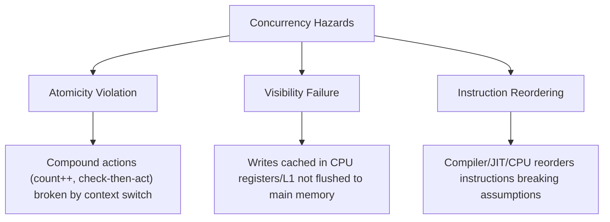
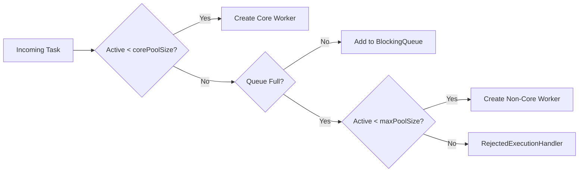

# Concurrency Concepts

## 1. Processes vs Threads

- **Process**: An OS-managed isolated execution environment with its own address space, memory page tables, file descriptors, and security tokens. Inter-Process Communication (IPC) requires sockets, shared memory, or pipes.
- **Thread**: The smallest schedulable unit of CPU execution within a process. Multiple threads share the same process heap, method area, and open file descriptors, but each possesses a private program counter (PC) and call stack frame.

## 2. Core Concurrency Hazards

- **Race Condition**: A flaw where the program outcome depends on the non-deterministic interleaving or timing of threads.
- **Data Race**: When two concurrent threads access the same memory location without synchronization, and at least one access is a write.
- **Atomicity**: An operation that completes in a single step relative to other threads—it cannot be observed in a partially completed state.

## 3. Java Memory Model (JMM) & Happens-Before

The JMM defines the rules governing how memory writes by one thread become visible to reads by other threads.

A **happens-before** relationship ($A \to_{hb} B$) guarantees that memory writes performed during action $A$ are visible to action $B$:

1. **Program Order Rule**: Within a single thread, each action happens-before any subsequent action in program order.
2. **Monitor Lock Rule**: An unlock on an intrinsic monitor or `Lock` happens-before every subsequent lock on that same monitor.
3. **Volatile Variable Rule**: A write to a `volatile` field happens-before every subsequent read of that same field.
4. **Thread Start Rule**: A call to `Thread.start()` happens-before any action in the started thread.
5. **Thread Join Rule**: All actions in a thread happen-before any other thread successfully returns from `join()` on that thread.
6. **Transitivity**: If $A \to_{hb} B$ and $B \to_{hb} C$, then $A \to_{hb} C$.

## 4. Synchronization & Lock-Free Primitives

| Primitive | Mechanism | Guarantees | Best Use Case |
|---|---|---|---|
| `volatile` | CPU memory barriers (`StoreLoad`, `LoadLoad`) | Visibility, ordering (no atomicity on compound actions) | Status/shutdown flags, double-checked locking singleton |
| `synchronized` | Intrinsic object monitor (`monitorenter`/`monitorexit`) | Mutual exclusion, visibility, ordering | Coarse-grained critical sections, simple blocks |
| `AtomicInteger` / CAS | Hardware atomic instructions (`CMPXCHG`) | Lock-free atomicity, visibility | Low/medium contention counters, single-variable state machines |
| `LongAdder` | Striped cell array across contending threads | High-throughput accumulation | High-contention metrics counters |
| `ReentrantLock` | AQS (AbstractQueuedSynchronizer) | Fair/unfair ordering, timed `tryLock`, multiple `Condition`s | Complex lock acquisition, timeouts, interruptible locking |
| `StampedLock` | Optimistic read validation + pessimistic read/write | High read throughput without mutual exclusion | Read-heavy spatial coordinates, caches |

## 5. Thread Pools & Executors

`ThreadPoolExecutor` orchestrates worker threads and incoming tasks:

### Rejection Policies:
1. `AbortPolicy`: Throws `RejectedExecutionException` (default).
2. `CallerRunsPolicy`: Executes task directly on the submitting caller thread (natural backpressure).
3. `DiscardPolicy`: Silently drops the task.
4. `DiscardOldestPolicy`: Drops the oldest unhandled task at the head of the queue.

## 6. Asynchronous Pipelines with CompletableFuture

`CompletableFuture<T>` provides non-blocking promise-based composition:
- `thenApply`: Transforms value synchronously when previous stage finishes ($T \to U$).
- `thenCompose`: Asynchronously chains a dependent future ($T \to CompletableFuture<U>$).
- `thenCombine`: Joins two independent futures concurrently ($T, U \to V$).
- `allOf`: Non-blocking completion stage when an array of futures finish.
- `orTimeout` / `completeOnTimeout`: Explicit deadlines on asynchronous tasks.

## 7. Java 21 Virtual Threads & Structured Concurrency

- **Platform Thread**: 1:1 mapped to an OS thread. Heavy memory footprint (~1MB stack), high context switch cost.
- **Virtual Thread**: $M:N$ lightweight user-mode thread managed by the JVM runtime. Negligible memory footprint (hundreds of bytes), scheduled onto a small pool of carrier platform threads (`ForkJoinPool`).
- **Carrier Pinning**: Occurs when a virtual thread enters a `synchronized` block or native JNI call while performing blocking I/O. In Java 21, `synchronized` pins the carrier thread; replace with `ReentrantLock` for blocking virtual thread paths.

## Related

- [Concurrency Internals](internals.md)
- [Interview Questions](questions.md)
- [Production Diagnostics](production.md)
