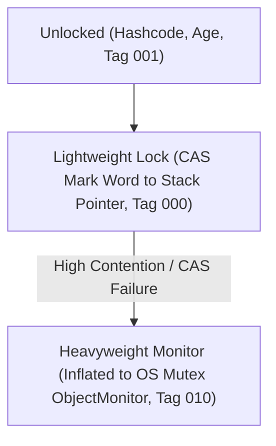
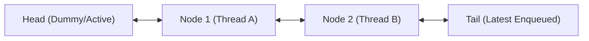
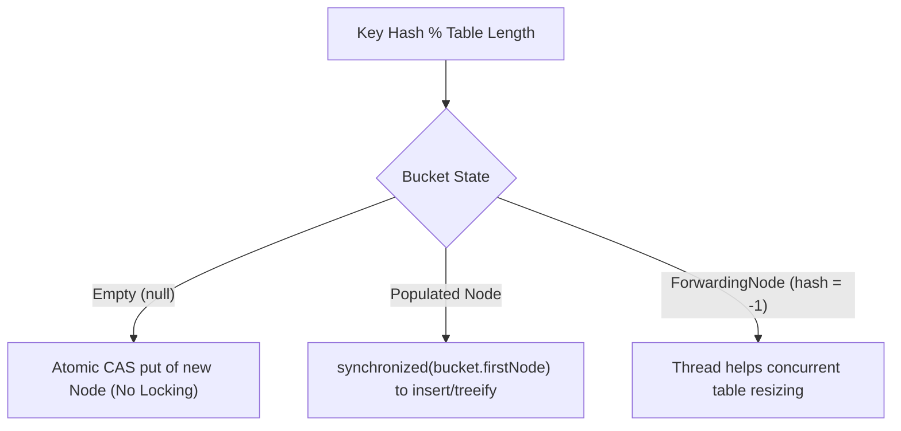
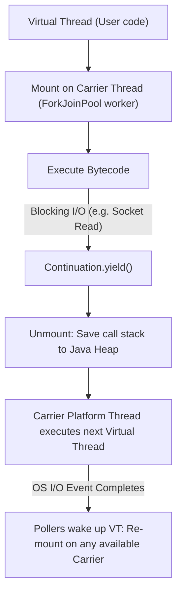

# Concurrency Internals

## 1. Intrinsic Monitors & Object Headers

Every Java object in the HotSpot JVM has an object header containing a **Mark Word** and a **Klass Word**.

The Mark Word encodes synchronization state across lock inflation tiers:

- **Lightweight Lock**: Uses CAS to write a pointer to the thread's execution stack frame (displaced mark word). If no contention exists, acquisition completes without OS kernel transitions.
- **Heavyweight Monitor (`ObjectMonitor`)**: When multiple threads contend for the lock, it inflates to an `ObjectMonitor` containing:
  - `_owner`: Pointer to the thread currently holding the monitor.
  - `_cxq`: Lock-free stack of newly contending threads.
  - `_EntryList`: Doubly-linked list of threads ready to acquire the lock.
  - `_WaitSet`: Circular doubly-linked list of threads that called `wait()`.

## 2. AbstractQueuedSynchronizer (AQS) Architecture

`ReentrantLock`, `Semaphore`, `CountDownLatch`, and `ReadWriteLock` are built on `java.util.concurrent.locks.AbstractQueuedSynchronizer`.

### Core Components:
1. **Volatile State (`state`)**: A 32-bit integer updated via CAS (`compareAndSetState`). For `ReentrantLock`, state represents lock hold count; for `Semaphore`, it represents available permits.
2. **CLH Wait Queue**: A FIFO doubly-linked list of waiting threads (`Node`).
3. **Parking**: Blocked threads are parked using `LockSupport.park(this)` and unparked by the preceding node when the lock is released.

## 3. Lock-Free CAS & Hardware Primitives

- **Compare-And-Swap (CAS)**: Executes the atomic CPU instruction `CMPXCHG`. If the memory location holds expected value $V$, update it to new value $V_{new}$; otherwise, fail without modifying memory.
- **Cache Coherency (MESI Protocol)**: CPU caches track line states (Modified, Exclusive, Shared, Invalid). `volatile` writes trigger memory barriers (`mfence` or `lock` prefix) flushing store buffers and invalidating remote L1/L2 caches.
- **False Sharing**: When independent variables updated by distinct threads reside on the same 64-byte cache line, modifying one forces continuous cache invalidations for the other. Resolved using `@jdk.internal.vm.annotation.Contended` padding (as in `LongAdder`).

## 4. ConcurrentHashMap Internals

Java 8+ `ConcurrentHashMap` abandons Segment-level locking in favor of fine-grained **Node-level synchronization**:

- **Empty Bins**: Insertions use lock-free `CAS` (`compareAndSetObject`).
- **Collisions**: Synchronizes only on the head node of that specific bin. Other bins remain completely lock-free for concurrent reads and writes.
- **Treeification**: When bin length exceeds 8 and total capacity $\ge 64$, bins convert to balanced red-black trees (`TreeBin`).

## 5. ForkJoinPool & Work-Stealing

`ForkJoinPool` distributes sub-tasks across worker threads using per-thread double-ended queues (`WorkQueue`):

- **Local Task Handling**: The worker thread pushes and pops sub-tasks from the **tail** of its own deque in LIFO order (optimizing CPU cache locality).
- **Work-Stealing**: When a worker exhausts its own queue, it steals tasks from the **head** (FIFO) of another randomly chosen worker's deque, minimizing contention with the owner.

## 6. Java 21 Virtual Thread Scheduler & Continuation Mechanism

Virtual threads decouple Java thread concurrency from OS kernel threads:

- **Continuation**: The JVM saves the virtual thread's execution frame to the heap upon blocking, freeing the underlying carrier OS thread to execute other virtual threads.
- **Pinning Mechanism**: If a virtual thread blocks while inside a native method or `synchronized` block, HotSpot cannot unmount the continuation frame, pinning the carrier thread and degrading throughput.

## Related

- [Concurrency Concepts](concepts.md)
- [Interview Questions](questions.md)
- [Solutions](solutions.md)
