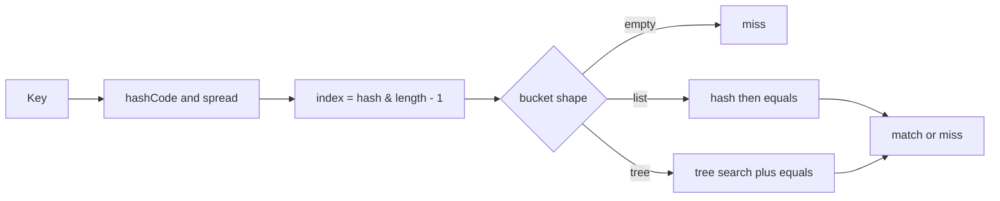
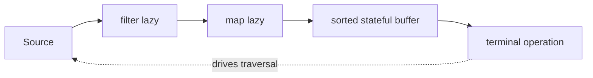

# Core Java Internals

## HashMap lookup

HashMap spreads high hash bits into low bits, then masks against a power-of-two table length. A
bucket is empty, a linked chain or a red-black tree. Candidate keys first compare hash, then identity
or `equals`. Resize redistributes nodes because the mask changes.

A long bucket can treeify around eight nodes only when the table is at least 64 entries; otherwise
HashMap prefers resize. A tree can return toward a list as collisions shrink. These are
implementation details, not API promises. Worst-case reasoning matters, but good key design matters
more than memorizing constants.

A key's insertion hash is not watched. Mutation changes the lookup bucket without relocating the
node—exactly the failure in the [mutable-key review](code-review.md#mutable-map-key).

## Equality dispatch

Record equality is final and component-based. For open classes, `instanceof` allows cross-subtype
comparison while `getClass()` restricts equality to one runtime class. Neither is universally right:
value types generally avoid open inheritance; persistence entities often need a carefully documented
identity policy that accounts for proxies and generated identifiers.

## Type erasure

The compiler checks generic constraints, inserts casts and erases most type arguments to their
bounds. It may generate bridge methods to preserve overriding after erasure. Consequences include:
no `new T()`, no `instanceof List<String>`, no generic arrays, and heap-pollution risk at raw or
varargs boundaries. Generic signatures remain in class metadata for reflection even though runtime
objects do not carry full reified arguments.

## Stream execution

Pipeline construction links stages; it does not traverse the source. The terminal operation builds
a sink chain and pulls elements through fused stateless stages. Stateful stages may buffer before
downstream processing. Short-circuiting propagates cancellation when the source supports it.

Parallel execution recursively splits a spliterator into ForkJoin tasks. Performance depends on
splitting cost, element cost, merge cost, ordering constraints and common-pool contention. Parallel
does not make stateful side effects thread-safe.

## String representation and pool

Since Java 9, String stores bytes plus a coder when content fits Latin-1, otherwise UTF-16 bytes.
This compact-string detail reduces many heaps but does not change the UTF-16-indexed public
contract. Literal strings are interned; `new String("x")` creates a distinct object despite equal
content. Immutability enables sharing, cached hashing and safe use as keys.

## ArrayList growth and iteration

ArrayList stores a contiguous object-reference array. Appending is amortized O(1): occasional growth
copies O(n) elements. Insertion/removal away from the end shifts a suffix. Iterators capture a
modification count and usually throw ConcurrentModificationException after structural interference;
this is best-effort detection, not synchronization.

## Try-with-resources translation

The compiler expands the construct into nested close logic that retains a primary exception and
calls `addSuppressed` for close failures. Close order is reverse declaration order. This explains why
manual `finally` code frequently loses the original cause or fails to close a later resource.

## Related

- [Concepts](concepts.md)
- [Mutable key issue](../../issues/data-consistency.md#mutable-key-after-hashmap-insertion)
- [Common-pool issue](../../issues/performance.md#blocking-io-in-the-common-forkjoinpool)
