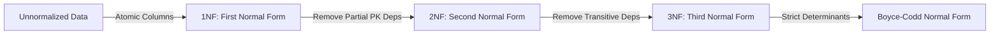
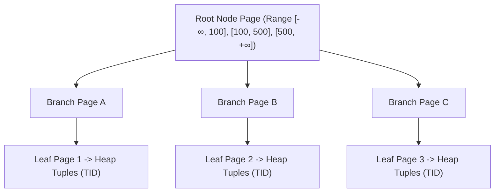
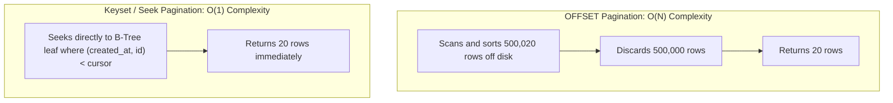

# Database / SQL Core Concepts

## 1. Relational Modeling and Normalization

Database normalization organizes relational schema to reduce data redundancy and eliminate update/delete anomalies while maintaining data integrity.



| Normal Form | Rule | Anomaly Eliminated |
|---|---|---|
| **1NF** | Every column must hold atomic (scalar) values; no repeating groups or arrays. | Redundant multi-value parsing. |
| **2NF** | In 1NF, and every non-key attribute is fully functionally dependent on the entire primary key (relevant for composite PKs). | Partial key update anomalies. |
| **3NF** | In 2NF, and no non-key attribute depends transitively on the primary key ($X \to Y \to Z$). | Transitive redundancy and update discrepancies. |
| **BCNF** | For every non-trivial functional dependency $X \to Y$, $X$ must be a superkey. | Overlapping candidate key anomalies. |

> [!TIP]
> **Intentional Denormalization:** While OLTP transactional schemas favor 3NF/BCNF, read-heavy reporting systems and high-throughput microservices selectively denormalize (e.g. duplicating `customer_name` onto `orders`) to eliminate multi-table joins.

---

## 2. B-Tree Indexing and Multi-Column Rules

A B-Tree (Balanced Tree) maintains sorted keys across fixed-size disk pages (8 KB in PostgreSQL), providing $O(\log N)$ search, insert, and delete complexity.



### The Leftmost Prefix Rule for Composite Indexes
When creating a composite index `(colA, colB, colC)`:
- Queries with `WHERE colA = ?` $\to$ **Uses Index**
- Queries with `WHERE colA = ? AND colB = ?` $\to$ **Uses Index**
- Queries with `WHERE colA = ? AND colB = ? AND colC = ?` $\to$ **Uses Index**
- Queries with `WHERE colB = ?` (without `colA`) $\to$ **Cannot use index directly for seek** (violates leftmost prefix rule)

### The Equality-Then-Range Index Design Rule
Structure multi-column indexes in three distinct stages:
1. **Equality columns first:** Columns matched with exact `=` filters (`tenant_id = :id`).
2. **Range or Sort columns second:** Columns evaluated via `<`, `>`, `BETWEEN`, or `ORDER BY` (`created_at DESC`).
3. **Payload / Covering columns third:** Columns fetched in `SELECT` using `INCLUDE (...)`.

---

## 3. Covering, Partial, and Functional Indexes

### Covering Index (Index-Only Scan)
A covering index contains all columns requested by a query, allowing the database to return results directly from the B-tree leaf pages without fetching table heap pages:
```sql
CREATE INDEX idx_orders_customer_covering ON orders(customer_id) INCLUDE (order_number, total_amount);
```

### Partial Index
Indexes only a filtered subset of rows matching a constant predicate, reducing disk space and write overhead:
```sql
-- Indexes only unfulfilled orders (e.g. 1% of total table volume)
CREATE INDEX idx_unfulfilled_orders ON orders(created_at) WHERE status IN ('PENDING', 'PROCESSING');
```

### Functional / Expression Index
Indexes computed expression results to support fast lookups on transformed columns:
```sql
CREATE INDEX idx_users_lower_email ON users(LOWER(email));
```

---

## 4. SQL Join Algorithms

When resolving joins (`INNER JOIN`, `LEFT OUTER JOIN`, `FULL JOIN`), the query planner chooses between three core physical algorithms:

| Join Algorithm | Mechanism | Best Suited For |
|---|---|---|
| **Nested Loop Join** | For each outer row, looks up matching inner rows via an index scan. | Small outer dataset with an indexed inner table. |
| **Hash Join** | Builds an in-memory hash table on the smaller relation, then scans the larger relation probing the hash table. | Medium/Large datasets with equality join predicates (`=`). |
| **Merge Join** | Both inputs are sorted on the join key, then scanned sequentially in parallel like a merge sort. | Large datasets where both inputs are already sorted (e.g. by B-tree index). |

---

## 5. ACID Properties and Isolation Levels

### ACID Guarantees:
- **Atomicity:** All modifications in a transaction are applied, or none are (enforced via WAL undo/redo records).
- **Consistency:** Database transitions only between valid states conforming to schema constraints, foreign keys, and unique checks.
- **Isolation:** Concurrent transactions execute without interfering with one another's intermediate state.
- **Durability:** Committed transactions survive system crashes or power outages (enforced via WAL `fsync` to persistent storage).

### Isolation Levels and ANSI SQL Anomalies:

| Isolation Level | Dirty Read | Non-Repeatable Read | Phantom Read | Write Skew |
|---|---|---|---|---|
| **READ UNCOMMITTED** | Possible *(not in PG)* | Possible | Possible | Possible |
| **READ COMMITTED** *(Default)* | **Prevented** | Possible | Possible | Possible |
| **REPEATABLE READ** | **Prevented** | **Prevented** | **Prevented in PG** | Possible |
| **SERIALIZABLE** | **Prevented** | **Prevented** | **Prevented** | **Prevented** |

---

## 6. Pagination Patterns: OFFSET vs Keyset



### Why Keyset Pagination Wins:
1. **Constant Execution Time:** Execution time is independent of page depth (page 1 and page 10,000 execute in $< 1\text{ms}$).
2. **Zero Drift:** Inserting new records while a user browses does not shift item positions or cause duplicate/missed entries.
