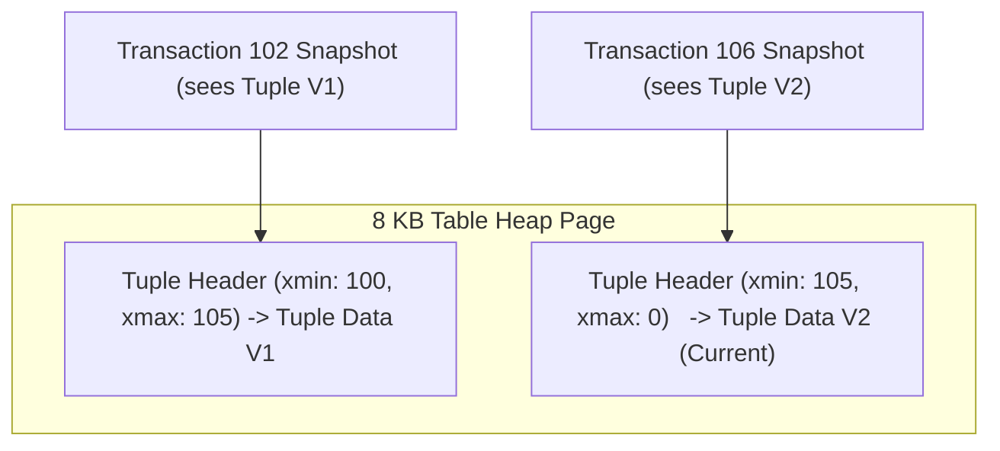
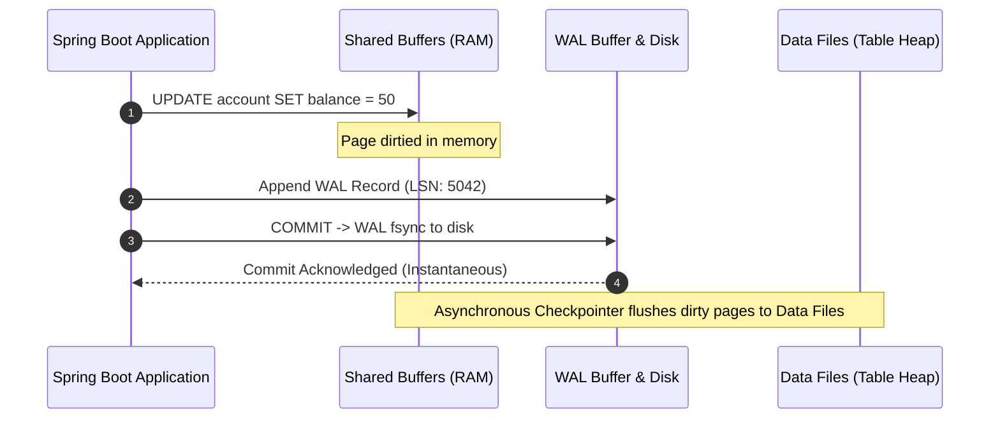
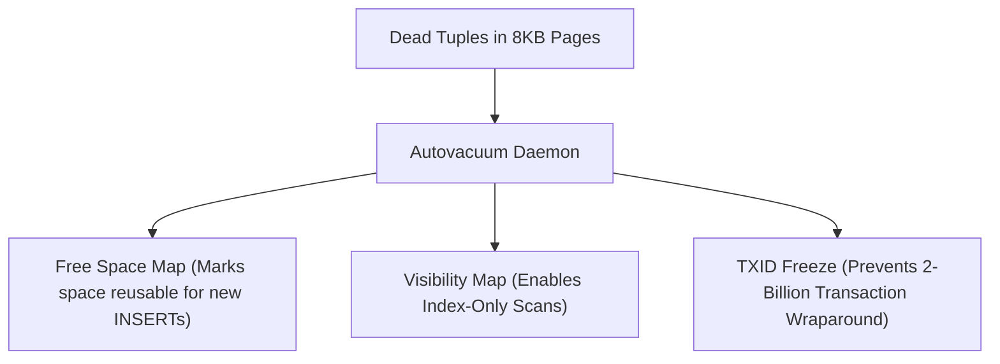
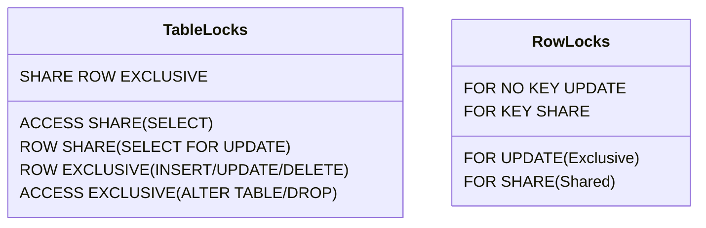

# Database / SQL Internals

## 1. PostgreSQL MVCC Architecture

PostgreSQL implements Multi-Version Concurrency Control (MVCC) to ensure **readers never block writers, and writers never block readers**.



### Tuple Header Metadata:
- **`xmin`:** The Transaction ID (TXID) of the transaction that inserted this tuple version.
- **`xmax`:** The TXID of the transaction that updated or deleted this tuple (or `0` if alive and unmodified).
- **`t_ctid`:** Physical pointer `(page_number, tuple_index)` pointing to the latest version of this row.

### Update Mechanism:
When an `UPDATE` executes, PostgreSQL does not modify the existing row in place. Instead, it:
1. Writes the new tuple version to the heap page with `xmin = current_txid` and `xmax = 0`.
2. Updates the old tuple's header setting `xmax = current_txid` and `t_ctid = pointer_to_new_tuple`.
3. Inserts new index entries pointing to the new tuple.

---

## 2. Write-Ahead Logging (WAL) and Buffer Management

To ensure Durability ($D$ in ACID) without forcing expensive random disk writes on every commit, PostgreSQL uses Write-Ahead Logging (WAL).



### Key Components:
1. **Shared Buffers:** In-memory cache of 8 KB database pages.
2. **WAL Writer:** Flushes sequential log records to disk upon transaction commit (`fsync`).
3. **Checkpointer:** Periodically writes dirtied pages from shared buffers to persistent table data files.

---

## 3. Autovacuum and Bloat Remediation

Because `UPDATE` and `DELETE` operations create obsolete tuple versions, dead tuples accumulate on disk.



### Table & Index Bloat:
- **Table Bloat:** Dead space inside table heap pages that cannot be returned to the OS.
- **Remediation:**
  - `REINDEX CONCURRENTLY index_name;` — Rebuilds indexes online with zero read/write locks.
  - `pg_repack` — Reorganizes entire tables online without locking table access.

---

## 4. Relational Lock Matrix

PostgreSQL manages concurrency using a multi-level locking hierarchy:



### Conflict Matrix:
- `ACCESS EXCLUSIVE` (acquired by `ALTER TABLE`, `DROP TABLE`, `VACUUM FULL`) blocks **all** queries, including basic `SELECT` statements.
- `SELECT ... FOR UPDATE` acquires a `ROW SHARE` table lock and an exclusive row lock on targeted rows.
- `SELECT ... FOR UPDATE SKIP LOCKED` instructs the engine to bypass currently locked rows and return only unlocked rows immediately, enabling lock-free distributed worker queues.

---

## 5. Decoding `EXPLAIN (ANALYZE, BUFFERS)`

Understanding query execution plans is essential for senior engineers:

```text
Bitmap Heap Scan on audit_logs  (cost=12.45..342.10 rows=45 width=128) (actual time=0.082..0.312 rows=50 loops=1)
  Recheck Cond: (tenant_id = 'acme'::text)
  Filter: (created_at >= '2026-01-01'::timestamptz)
  Buffers: shared hit=42 read=3
  ->  Bitmap Index Scan on idx_audit_tenant_created  (cost=0.00..12.44 rows=120) (actual time=0.045..0.045 rows=50 loops=1)
        Index Cond: (tenant_id = 'acme'::text)
        Buffers: shared hit=3
Planning Time: 0.150 ms
Execution Time: 0.354 ms
```

### Metrics Explained:
- `cost=12.45..342.10`: Estimated startup cost and total cost in arbitrary disk-page fetch units.
- `actual time=0.082..0.312`: Real clock time in milliseconds to return first and last rows.
- `shared hit=42`: 42 database pages (336 KB) were retrieved directly from RAM (`shared_buffers`).
- `read=3`: 3 database pages (24 KB) had to be read from physical disk storage.

---

## 6. HikariCP Connection Pool Sizing Formula

Configuring oversized database connection pools is a primary cause of production database CPU thrashing.

$$\text{connections} = ((\text{CPU Cores} \times 2) + \text{effective\_spindle\_count})$$

For an 8-core database server with SSD storage:

$$\text{pool size} = ((8 \times 2) + 1) = 17 \text{ connections}$$

> [!IMPORTANT]
> A pool of 17 connections handling requests quickly will yield higher transactions-per-second (TPS) than a pool of 300 connections competing for CPU time slices and disk bandwidth.
