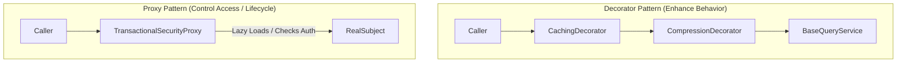
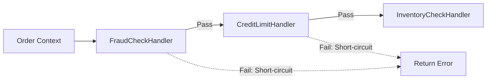
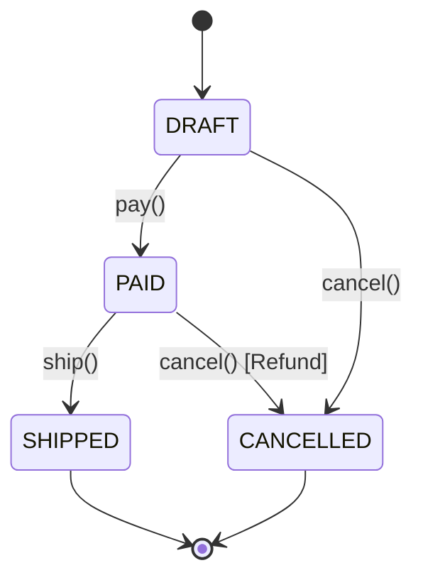

# Design Pattern Concepts & Trade-Offs

A deep exploration of the most critical design patterns in enterprise Java and Spring Boot. For each pattern: **Problem $\to$ Naive Approach $\to$ Pattern Solution $\to$ Spring / Modern Implementation $\to$ Trade-offs $\to$ When NOT to use**.

---

## 1. Strategy Pattern

### Problem & Naive Approach
A core algorithm varies based on runtime conditions (e.g. payment rails, routing channels, fee calculations). The naive approach uses an expanding procedural `switch (type)` or cascading `if/else` block. Every new payment rail forces modifications across multiple existing methods, violating the Open/Closed Principle and causing merge conflicts and regression hazards.

### Pattern Solution & Modern Spring Implementation
The **Strategy Pattern** extracts each variant into an independent class implementing a shared interface (`PaymentStrategy`).
In Spring Boot, strategies register as `@Component` beans. The coordinator injects `List<PaymentStrategy>`, populating an immutable registry map:

```mermaid
flowchart TD
    Client["Client / PaymentService"] --> Factory["PaymentStrategyFactory"]
    Factory -->|"Resolves Strategy"| Strategy["PaymentStrategy (Interface)"]
    Strategy <|.. Card["CreditCardPaymentStrategy"]
    Strategy <|.. PayPal["PayPalPaymentStrategy"]
    Strategy <|.. Crypto["CryptoPaymentStrategy"]
```

### Trade-offs & When NOT to use
- **Pros**: Full adherence to Open/Closed Principle; strategies can be unit tested in isolation without mocks; zero merge conflicts when adding new rails.
- **Cons**: Increases the total number of classes.
- **When NOT to use**: If there are only 2 static variants that will never change (e.g. `MALE`/`FEMALE`), a simple boolean or record method is vastly preferable to an entire strategy hierarchy.

---

## 2. Factory Method & Abstract Factory

### Problem & Naive Approach
Instantiating complex object graphs directly with `new` tightly couples the caller to concrete implementation classes. When product families or environment-specific implementations (e.g. Local vs AWS S3 storage clients) are needed, scattered `new` calls make swapping configurations impossible.

### Pattern Solution & Spring Integration
- **Factory Method**: Defines an interface method for creating an object, deferring instantiation to subclasses or Spring `@Bean` producer methods.
- **Abstract Factory**: Creates whole families of related or dependent objects without specifying their concrete classes (e.g. UI theme widgets or Cloud provider resources).

```java
@Configuration
public class StorageFactoryConfig {
    @Bean
    @ConditionalOnProperty(name = "storage.type", havingValue = "s3")
    public StorageClient s3StorageClient() {
        return new S3StorageClient();
    }

    @Bean
    @ConditionalOnProperty(name = "storage.type", havingValue = "local", matchIfMissing = true)
    public StorageClient localStorageClient() {
        return new LocalDiskStorageClient();
    }
}
```

### When NOT to use
Do not build abstract factory hierarchies when Spring's native Dependency Injection and `@ConditionalOn...` annotations already handle environment-specific bean instantiation.

---

## 3. Builder Pattern (with Invariant Validation)

### Problem & Naive Approach
Objects with more than 4–5 parameters suffer from the "telescoping constructor" anti-pattern:
```java
public User(String id, String name, String email, String phone, Address addr, boolean active, ...)
```
Callers easily transpose parameters of the same type (e.g. swapped `firstName` and `lastName`), and creating partially populated objects requires dozens of constructor overloads.

### Pattern Solution & Modern Java 21
The **Builder Pattern** provides a fluent API for parameter accumulation, culminating in a `build()` method that enforces multi-attribute invariants:

```java
User user = new User.Builder()
    .username("johndoe")
    .email("john@example.com")
    .creditLimit(new BigDecimal("500.00"))
    .build(); // Invariant validation happens here atomically!
```

### Trade-offs & When NOT to use
- **Pros**: Parameter clarity, immutable resulting objects, centralized invariant validation before instantiation.
- **When NOT to use**: For simple data-carrier DTOs with 2–3 fields, use Java 21 **records** instead. Do not build 50-line builders for 3-field records.

---

## 4. Adapter Pattern

### Problem & Naive Approach
An existing or third-party component provides necessary functionality, but its interface does not match what your domain core requires. The naive approach scatters vendor-specific conversion logic, data types, and status code checks directly throughout domain business services.

### Pattern Solution
The **Adapter Pattern** wraps the foreign adaptee class and implements the target domain port interface, translating signatures, types, and exceptions:

```mermaid
flowchart LR
    Domain["Domain Service"] -->|"Calls Port"| Port["PaymentGatewayPort<br/>(pay(accountId, amount))"]
    Port <|.. Adapter["LegacyVendorAdapter"]
    Adapter -->|"Translates & Calls"| Vendor["VendorSDKClient<br/>(makeDirectDebit(acct, cents))"]
```

### When NOT to use
Do not create adapters between two internal classes that you own and can freely refactor. The Adapter pattern is intended for bridging incompatible boundaries.

---

## 5. Decorator vs. Proxy Pattern

Both patterns wrap a target class and implement the same interface, but their **design intent** differs:



| Dimension | Decorator Pattern | Proxy Pattern |
|---|---|---|
| **Primary Intent** | Dynamically **adds responsibilities/behaviors** (caching, compression, encryption). | **Controls access, lifecycle, or remote boundaries** (lazy init, security, RPC). |
| **Creation** | Composed dynamically by the caller/factory; wraps other decorators recursively. | Usually creates or manages the real instance internally; transparent to caller. |
| **Spring Analogy** | Custom query caching wrappers, custom IO filter streams. | Spring AOP `@Transactional`, `@Async`, and `@PreAuthorize` dynamic proxies. |

---

## 6. Chain of Responsibility Pattern

### Problem & Naive Approach
A request must pass through multiple validation, fraud, or transformation steps. The naive approach bundles all rules into a single 500-line method full of nested `if` statements. Adding or reordering checks requires high-risk edits to monolithic validation code.

### Pattern Solution
The **Chain of Responsibility** decouples the sender from handlers by giving multiple objects a chance to handle the request. Handlers link in a pipeline; each handler processes the request and decides whether to forward it to `next.handle(context)` or short-circuit upon error:



---

## 7. State Pattern

### Problem & Naive Approach
Complex lifecycles (e.g. `Order: DRAFT -> PAID -> SHIPPED -> CANCELLED`) governed by nested flags (`boolean isPaid, boolean isShipped, boolean isCancelled`) result in error-prone conditional logic:
```java
if (isPaid && !isShipped && !isCancelled) { ... }
```
Invalid state combinations occur easily, and adding new states requires updating every lifecycle method.

### Pattern Solution
The **State Pattern** encapsulates state-specific behavior into dedicated classes implementing an `OrderState` interface. State transitions occur by re-assigning `context.setState(new NextState())`. Illegal transitions throw fast:



---

## 8. Specification Pattern

### Problem & Naive Approach
Domain filtering criteria (e.g. "Customer is adult, has active subscription, and no overdue balances") become duplicated across UI controllers, database queries, and batch jobs.

### Pattern Solution
The **Specification Pattern** encapsulates business rules into reusable objects that can be logically chained via `and()`, `or()`, and `not()`:
```java
Specification<Product> activePremium = inStockSpec.and(premiumSpec);
boolean eligible = activePremium.isSatisfiedBy(product);
```
In Spring Data JPA, `org.springframework.data.jpa.domain.Specification` leverages this pattern to construct dynamic Hibernate Criteria queries without SQL injection risk.

---

## 9. Template Method Pattern

### Problem & Naive Approach
Multiple algorithms share identical operational skeletons (e.g. initialize transaction $\to$ execute operation $\to$ commit $\to$ log metrics) with only minor variations in the execution step. Duplicating the boilerplate leads to forgotten log lines or mismatched transaction commit calls.

### Pattern Solution
The **Template Method Pattern** defines the skeleton of an algorithm in an abstract base class `final` method, deferring specific variant steps to abstract or hook methods overridden by subclasses:

```java
public abstract class DataMigrator {
    public final void runMigration() {
        connect();
        extract();
        transform();
        load();
        cleanup();
    }
    protected abstract void transform();
}
```
*Contrast with Strategy*: Template Method uses **inheritance** (fixed compile-time skeleton), whereas Strategy uses **composition** (interchangeable runtime behaviors).
