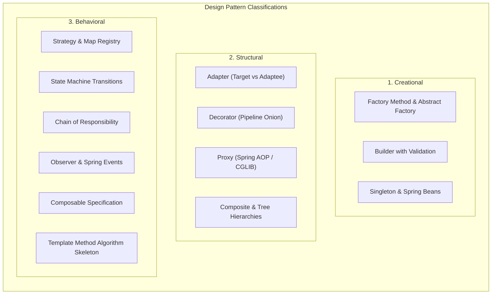

# Design Patterns in Modern Java & Spring

A production-grade engineering laboratory exploring behavioral, creational, and structural design patterns in modern Java 21 and Spring Boot, common anti-patterns, framework internals, and pragmatic trade-offs.

---

## 1. Overview & Modern Perspectives

Design patterns are reusable solutions to commonly occurring software engineering problems. In enterprise Java and Spring Boot ecosystems, patterns are not decorative boilerplate or dogma; they provide standardized architectural idioms for extensibility, decoupled integration, and maintainable domain workflows.

### The Java 21 Evolution
Modern Java has transformed how patterns are implemented:
- **Records**: Value Objects and DTOs replace verbose Builder patterns for simple data containers.
- **Sealed Types & Pattern Matching**: Replaces the classic **Visitor Pattern** and double-dispatch hierarchies with exhaustive, compile-time checked `switch` expressions.
- **Lambdas & Functional Interfaces**: Replaces single-method Strategy classes with lightweight lambda references (`Predicate<T>`, `Function<T, R>`).
- **Dependency Injection**: Spring's `@Component` container turns Factory and Registry lookups into clean constructor injection of `List<Strategy>`.

---

## 2. Core Engineering Invariants

1. **The Open/Closed Invariant (Strategy & Factory)**:
   - Business operations that vary by type (e.g. payment rails, tax rules, export formats) must not rely on procedural switch statements.
   - Adding a new variant must require authoring a single new class implementing an interface, with zero modifications to existing classes.
2. **The Decorator Onion Ordering Invariant**:
   - Cross-cutting decorators must be ordered intentionally.
   - Security authorization and rate limiting must wrap the outer edge of the onion; caching and storage adapters must live on the inner edge. A cache hit must *never* bypass authorization.
3. **The YAGNI / Anti-Over-Engineering Invariant**:
   - Patterns solve specific friction. Introducing Bridge, Factory, and Visitor abstractions for a trivial 3-line string transformation introduces accidental complexity and high cognitive load.
   - Keep code idiomatic and simple (KISS); refactor towards patterns only when varying requirements emerge.

---

## 3. Topic Navigation

| Section | Focus |
|---|---|
| [**Concepts**](concepts.md) | Deep dives into GoF patterns, Spring implementations, and trade-offs. |
| [**Internals**](internals.md) | Under-the-hood analysis: Spring AOP Proxies, `BeanPostProcessor`, and Event Multicaster. |
| [**Questions**](questions.md) | 23 interview questions spanning Basic, Intermediate, Senior, and Scenarios with code examples. |
| [**Code Review**](code-review.md) | 3 realistic pull-request reviews: switch-on-type, pattern over-engineering, decorator order bug. |
| [**Solutions**](solutions.md) | Production refactoring walkthroughs, sequence diagrams, and trade-off matrices. |
| [**Tests**](tests.md) | Unit testing patterns in isolation, verifying decorator order, and state machines. |
| [**Production**](production.md) | Incident post-mortems (The Cache-Leaked Secret, The Runaway Switch), diagnostics, and checklist. |
| [**Exercises**](exercises.md) | Hands-on refactoring exercises with solution guidance. |
