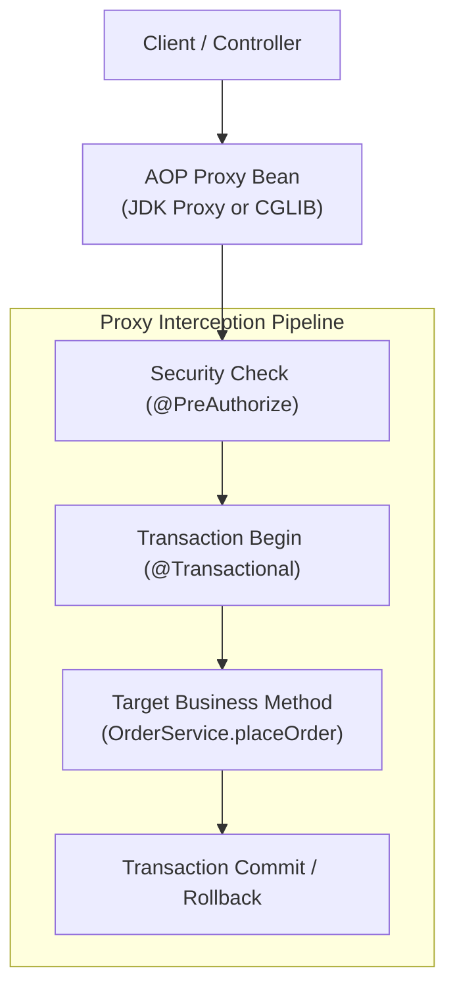
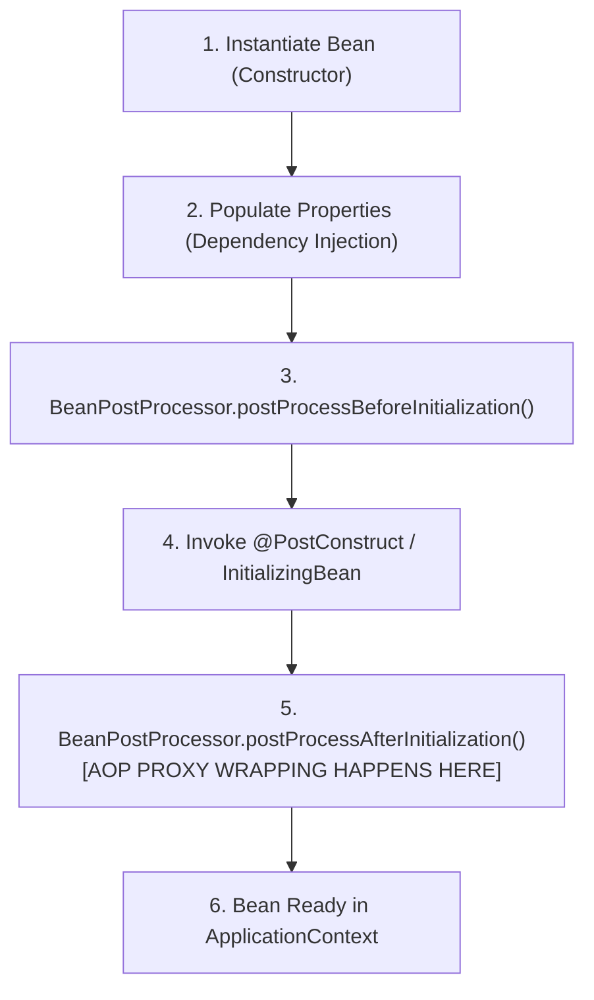
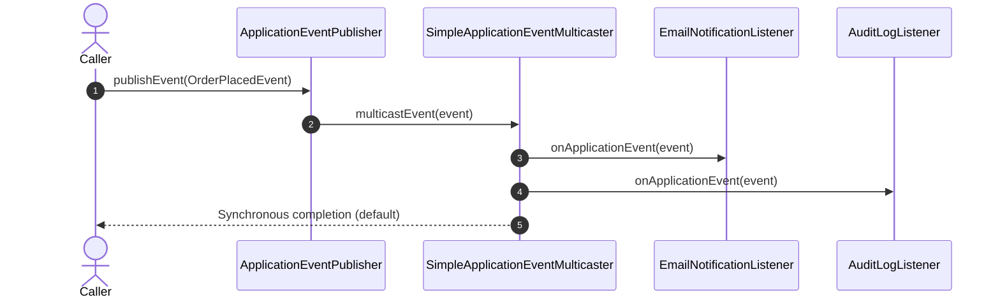
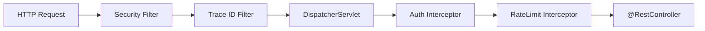

# Design Patterns in Spring Internals

How the Spring Framework leverages classic and enterprise design patterns under the hood to achieve non-invasive inversion of control, transaction management, and aspect-oriented programming.

---

## 1. The Proxy Pattern in Spring AOP

Spring's declarative enterprise capabilities (`@Transactional`, `@Async`, `@Cacheable`, `@PreAuthorize`) rely entirely on the **Dynamic Proxy Pattern**.



### JDK Dynamic Proxy vs. CGLIB Bytecode Proxy
Spring chooses between two proxy strategies:

| Dimension | JDK Dynamic Proxy (`java.lang.reflect.Proxy`) | CGLIB / ByteBuddy Proxy |
|---|---|---|
| **Mechanism** | Generates bytecode in memory implementing the target's interfaces. | Generates a dynamic subclass that overrides non-final methods. |
| **Requirements** | Target class **must implement at least one interface**. | Target class does not require interfaces, but **cannot be `final`**. |
| **Field Access** | Target fields cannot be accessed directly (interception via interface methods). | Target methods must not be `final`; constructor runs twice during proxying. |
| **Spring Boot Default** | Default in Spring Boot 1.x. | **Default in Spring Boot 2.x & 3.x** (`spring.aop.proxy-target-class=true`). |

### The Self-Invocation Gotcha
When method `A()` in class `OrderService` calls method `B()` in the same class:
```java
public void a() {
    b(); // Direct internal invocation bypassing proxy!
}

@Transactional
public void b() { ... }
```
Because the call is executed on `this` rather than through the Spring AOP proxy instance, the transactional interception advice is **never triggered**.

---

## 2. BeanPostProcessor: The Template Method & Proxy Factory

Spring's bean lifecycle is a masterclass in the **Template Method Pattern**. The `AbstractAutowireCapableBeanFactory` defines the fixed creation skeleton:



### Dynamic Proxy Substitution
In step 5 (`postProcessAfterInitialization`), classes like `AbstractAutoProxyCreator` inspect bean annotations. If `@Transactional` or `@Aspect` is detected, the original raw bean is wrapped in a dynamic proxy, and the **proxy reference** is returned to the container. All other beans inject the proxy, not the raw instance.

---

## 3. The Observer Pattern: ApplicationEventMulticaster

Spring implements the **Observer Pattern** through its event subsystem:
- **Subject**: `ApplicationEventPublisher`
- **Dispatcher**: `ApplicationEventMulticaster` (`SimpleApplicationEventMulticaster`)
- **Observer**: `ApplicationListener<E>` or `@EventListener` methods



### Internal Threading & Async Execution
By default, `SimpleApplicationEventMulticaster` executes listeners **synchronously on the caller's thread within the active database transaction**.
If a listener is annotated with `@Async` or if a `TaskExecutor` is configured on the multicaster, events are dispatched asynchronously to worker thread pools, converting in-process observer calls into non-blocking background jobs.

---

## 4. Chain of Responsibility: Servlet Filters & HandlerInterceptors

Spring Web MVC routes HTTP traffic through two distinct Chains of Responsibility:



1. **Servlet Filter Chain (`FilterChain`)**: Low-level HTTP envelope handling (security headers, CORS, TLS termination).
2. **Spring MVC HandlerInterceptor (`preHandle`, `postHandle`, `afterCompletion`)**: Application-level cross-cutting logic with full access to the resolved handler method metadata (`HandlerMethod`).
