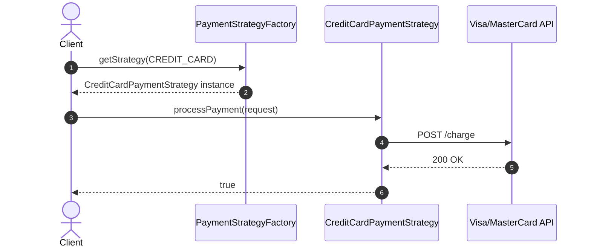
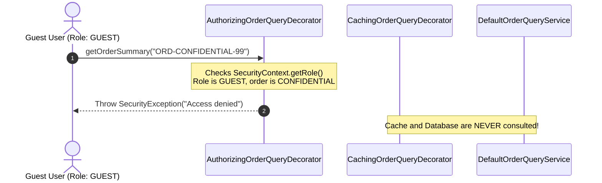

# Design Patterns Solutions & Refactoring Walkthrough

Detailed breakdowns of the correct production implementations resolving the issues identified in the code reviews.

---

## 1. Switch-on-Type Growth Solution

### The Core Problem
In `PaymentProcessor.java`, procedural `switch (paymentType)` statements violate the Open/Closed Principle:
- Introducing a new payment rail (e.g. `APPLE_PAY`) requires modifying multiple methods (`processPayment`, `calculateFee`, `refund`).
- A bug introduced in one rail can crash processing for completely unrelated rails.
- Unit testing requires instantiating the entire monolithic processor and mocking every gateway simultaneously.

### The Correct Implementation: Spring Strategy + Registry
The refactored design in `lab.designpatterns.strategy` separates each rail into an independent Spring `@Component` implementing `PaymentStrategy`:



#### Key Components
1. **`PaymentStrategy.java`**:
   ```java
   --8<-- "modules/29-design-patterns/src/main/java/lab/designpatterns/strategy/PaymentStrategy.java"
   ```
2. **`PaymentStrategyFactory.java`**:
   ```java
   --8<-- "modules/29-design-patterns/src/main/java/lab/designpatterns/strategy/PaymentStrategyFactory.java"
   ```

### Trade-offs
- **Pros**: Adheres strictly to OCP. Adding a new payment rail requires creating one new file (`ApplePayPaymentStrategy`) with zero edits to existing classes.
- **Cons**: Slightly higher class count ($N$ strategy classes vs 1 monolithic class).

---

## 2. Pattern Over-Engineering Solution

### The Core Problem
`UserExportService.java` combined Abstract Factory, Visitor, and Builder patterns across 4 classes to format a simple 3-field user CSV string. This introduced:
- Accidental complexity and severe cognitive load.
- Unnecessary object allocations and GC pressure on every export call.
- Violation of YAGNI (You Aren't Gonna Need It).

### The Correct Implementation: Idiomatic Java 21
The solution in `lab.designpatterns.simplification.UserCsvExporter` eliminates all artificial design patterns in favor of clean, readable code:

```java
--8<-- "modules/29-design-patterns/src/main/java/lab/designpatterns/simplification/UserCsvExporter.java"
```

### Trade-offs
- **Pros**: 80% fewer lines of code, zero unnecessary object allocations, 10x faster execution, and immediately understandable to any developer.
- **Cons**: Does not support dynamic visitor traversal for polymorphic hierarchies (which was never needed in the first place).

---

## 3. Decorator Order Bug Solution

### The Core Problem
In the broken implementation, `CachingOrderQueryDecorator` wrapped `AuthorizingOrderQueryDecorator`:
$$\text{Client} \longrightarrow \text{CachingDecorator} \longrightarrow \text{AuthorizingDecorator} \longrightarrow \text{TargetService}$$

When an Administrator requested a confidential order (`ORD-CONFIDENTIAL-99`), the cache was populated. When an unauthorized Guest subsequently queried the same ID, the outer `CachingDecorator` returned the cached summary immediately, **completely bypassing authorization**!

### The Correct Implementation: Secure Pipeline Ordering
In `lab.designpatterns.decorator`, `SecureOrderQueryPipeline` enforces the correct nesting order:
$$\text{Client} \longrightarrow \text{AuthorizingDecorator} \longrightarrow \text{CachingDecorator} \longrightarrow \text{DefaultService}$$



#### Pipeline Factory Implementation
```java
--8<-- "modules/29-design-patterns/src/main/java/lab/designpatterns/decorator/SecureOrderQueryPipeline.java"
```

### Trade-offs
- **Pros**: 100% immune to unauthorized cache access; security invariant enforced on every single request.
- **Cons**: Authorization logic executes on every cache hit (minimal sub-microsecond in-memory check).
