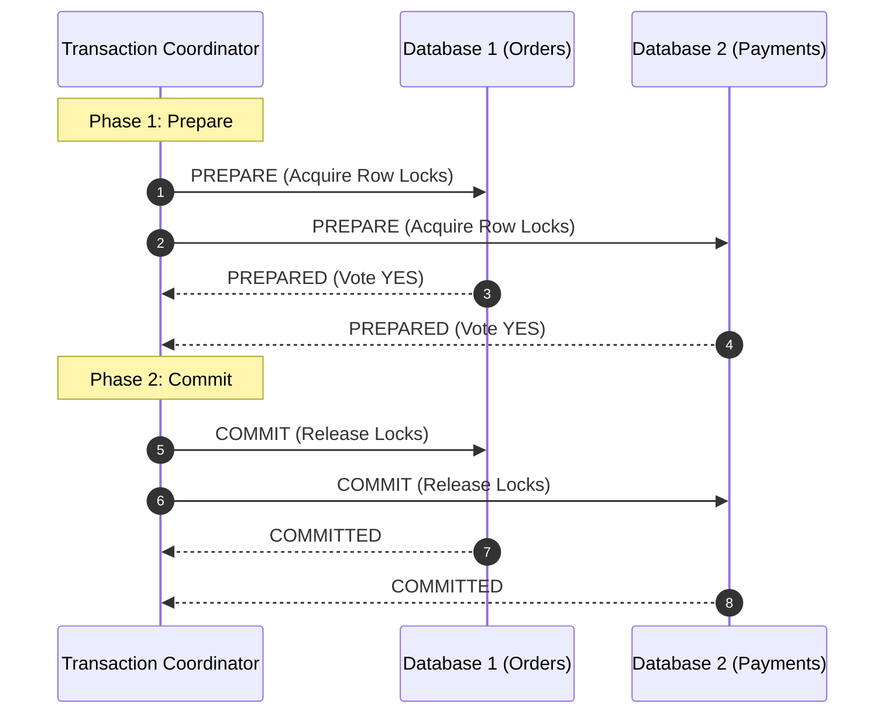
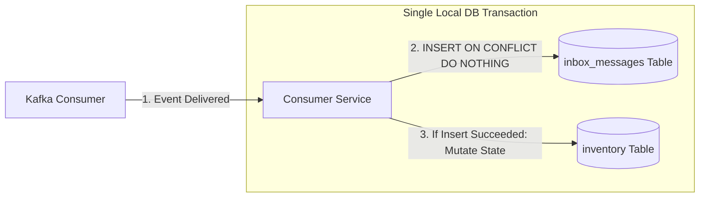

# Distributed Data Concepts

Modern cloud-native applications decompose relational monoliths into autonomous microservices. With separate databases, distributed systems face fundamental data coordination challenges.

## 1. The Fall of Two-Phase Commit (2PC)

Historically, distributed transactions relied on Two-Phase Commit (2PC / XA):



### Why 2PC Fails in Microservices
1. **The Blocking Problem**: If the coordinator crashes between Phase 1 and Phase 2, participant databases hold row and table locks indefinitely, blocking all other transactions.
2. **Availability Penalty (CAP Theorem)**: Under network partitions, if any single participant or network link is down, the entire transaction must abort. System availability becomes the product of all components ($A_{\text{total}} = A_1 \times A_2 \times \dots \times A_n$).
3. **Monolithic Lock Contention**: Network latency between cloud regions turns sub-millisecond database locks into multi-second distributed bottlenecks.

## 2. The Dual Write Problem

The most common data bug in distributed microservices is attempting to write to both a database and a message broker:

```mermaid
flowchart TD
    App["Application Code"]
    DB[("PostgreSQL DB")]
    Kafka[("Apache Kafka")]

    App -->|1. INSERT Order| DB
    App -->|2. kafkaTemplate.send()| Kafka

    subgraph FailureModes["Dual Write Failure Scenarios"]
        F1["Failure A: Kafka call throws exception.<br/>DB rolls back, but what if send() was async?"]
        F2["Failure B: Kafka send succeeds.<br/>Database commit fails! Phantom Kafka event emitted."]
        F3["Failure C: DB commits. Node crashes before Kafka call.<br/>Event lost forever."]
    end
```

Because an RDBMS commit and a network call to Kafka cannot share an atomic transaction boundary, one will inevitably succeed while the other fails, corrupting system consistency.

## 3. The Transactional Outbox Pattern

The Transactional Outbox solves the Dual Write dilemma by converting remote network calls into local database writes:

1. In the **same database transaction**, write the domain entity (`orders`) and insert an event payload into an `outbox_events` table.
2. If the transaction commits, **both** records persist atomically. If the transaction rolls back, **neither** persists.
3. An asynchronous background process (Outbox Publisher or CDC relay) reads the outbox table and dispatches messages to the broker.

### Polling Outbox vs Change Data Capture (CDC)
- **Polling Worker**: Executes periodic SQL queries (`SELECT FOR UPDATE SKIP LOCKED`). Simple to implement; introduces polling database load and slight latency ($100\text{ms} - 1\text{s}$).
- **Change Data Capture (Debezium)**: Tails the database Write-Ahead Log (PostgreSQL WAL / MySQL binlog) directly. Zero database query overhead and sub-millisecond publishing latency.

## 4. The Inbox Pattern & Idempotent Consumer

Because brokers deliver messages **at-least-once**, network timeouts and consumer rebalances guarantee that duplicate events will arrive. The Inbox Pattern ensures consumer idempotency:



If the event ID already exists in `inbox_messages`, the transaction skips business logic and safely acknowledges the message to Kafka.

## 5. The Saga Pattern

A Saga coordinates long-running business transactions spanning multiple microservices as a sequence of local transactions:
$$T_1, T_2, T_3, \dots, T_n$$
If step $T_i$ fails, the Saga executes compensating transactions in reverse order:
$$C_{i-1}, C_{i-2}, \dots, C_1$$

### Orchestration vs Choreography
- **Choreography**: Services publish events; other services listen and react. Decentralized and loosely coupled, but complex to monitor and prone to cyclical event loops.
- **Orchestration**: A central coordinator state machine explicitly invokes commands on participant services and manages compensation workflows. Easier to trace, monitor, and test.

### The Pivot Transaction
- **Compensatable Transactions**: Steps before the pivot that can be rolled back via compensating actions.
- **Pivot Transaction**: The point of no return (e.g. executing the credit card charge). Once the pivot commits, the Saga cannot be aborted.
- **Retryable Transactions**: Steps after the pivot (e.g. sending confirmation email). These must be guaranteed to succeed eventually through retries.
