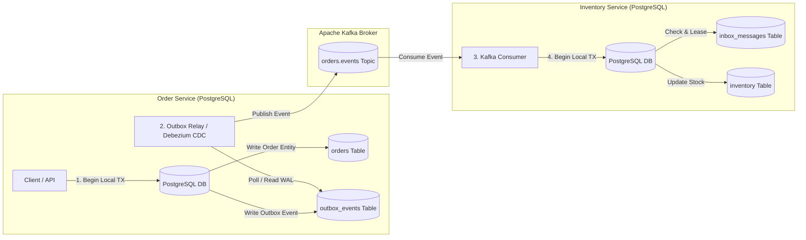

# Distributed Data Patterns

In microservice architectures, monolithic ACID database transactions cannot scale across decoupled network services
without devastating availability and latency penalties. Distributed Data Patterns provide the architectural blueprints
to manage consistency, state transitions, event publication, and duplicate detection across distributed nodes.

## Architectural Overview

The canonical distributed event publishing and processing lifecycle:

## Key Invariants

1. **Local Transaction Boundaries**: Microservices must never attempt Two-Phase Commit (2PC) or distributed XA transactions across network boundaries. State changes within a service must rely on local ACID transactions.
2. **Transactional Outbox for Event Publishing**: When a state mutation emits an asynchronous event, the business entity and the outbox event **must** be committed within the exact same local database transaction. Publishing directly to message brokers inside or after transactions causes the Dual Write problem.
3. **At-Least-Once Delivery Reality**: Message brokers and network transports guarantee at-least-once delivery, never exactly-once across end-to-end distributed boundaries.
4. **Idempotent Consumers via Inbox**: Consumers must implement atomic deduplication (the Inbox Pattern) backed by unique constraints (`message_id`, `consumer_group`) to detect and discard redelivered events without re-applying business side-effects.
5. **Idempotent Saga Compensations**: In distributed Sagas, compensating transactions (refunds, cancellations) can be redelivered. Compensations must be strictly idempotent to prevent catastrophic double-refunds or incorrect balance mutations.
6. **Explicit Pivot Transactions**: Sagas must clearly distinguish between compensatable transactions and the pivot transaction (the point of no return), after which all subsequent steps must be retryable forward to completion.

## Module Topics

| Section | Focus |
|---|---|
| [Concepts](concepts.md) | 2PC limitations, Dual Write problem, Transactional Outbox, CDC / Debezium, Inbox pattern, Saga orchestration vs choreography, eventual consistency |
| [Internals](internals.md) | Outbox SQL schemas, `SELECT FOR UPDATE SKIP LOCKED` mechanics, Debezium WAL replication slots, inbox deduplication indexes |
| [Interview Questions](questions.md) | 23 questions across 4 tiers: Basic, Intermediate, Senior, and Production Incident Scenarios |
| [Code Review](code-review.md) | 4 realistic broken review targets covering dual writes, non-idempotent compensations, missing inbox deduplication, and outbox PR hazards |
| [Solutions](solutions.md) | Production-grade implementations with rationale, trade-offs, and failure prevention analysis |
| [Tests](tests.md) | Mockito unit verification and Testcontainers PostgreSQL + Kafka end-to-end integration test suites |
| [Production](production.md) | Incident walkthroughs (Dual Write data loss, double compensation loops), outbox table lag monitoring, and production readiness checklist |
| [Exercises](exercises.md) | Hands-on exercises: Outbox Polling Worker with SKIP LOCKED and Idempotent Saga Step Coordinator |

## Related Modules

- [Kafka](../kafka/index.md) — Partitioning, producer durability (`acks=all`), and consumer commit modes
- [Spring Transactions](../spring-transactions/index.md) — Local ACID transaction boundaries and synchronization
- [Distributed Systems](../distributed-systems/index.md) — Partial failure, network partitions, and CAP theorem
