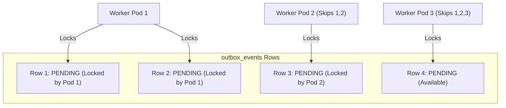
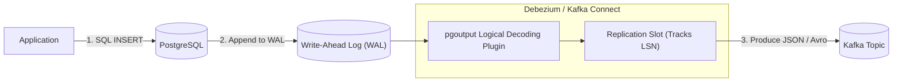

# Distributed Data Internals

Understanding internal locking mechanisms, WAL parsing engines, and deduplication indexes is vital for building robust data pipelines.

## 1. Outbox Table Schema & SKIP LOCKED Concurrency

When deploying multiple instances of an Outbox Publisher worker, naive queries (`SELECT * FROM outbox_events WHERE status = 'PENDING'`) result in lock contention, deadlocks, and duplicate processing.

### The PostgreSQL `FOR UPDATE SKIP LOCKED` Solution
In PostgreSQL and MySQL 8+, `FOR UPDATE SKIP LOCKED` allows workers to lock a batch of rows while skipping any rows currently locked by other concurrent transactions:

```sql
SELECT id, aggregate_type, aggregate_id, event_type, payload, status, created_at
FROM outbox_events
WHERE status = 'PENDING'
ORDER BY created_at ASC
LIMIT 50
FOR UPDATE SKIP LOCKED;
```



### Table Bloat & Partitioning
Continually inserting, updating, and deleting rows in the outbox table creates severe PostgreSQL MVCC dead-tuple bloat. 
**Production Best Practice**: Do not `DELETE` row-by-row. Instead:
1. Use declarative table partitioning by day: `CREATE TABLE outbox_events (...) PARTITION BY RANGE (created_at);`
2. Run a daily cron job that drops old partitions via DDL: `DROP TABLE outbox_events_2026_09_14;` (instant $O(1)$ disk reclamation without vacuum overhead).

## 2. Change Data Capture (CDC) with Debezium Internals

Change Data Capture (CDC) eliminates polling queries entirely by reading the database transaction log directly:



### Logical Decoding & Log Sequence Numbers (LSN)
- PostgreSQL's `pgoutput` plugin decodes physical WAL binary records into structured row change events (`op: 'c'` for create, `'u'` for update).
- The **Replication Slot** maintains a committed `confirmed_flush_lsn`. As Kafka acknowledges records, Debezium advances the LSN. If Debezium crashes, it resumes streaming exactly from the last unconfirmed LSN without missing a single database change.

## 3. Inbox Deduplication Index Mechanics

The Inbox Pattern relies on atomic relational constraints to ensure exactly-once side effects:

```sql
CREATE TABLE inbox_messages (
    message_id VARCHAR(64) NOT NULL,
    consumer_group VARCHAR(64) NOT NULL,
    processed_at TIMESTAMP WITH TIME ZONE NOT NULL,
    PRIMARY KEY (message_id, consumer_group)
);
```

### Atomic Lease Acquisition
```sql
INSERT INTO inbox_messages (message_id, consumer_group, processed_at)
VALUES ('evt-123', 'inventory-consumer', NOW())
ON CONFLICT (message_id, consumer_group) DO NOTHING;
```
- In PostgreSQL, `INSERT ... ON CONFLICT DO NOTHING` returns `UPDATE 1` if the row was successfully inserted (first delivery), or `UPDATE 0` if the unique key conflicted.
- This provides an atomic test-and-set primitive in a single round-trip without acquiring explicit row locks or risking race conditions across parallel threads.
