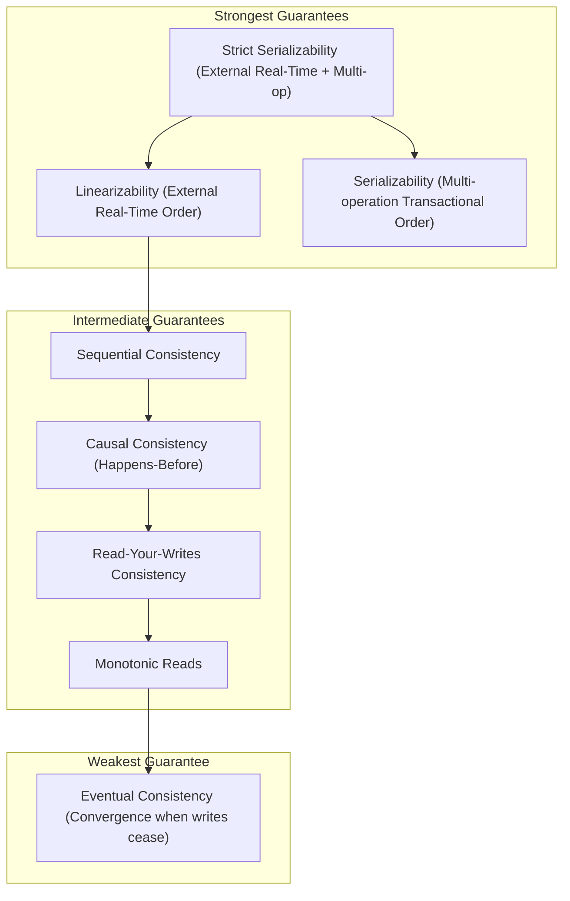
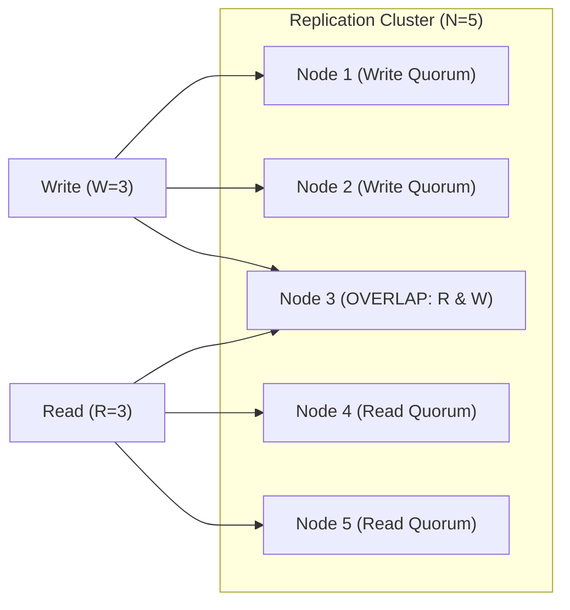
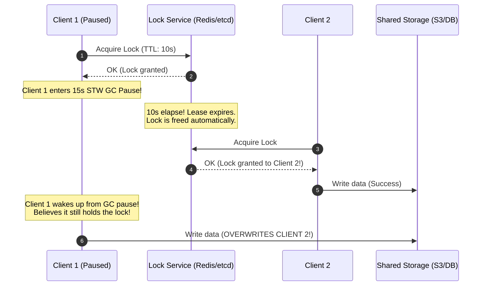

# Distributed Systems Concepts

Core theoretical foundations, theorems, consistency models, replication mechanisms, and consensus trade-offs.

---

## 1. Partial Failure and the Asynchronous Network

In single-process systems, components either execute or crash together. In distributed systems, the defining characteristic is **partial failure**: some nodes and network switches fail while others continue executing.

An asynchronous network provides:
- **No Upper Bound on Latency**: A packet may arrive in 2 milliseconds, 20 seconds, or never.
- **No Remote Crash Detection**: A sender cannot distinguish between a remote node crash, a dead network cable, a temporary GC pause, or extreme network buffer bloat.
- **Unreliable Clocks**: Each node has an independent crystal oscillator subject to physical thermal drift.

---

## 2. The CAP and PACELC Theorems

### The CAP Theorem (Brewer, Gilbert & Lynch)
In any distributed asynchronous data store, when a **Network Partition ($P$)** occurs, the system must choose between:
- **Consistency ($C$)**: Every read receives the most recent write or an error (Linearizability). To preserve consistency, the minority partition must refuse writes.
- **Availability ($A$)**: Every non-failing node returns a non-error response, but data may be stale or conflicting across partitions.

$$\text{You cannot choose CA when } P \text{ is a physical reality of networks.}$$

### The PACELC Theorem (Daniel Abadi)
The CAP theorem only describes behavior during a rare network partition. The **PACELC** theorem extends CAP to describe regular operation:

$$\text{If } \mathbf{P} \text{ (Partition), choose } \mathbf{A} \text{ or } \mathbf{C}; \quad \mathbf{E} \text{lse (Normal Operation), choose } \mathbf{L} \text{ (Latency) or } \mathbf{C} \text{ (Consistency).}$$

| System | Classification | Normal Operation Trade-off | Partition Behavior |
|---|---|---|---|
| **Cassandra / DynamoDB (eventual)** | **PA/EL** | Yields Consistency for ultra-low Latency | Yields Consistency for Availability |
| **HBase / Spanner / CockroachDB** | **PC/EC** | Yields Latency for strict Consistency | Yields Availability for Consistency |
| **MongoDB (default)** | **PA/EC** | Sacrifices Latency for Consistency | Yields Consistency for Availability |

---

## 3. The Consistency Spectrum



- **Linearizability**: A read is guaranteed to observe any write that completed in real wall-clock time prior to the start of the read. Behaves as if there is only a single copy of data in the universe.
- **Serializability**: Transactions execute concurrently such that the final state is equivalent to *some* serial execution order (does not impose a real-time ordering).
- **Causal Consistency**: Causally related operations (e.g. question $\to$ answer) are observed in the same order by all nodes; concurrent, unrelated operations can be observed in varying orders.
- **Eventual Consistency**: If no new updates are made, all replicas eventually converge to identical values. Provides zero guarantees about what a read returns at any specific instant.

---

## 4. Replication and Quorum Mathematics

To survive $F$ node failures in an $N$-node cluster without losing data or accepting conflicting writes:

$$\mathbf{R} + \mathbf{W} > \mathbf{N}$$

Where:
- $N$ = Total number of replicas
- $W$ = Number of replicas that must confirm a write before reporting success
- $R$ = Number of replicas that must be queried during a read



Because $W + R > N$, by the **Pigeonhole Principle**, the read set and write set must overlap by at least one node. The overlapping node (Node 3) holds the latest version, which the client selects via version vectors or timestamps.

---

## 5. Clocks and Ordering

### Physical Clocks and NTP Skew
Physical quartz clocks on server motherboards drift by milliseconds per day due to temperature fluctuations. Network Time Protocol (NTP) synchronizes clocks across the Internet, but:
- Network jitter limits NTP synchronization accuracy to 5–50 milliseconds across data centers.
- NTP step adjustments can jump time backward.
- **Last-Write-Wins (LWW)** based on `System.currentTimeMillis()` silently drops legitimate updates whenever clock skew exceeds write intervals.

### Logical Clocks
1. **Lamport Timestamps**: A monotonically increasing integer counter. Every process increments its local counter on each event. When sending a message, it attaches its counter; the recipient updates its counter to $\max(\text{local}, \text{received}) + 1$.
   - **Guarantees**: If event $A \to B$ ($A$ causally preceded $B$), then $L(A) < L(B)$.
   - **Limitation**: If $L(A) < L(B)$, you *cannot* conclude that $A$ caused $B$ (they might be concurrent).
2. **Vector Clocks**: Each node maintains an array (vector) of counters, one for every node in the cluster.
   - Enables determining whether two events are causally related or **concurrent** (requiring application-level conflict resolution).
3. **Hybrid Logical Clocks (HLC)**: Combines physical wall-clock time with a logical counter, bounding drift close to physical time while guaranteeing strict causal ordering.
4. **Google TrueTime**: Employs atomic clocks and GPS receivers in each data center to provide bounded time uncertainty: $[\text{now} - \epsilon, \text{now} + \epsilon]$ (where $\epsilon \approx 1-7\text{ ms}$). Spanner waits out the uncertainty interval ($2\epsilon$) before committing, achieving strict serializability globally.

---

## 6. Distributed Locking Pitfalls & Fencing Tokens

The industry-wide debate between Martin Kleppmann and Salvatore Sanfilippo (creator of Redlock) revealed that **mutual exclusion cannot be guaranteed by a distributed lock alone** when storage is decoupled from the lock service.

### The Client Pause Hazard
A client acquires a lock with a 10-second TTL. Immediately afterward, the client experiences a 15-second Stop-The-World (STW) garbage collection pause, hypervisor stall, or packet buffer delay.



### The Solution: Monotonic Fencing Tokens
The lock service must return a monotonically increasing integer token (fencing token) on every lock grant (e.g. 101, 102, 103). The storage service must verify that incoming writes carry a token higher than the latest recorded write:

```sql
UPDATE shared_resource
SET data = :payload,
    last_fencing_token = :token
WHERE resource_id = :id
  AND last_fencing_token < :token;
```

Client 1's write carries token `101`; Client 2's write carries token `102`. When Client 1 wakes up and attempts to write with token `101`, the storage layer rejects it because `101 < 102`.

---

## 7. Backpressure, Flow Control, and Load Shedding

When upstream production rate exceeds downstream processing capacity, unconstrained buffering leads to out-of-memory crashes.

- **Reactive Streams Backpressure**: The consumer explicitly signals demand to the publisher via `request(N)` tokens. The publisher only produces items when demand tokens are available.
- **TCP Flow Control**: The receiver advertises its available socket receive window (`rwnd`). If the application thread is slow, `rwnd` drops to 0, pausing the sender at the TCP level.
- **Load Shedding**: When queue depth or latency metrics breach SLA boundaries, the service proactively rejects excess requests with HTTP `503 Service Unavailable` or `429 Too Many Requests`, preserving responsiveness for active transactions.

---

## Related

- [Internals](internals.md)
- [Code Review](code-review.md)
- [Solutions](solutions.md)
- [Production](production.md)
- [Interview Questions](questions.md)
