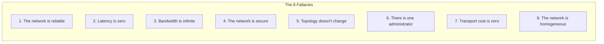
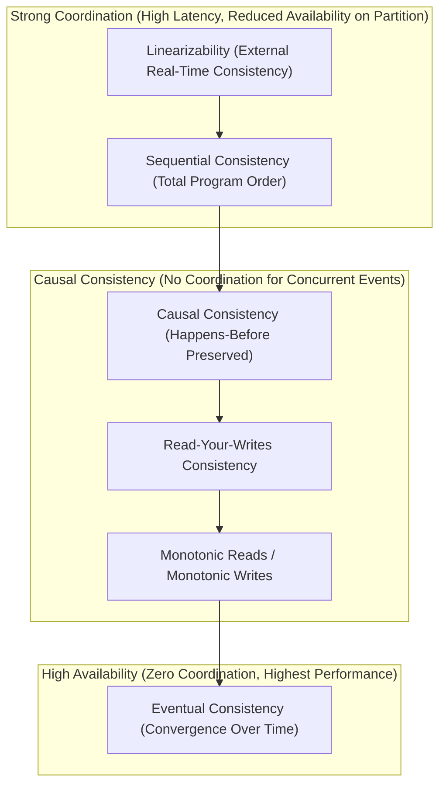

# Distributed Systems

A distributed system consists of autonomous computing nodes communicating over a shared network to coordinate actions and share state. While distributed architectures unlock horizontal scalability and fault tolerance, they introduce fundamental physics and computer science constraints: network partitions, independent clock drift, asynchronous message delivery, and partial failure.

This topic is a **doc module** exploring foundational distributed systems theory, consistency models, consensus mechanics, distributed locking hazards, and operational incident triage.

---

## The Eight Fallacies of Distributed Computing

Coined by L. Peter Deutsch and James Gosling at Sun Microsystems, these eight false assumptions lead to catastrophic software failures when architects treat remote network calls as local in-memory method invocations:

---

## The Consistency Spectrum

Consistency in distributed systems is not a binary switch; it is a spectrum of guarantees trading latency and availability for stronger coordination:

---

## Module Overview

| Resource | Purpose |
|---|---|
| [Concepts](concepts.md) | Fallacies, Partial Failure, CAP & PACELC, Consistency Models, Quorums, Clocks & Distributed Locking |
| [Internals](internals.md) | Quorum overlap proofs ($R + W > N$), Vector Clocks, Fencing Token validation, and 2PC blocking mechanics |
| [Interview Questions](questions.md) | 23 questions across Basic, Intermediate, Senior, and Incident Scenarios |
| [Code Review](code-review.md) | 3 architectural ADR & Design Document review targets with collapsed issue explanations |
| [Solutions](solutions.md) | Corrected architecture designs, fencing tokens, Hybrid Logical Clocks, and Saga orchestration |
| [Production](production.md) | Incident walkthroughs (The Fencing Token Incident), distributed telemetry, and production checklist |
| [Exercises](exercises.md) | Hands-on challenges: Vector Clock Causality Engine and Storage Fencing Token Validator |

---

## Related

- [AWS Messaging](../aws-messaging/index.md)
- [Kafka](../kafka/index.md)
- [RabbitMQ](../rabbitmq/index.md)
- [Architecture spec](../../spec/curriculum.md)
