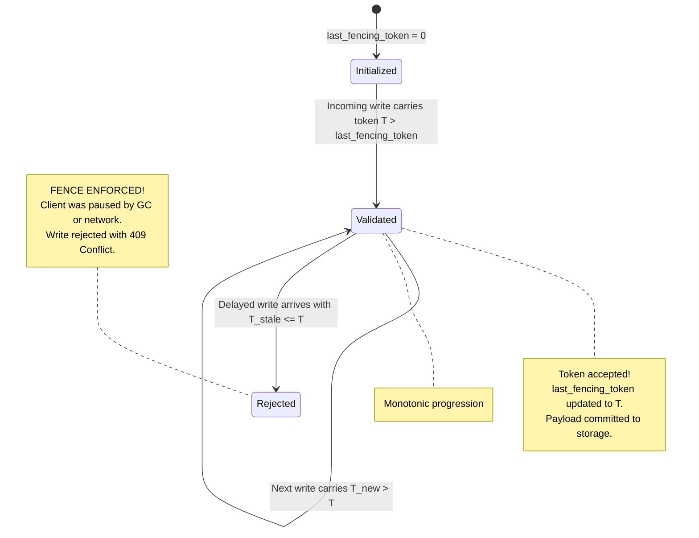
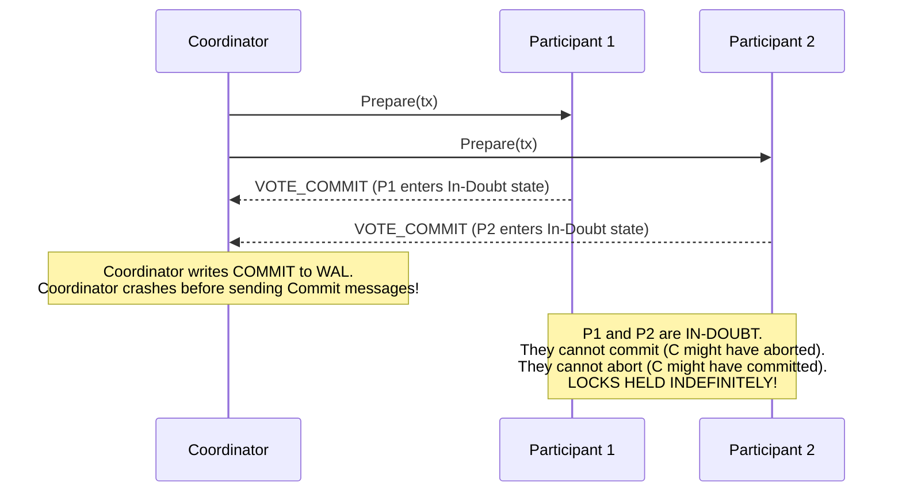

# Distributed Systems Internals

Mathematical proofs, state machines, consensus invariants, and causal vector algorithms.

---

## 1. Mathematical Proof of Quorum Overlap

In a replica group of $N$ nodes, let:
- $W \subseteq \{1, \dots, N\}$ be the write quorum such that $|W| = w$.
- $R \subseteq \{1, \dots, N\}$ be the read quorum such that $|R| = r$.

### Theorem
If $w + r > N$, then $W \cap R \neq \emptyset$.

### Proof by Contradiction
Assume $W \cap R = \emptyset$.
Then by the sum rule for disjoint sets:
$$|W \cup R| = |W| + |R| = w + r$$

Since both $W$ and $R$ are subsets of the entire cluster $S$ where $|S| = N$:
$$|W \cup R| \le N$$

Substituting the assumed disjoint sum:
$$w + r \le N$$

This directly contradicts the initial premise that $w + r > N$.
Therefore, $W \cap R \neq \emptyset$.

By the **Pigeonhole Principle**, at least one node belongs to both the write quorum and the read quorum. When paired with monotonic version numbers or version vectors, that overlapping node is guaranteed to return the latest committed state.

---

## 2. Vector Clock Causality Algorithm

A vector clock for a system of $n$ processes is an array of $n$ logical clocks:

$$V = [v_1, v_2, \dots, v_n]$$

Each process $P_i$ maintains local vector $V_i$.

### State Update Rules

1. **Local Event Rule**: Before process $P_i$ executes a local event:
   $$V_i[i] \leftarrow V_i[i] + 1$$
2. **Message Send Rule**: Process $P_i$ attaches its current vector $V_i$ to every outgoing message $m$.
3. **Message Receive Rule**: When process $P_j$ receives message $m$ containing vector $V_{\text{msg}}$:
   $$V_j[k] \leftarrow \max(V_j[k], V_{\text{msg}}[k]) \quad \forall k \in \{1, \dots, n\}$$
   $$V_j[j] \leftarrow V_j[j] + 1$$

### Causality Comparison Operator

For two vector timestamps $V_A$ and $V_B$:
- **$V_A \le V_B$ (Happened-Before)**:
  $$V_A[k] \le V_B[k] \quad \forall k \in \{1, \dots, n\}$$
- **$V_A < V_B$ (Strict Causality)**:
  $$V_A \le V_B \quad \text{and} \quad V_A \neq V_B$$
- **$V_A \parallel V_B$ (Concurrent / Conflict)**:
  $$\neg(V_A \le V_B) \quad \text{and} \quad \neg(V_B \le V_A)$$

When $V_A \parallel V_B$, the system detects an uncoordinated concurrent update that cannot be automatically ordered and triggers domain-specific conflict resolution (e.g. Git merge, Riak siblings, or CRDT join).

---

## 3. Fencing Token Storage-Layer State Machine

The storage boundary must enforce a monotonically increasing version gate to invalidate delayed requests from expired lock holders:

### Storage Invariant
$$\text{Commit}(token, data) \iff token > \text{last\_committed\_token}$$

This check must be executed atomically within the storage layer (via SQL `WHERE token > last_token`, DynamoDB `attribute_exists` conditional expression, or S3 conditional write headers).

---

## 4. Why Two-Phase Commit (2PC) Blocks on Coordinator Failure

Consider a 2PC execution with Coordinator $C$ and Participants $P_1, P_2$.

### The In-Doubt Impossibility Proof
1. In Phase 1, both $P_1$ and $P_2$ vote `VOTE_COMMIT`. By protocol definition, participants surrender autonomy: they may neither abort nor commit unilaterally.
2. The Coordinator decides `COMMIT` and records it in its local log, but immediately crashes before transmitting any `Commit` RPCs.
3. If $P_1$ and $P_2$ communicate among themselves:
   - Both know they voted `VOTE_COMMIT`.
   - Neither knows whether the Coordinator crashed before or after recording `COMMIT` in its local log, or whether it broadcast an `Abort` to an unreachable participant.
4. If $P_1$ unilaterally decides to abort to free its database locks, the recovered Coordinator might wake up and demand `COMMIT`, violating consistency.
5. If $P_1$ unilaterally commits, another participant might have timed out and aborted, violating atomicity.
6. **Conclusion**: Participants **must remain in the In-Doubt state holding locks indefinitely** until the coordinator recovers and reads its log, proving that 2PC is fundamentally an availability-destroying blocking protocol.

---

## Related

- [Concepts](concepts.md)
- [Code Review](code-review.md)
- [Solutions](solutions.md)
- [Production](production.md)
- [Interview Questions](questions.md)
