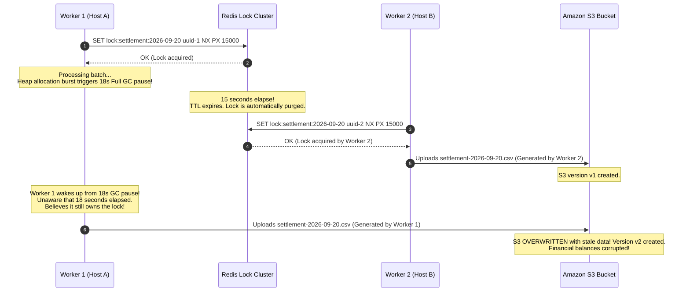

# Distributed Systems in Production

Operational failure scenarios, distributed diagnostics, telemetry metrics, incident runbooks, and production readiness for mission-critical distributed architectures.

---

## 1. Incident Walkthrough: The Fencing Token Split-Brain Corruption

### Incident Context
An automated financial reconciliation engine aggregates end-of-day bank settlement files and writes certified ledger balances to cloud object storage. To ensure only one worker processes a settlement batch at a time, workers acquire a distributed lock in Redis with a 15-second TTL (`SET lock:settlement:<date> <worker_id> NX PX 15000`).

### Failure Progression



### Diagnostic Investigation
1. **JVM Garbage Collection Logs**:
   ```text
   2026-09-20T23:59:12.104+0000: [GC (Allocation Failure) 
   [ZGC Phase: Pause Mark Start 1.204ms]
   [ZGC Phase: Pause Mark End (STW fallback due to out of memory thread stalling) 18452.312ms]
   User=12.45s Sys=1.02s Real=18.45s]
   ```
   Confirmed an 18.45-second Stop-The-World pause on Worker 1.
2. **S3 Object Versioning**:
   Inspecting S3 object metadata revealed two consecutive `PutObject` operations 3 seconds apart with different client IP addresses, proving dual concurrent writers.

### Root Cause
The distributed lock lease expired while the client was paused. The system relied on client-side time perception without server-side **fencing token** validation.

### Remediation
1. **Atomic Fencing Counter**: Modified lock acquisition to execute a Redis Lua script returning a monotonically increasing 64-bit integer token.
2. **Storage Gatekeeping**: Implemented a conditional check on the storage manifest:
   ```sql
   UPDATE settlement_manifest
   SET s3_uri = :uri,
       fencing_token = :token
   WHERE settlement_date = :date
     AND fencing_token < :token;
   ```
   When Worker 1 wakes up and attempts to commit with its stale token, the database rejects the write with `0 rows updated`, completely eliminating dual-writer corruption.

---

## 2. Distributed Telemetry and Alerting Metrics

Monitor these critical metrics to detect clock skew, split-brain conditions, and consensus degradation:

| Metric | Source | Severity | Alarm Condition | Operational Meaning |
|---|---|---|---|---|
| `node_timex_offset_seconds` | Node Exporter / NTP | **P1 (Critical)** | `abs(offset) > 0.05` ($> 50\text{ ms}$) | Severe physical clock drift; LWW and cache TTLs compromised |
| `raft_term_consecutive_elections` | Raft Consensus | **P1 (Critical)** | `> 3` elections in 60s | Network partition or unstable leader; consensus flap |
| `raft_peers_connected` | Consensus Engine | **P2 (Major)** | `< floor(N/2) + 1` | Quorum lost; cluster is read-only or partitioned |
| `http_client_p99_latency_seconds` | Micrometer | **P2 (Major)** | Spike beyond client timeout | Tail latency explosion; potential thread pool starvation |
| `jvm_gc_pause_seconds_max` | Micrometer / JVM | **P2 (Major)** | `> 5s` | Excessive GC pause; lock leases and heartbeats at risk |

---

## 3. Incident Runbooks

### Runbook 1: Clearing Stuck In-Doubt Transactions from a Crashed 2PC Coordinator

If a legacy Two-Phase Commit coordinator crashes during Phase 2, participant databases remain locked in an In-Doubt state.

1. **Identify In-Doubt Prepared Transactions**:
   ```sql
   -- PostgreSQL
   SELECT gid, prepared, owner, database FROM pg_prepared_xacts;
   ```
2. **Determine Outcome from Coordinator WAL**:
   Inspect the coordinator service disk logs or audit database to verify whether the global transaction was decided as `COMMIT` or `ABORT`.
3. **Manually Resolve In-Doubt Transactions**:
   ```sql
   -- If coordinator committed:
   COMMIT PREPARED 'tx_checkout_991823';

   -- If coordinator aborted or status unknown:
   ROLLBACK PREPARED 'tx_checkout_991823';
   ```

### Runbook 2: Resolving a Network Partition Split-Brain Cluster

If an alert fires indicating that a network partition has caused nodes to disagree on cluster leadership:

1. **Verify Quorum Majority**:
   Check cluster membership status across all availability zones:
   ```bash
   consul operator raft list-peers
   # or etcdctl endpoint status
   ```
2. **Isolate the Minority Group**:
   Ensure firewall rules or network ACLs prevent external client traffic from reaching the minority partition until the network partition heals.
3. **Trigger Controlled Leader Failover**:
   If the active leader is in a degraded partition, gracefully step down the leader to allow the majority partition to elect a healthy coordinator.

---

## 4. Production Readiness Checklist for Distributed Systems

- [ ] **Timeouts on Every Network Call**: Explicit connection (1–2s), socket/read (2–5s), and total execution timeouts configured on all HTTP/gRPC clients.
- [ ] **Fencing Tokens Implemented**: All distributed locks backed by monotonic fencing tokens verified atomically at the storage layer.
- [ ] **Idempotent Consumers**: Mutating APIs and event consumers enforce unique idempotency keys with atomic deduplication.
- [ ] **Bounded Retries with Jitter**: Exponential backoff configured with randomized full jitter to prevent thundering herd retry storms.
- [ ] **Strict Quorum Configuration**: Distributed databases configured with $R + W > N$ (e.g. $W=2, R=2, N=3$ or $W=3, R=3, N=5$).
- [ ] **NTP Synchronization Monitored**: Automated alarms configured on `node_timex_offset_seconds` across all nodes.
- [ ] **Load Shedding and Backpressure**: Services monitor queue depths and CPU utilization, proactively shedding load with HTTP 503 during overload.
- [ ] **Chaos Engineering Tested**: Network partition injection and latency injection regularly tested via Chaos Mesh or AWS Fault Injection Simulator.

---

## Related

- [Concepts](concepts.md)
- [Internals](internals.md)
- [Code Review](code-review.md)
- [Solutions](solutions.md)
- [Interview Questions](questions.md)
