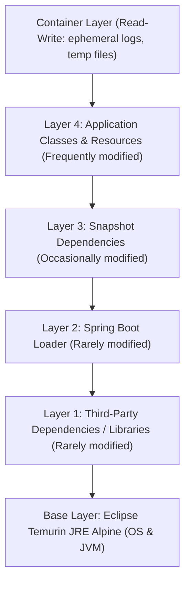
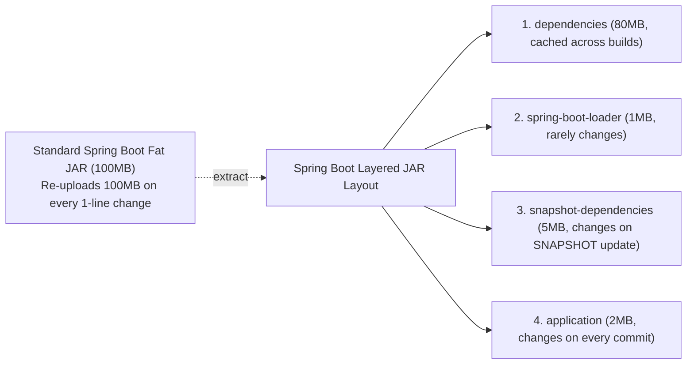
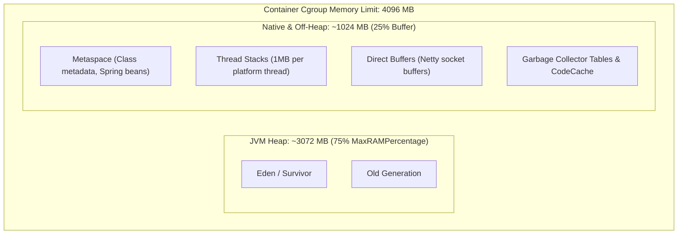
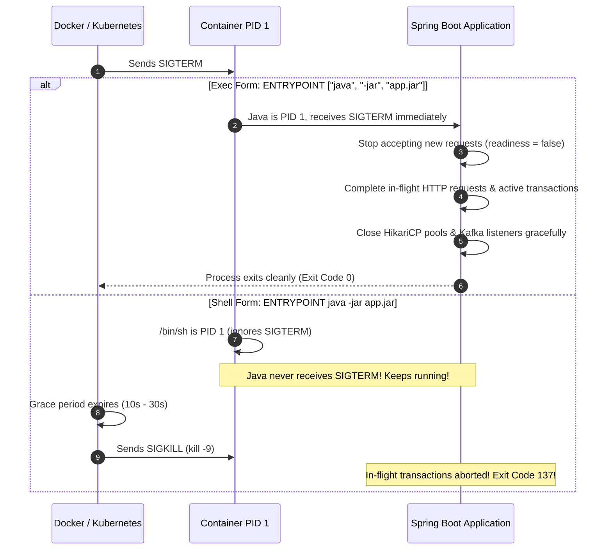

# Docker & Containerization Concepts

Docker packages an application and its runtime dependencies into a standardized container image. While containers share the host Linux kernel, they operate in isolated user spaces governed by Linux kernel primitives: namespaces, control groups (cgroups), and union file systems (overlay2).

---

## 1. Container Architecture & Filesystem Layers

A Docker image consists of a series of read-only layers stacked on top of each other. Each Dockerfile instruction (`FROM`, `COPY`, `RUN`) creates a new immutable layer.



### Storage Drivers & Copy-on-Write (CoW)

- **Union Filesystem (overlay2)**: Docker merges all underlying image layers into a unified view. When a container runs, Docker places a thin, mutable **container layer** on top.
- **Copy-on-Write**: If a container process attempts to modify a file from a lower read-only layer, overlay2 copies the file up into the writable container layer before modifying it.
- **Cache Optimization**: Docker caches layers based on instruction text and file hashes. If a layer changes, **all subsequent layers are invalidated**. Therefore, slow-changing instructions (installing packages, copying dependency manifests) must appear early, while fast-changing code (compiling application sources) must appear last.

---

## 2. Spring Boot Layered JARs (`layertools`)

Traditional fat JARs package everything—dependencies, loader classes, and application code—into a single large archive (often 50–100MB). Whenever a developer modifies a single line of Java code, the entire fat JAR is rebuilt, forcing Docker to invalidate its layer cache and re-upload the entire 100MB layer to the container registry.

Spring Boot layered JARs solve this by separating the JAR archive into distinct logical layers:



### Extracting Layers in Dockerfile

```dockerfile
# Extract layers from fat JAR
RUN java -Djarmode=layertools -jar app.jar extract

# Copy layers into final runtime image
COPY --from=builder /build/dependencies/ ./
COPY --from=builder /build/spring-boot-loader/ ./
COPY --from=builder /build/snapshot-dependencies/ ./
COPY --from=builder /build/application/ ./

# Launch using Spring Boot's JarLauncher
ENTRYPOINT ["java", "org.springframework.boot.loader.launch.JarLauncher"]
```

When code changes, only the tiny `application/` layer (~2MB) is invalidated and rebuilt. Registry pushes and Kubernetes image pull times drop from tens of seconds to sub-second durations.

---

## 3. JVM in Containers: cgroups & Memory Ergonomics

Historically (pre-Java 8u191 and Java 10), the JVM was unaware of container boundaries. `Runtime.getRuntime().maxMemory()` queried the host hardware's physical RAM rather than the container's cgroup memory limit. A JVM running in a 2GB container on a 64GB host assumed 64GB was available, allocating a default heap of 16GB (25% of 64GB) and triggering immediate kernel terminations.

Modern Java (Java 17 and Java 21) is fully container-aware and respects **cgroups v1 and cgroups v2**.

### The Total Memory Equation

Total container memory is **not** equal to heap size:

$$\text{Total Resident Memory (RSS)} = \text{Heap} + \text{Metaspace} + \text{Thread Stacks} + \text{Direct Byte Buffers} + \text{GC Structures} + \text{Code Cache} + \text{OS Overhead}$$



### Why `-Xmx` Should Be Replaced with `-XX:MaxRAMPercentage`

- **Hardcoded `-Xmx` Trap**: Setting `-Xmx3g` inside a container with a 3.5GB limit leaves only 500MB for native memory. High concurrency, Metaspace growth, or Netty direct buffers push total RSS beyond 3.5GB, causing the Linux kernel **Out-Of-Memory (OOM) Killer** to terminate the container (`Exit Code 137`).
- **Container Ergonomics Standard**:
  ```bash
  -XX:MaxRAMPercentage=75.0 -XX:InitialRAMPercentage=50.0
  ```
  This automatically calculates max heap as 75% of the container's cgroup limit (e.g. 3GB for a 4GB container, 6GB for an 8GB container), guaranteeing a proportional 25% safety margin for off-heap allocations across varying deployment sizes.

---

## 4. Container Security: Non-Root Execution

Running containers as `root` (UID 0) violates the **Principle of Least Privilege**:
- If an attacker discovers a Remote Code Execution (RCE) vulnerability (e.g. Log4Shell, Spring4Shell, insecure deserialization) in an application running as root, the attacker executes arbitrary shell commands with root privileges inside the container namespace.
- Root inside the container can inspect mounted secrets, install malicious binaries, access unprotected Docker socket mounts (`/var/run/docker.sock`), or exploit kernel vulnerabilities (e.g. Dirty COW, runc escapes) to gain root control of the host machine.

### Hardening Container User Identity

```dockerfile
# Create unprivileged system user and group
RUN addgroup -S appgroup && adduser -S appuser -G appgroup

# Ensure application files are owned by the unprivileged user
COPY --chown=appuser:appgroup app.jar .

# Switch away from root
USER appuser:appgroup
```

In Kubernetes, enforce non-root execution via Security Contexts:
```yaml
securityContext:
  runAsNonRoot: true
  runAsUser: 10001
  allowPrivilegeEscalation: false
  readOnlyRootFilesystem: true
```

---

## 5. Signal Handling: PID 1 & Graceful Shutdown

When Docker stops a container (`docker stop <id>`) or Kubernetes evicts a pod, the orchestrator issues a `SIGTERM` signal, granting a grace period (default 10 seconds in Docker, 30 seconds in Kubernetes) for the process to terminate cleanly. If the process does not terminate within the grace period, the kernel issues an uncatchable `SIGKILL` (`kill -9`).



### Shell Form vs Exec Form Entrypoints

- **Shell Form (`ENTRYPOINT java -jar app.jar`)**: Docker wraps the command in `/bin/sh -c "java -jar app.jar"`. The shell becomes PID 1. Standard shells do not forward signals to children, so the JVM never receives `SIGTERM`.
- **Exec Form (`ENTRYPOINT ["java", "-jar", "app.jar"]`)**: Java executes directly as PID 1, trapping `SIGTERM` and executing JVM shutdown hooks.

---

## 6. Docker Health Checks vs Kubernetes Probes

| Feature | Docker `HEALTHCHECK` | Kubernetes Liveness Probe | Kubernetes Readiness Probe |
|---|---|---|---|
| **Purpose** | Local daemon container health monitoring and Compose restart policies | Detects deadlocks or crashed processes requiring pod restart | Determines if pod is ready to accept incoming traffic |
| **Endpoint** | `/actuator/health/liveness` | `/actuator/health/liveness` | `/actuator/health/readiness` |
| **Failure Action** | Marks container `unhealthy` | Restarts container (`kubelet`) | Removes pod IP from Service `Endpoints` (no restart) |
| **Startup Phase** | `start-period` prevents premature failures | `startupProbe` disables liveness checks during startup | Fails until Spring context initialization completes |

In Docker Compose and standalone Docker environments, always define `HEALTHCHECK` to prevent traffic routing to half-booted containers:

```dockerfile
HEALTHCHECK --interval=10s --timeout=3s --start-period=30s --retries=3 \
  CMD wget --no-verbose --tries=1 --spider http://localhost:8080/actuator/health/liveness || exit 1
```
