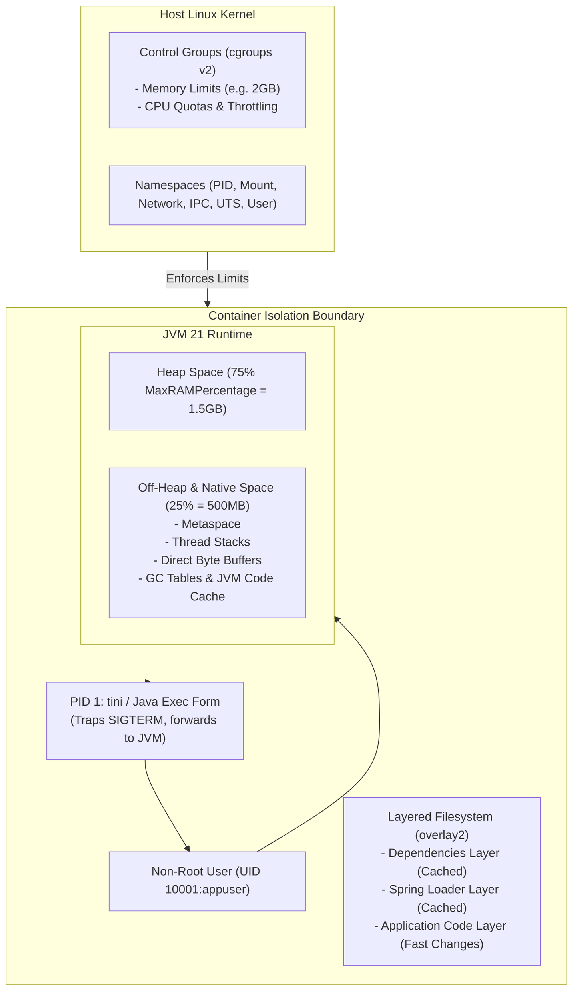

# Docker & Container Engineering

Containerizing enterprise Java applications requires understanding how the JVM interacts with Linux kernel namespaces, control groups (cgroups v1 and v2), copy-on-write storage drivers, and container orchestrators. A naive Dockerfile (`FROM openjdk` + `COPY . .`) creates gigabyte-sized images riddled with CVE vulnerabilities, risks sudden Linux Out-Of-Memory (OOM) killer terminations (`Exit Code 137`), drops active transactions during redeployments, and leaks build credentials.

This topic is a **doc module** exploring production Docker engineering for Java 21 and Spring Boot 3.5: image layering, multi-stage builds, Spring Boot layered JARs (`layertools`), JVM container ergonomics, non-root security boundaries, signal propagation for zero-downtime graceful shutdown, and container image scanning.

---

## The Container Architecture Blueprint

---

## Core Engineering Invariants

| Invariant | Operational Rationale | Senior Production Standard |
|---|---|---|
| **Multi-Stage Builds** | Exclude compilers (`javac`), build tools (Gradle/Maven), and source code from runtime images. | Use multi-stage builds with headless JRE or distroless base images, reducing image size from $>1\text{GB}$ to $<200\text{MB}$. |
| **Spring Layered JARs** | Prevent re-uploading unchanged third-party dependency jars on every application code change. | Extract layered JARs via `java -Djarmode=layertools -jar app.jar extract` and copy layers in order of change frequency. |
| **Non-Root Execution** | Prevent container breakout attacks and host system takeover upon Remote Code Execution (RCE). | Create dedicated system user/group (`appuser:appgroup` / UID 10001); never run containers as `root` (UID 0). |
| **Container JVM Ergonomics** | Prevent Linux kernel OOM Killer termination (`Exit Code 137`) by aligning JVM memory with cgroup constraints. | Avoid static `-Xmx`; use `-XX:MaxRAMPercentage=75.0` (or 70.0) to leave 25–30% container memory for off-heap native overhead. |
| **Exec Form Entrypoint** | Enable graceful shutdown by ensuring the JVM runs as PID 1 to receive `SIGTERM` directly. | Use JSON array exec syntax `ENTRYPOINT ["java", "-jar", "app.jar"]`; never use shell string syntax `ENTRYPOINT java -jar app.jar`. |
| **Zero Secrets in Layers** | Prevent credential leakage via `docker history` or registry inspection. | Never use `ARG` or `ENV` for passwords; use BuildKit `--mount=type=secret` during build and inject runtime secrets via Kubernetes/AWS. |

---

## Module Overview

| Resource | Purpose |
|---|---|
| [Concepts](concepts.md) | Image layers, overlay2, cgroups v1 vs v2, JVM ergonomics, non-root security, signal propagation, and Cloud Native Buildpacks |
| [Internals](internals.md) | cgroup memory limits calculation, Linux OOM killer mechanics, signal handling in PID 1, and Spring Boot `layertools` layer layout |
| [Interview Questions](questions.md) | 23 questions across Basic, Intermediate, Senior, and Production Incident Scenarios |
| [Code Review](code-review.md) | 4 architectural Dockerfile & Compose review targets with collapsible issue reveals |
| [Solutions](solutions.md) | Production-grade multi-stage Dockerfiles, cgroup-aware Compose specs, and BuildKit secret mounts with trade-offs |
| [Production](production.md) | Incident walkthroughs (The Mysterious Exit Code 137, The Zombie Shell Shutdown), telemetry, and production checklist |
| [Exercises](exercises.md) | Hands-on challenges: Writing an optimized Spring Boot layered Dockerfile & Container CVE scanning with Trivy |

---

## Related

- [JVM & Performance](../jvm/index.md) — Heap sizing, Metaspace, GC tuning, and Native Memory Tracking
- [Spring Boot](../spring-boot/index.md) — Actuator health indicators and graceful shutdown configuration
- [Observability](../observability/index.md) — Container metrics and structured logging
- [Reliability issue catalogue](../../issues/reliability.md)
- [Curriculum spec](../../spec/curriculum.md)
