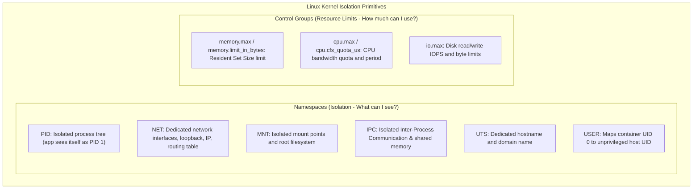
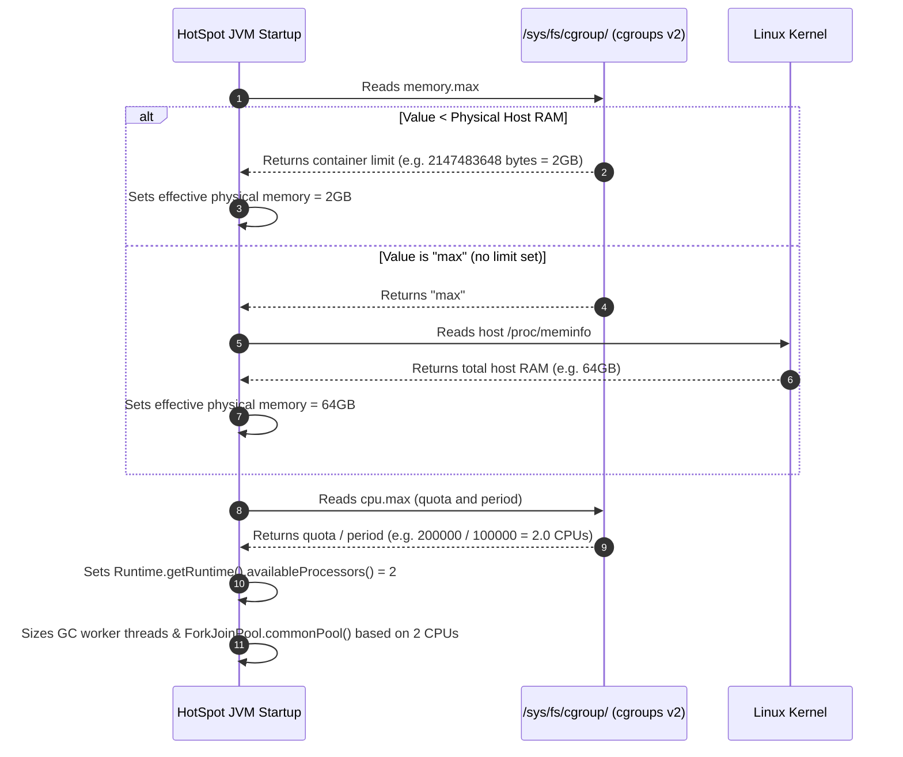
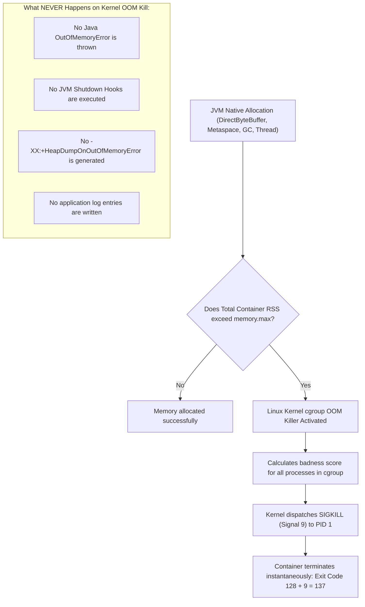
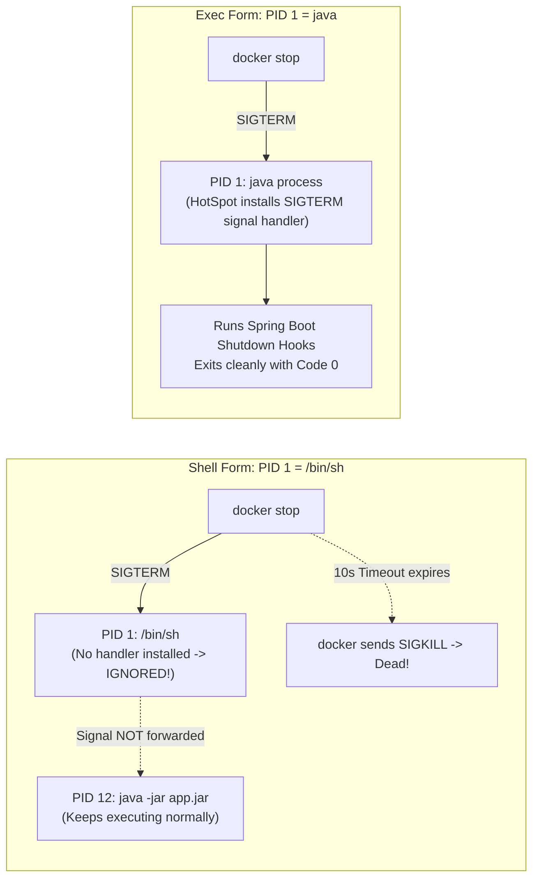

# Docker Internals

Deep dive into the Linux kernel mechanics, control groups, signal traps, and storage drivers that power Docker containers running the HotSpot JVM.

---

## 1. Linux Kernel Namespaces & cgroups

Containers are not virtual machines; they are standard Linux processes isolated by kernel **namespaces** and constrained by **control groups (cgroups)**.



### cgroups v1 vs cgroups v2

Modern Linux distributions (RHEL 9, Ubuntu 22.04+, Debian 11+, Amazon Linux 2023) use **cgroups v2** (unified hierarchy):

| Dimension | cgroups v1 | cgroups v2 |
|---|---|---|
| **Hierarchy** | Multiple orthogonal hierarchies per controller (`/sys/fs/cgroup/memory`, `/sys/fs/cgroup/cpu`) | Single unified hierarchy (`/sys/fs/cgroup/`) |
| **Memory File** | `/sys/fs/cgroup/memory/memory.limit_in_bytes` | `/sys/fs/cgroup/memory.max` |
| **Memory Pressure** | Separate swap accounting, coarse notifications | Integrated memory pressure stall metrics (`memory.pressure`) |
| **JVM Support** | Java 8u191+, Java 10+ | Java 11.0.16+, Java 17+, Java 21+ |

---

## 2. JVM Container Awareness & Ergonomics Calculation

When the HotSpot JVM boots up inside a Linux container, `osContainer_linux.cpp` queries the filesystem to inspect cgroup parameters:



### JVM Flags for Container Sizing

To inspect how the JVM calculates its boundaries:

```bash
# Print container detection and ergonomics calculation:
java -XshowSettings:system -version

# Print calculated heap sizes:
java -XX:+PrintFlagsFinal -version | grep -E "MaxHeapSize|InitialHeapSize"
```

Default sizing without flags:
- Max Heap (`MaxRAMPercentage`): defaults to **25%** of available memory.
- If a container is given 2GB of RAM, default max heap is only **500MB**!
- Explicitly set `-XX:MaxRAMPercentage=75.0` to utilize 1.5GB of the 2GB container limit for heap.

---

## 3. The Anatomy of Linux OOM Killer (Exit Code 137)

When a container exceeds its cgroup memory limit (`memory.max`), the Linux kernel does not allow memory allocation to fail with an error; it invokes the **Out-Of-Memory (OOM) Killer**.



### How to Confirm an OOM Kill

Since the JVM cannot log its own death, inspect host and container kernel logs:

```bash
# Docker:
docker inspect <container-id> --format '{{.State.OOMKilled}}' # returns: true
docker inspect <container-id> --format '{{.State.ExitCode}}'   # returns: 137

# Linux Kernel dmesg:
dmesg -T | grep -i oom
# Outputs: Memory cgroup out of memory: Killed process 41258 (java) total-vm:4582100kB, anon-rss:2096128kB
```

---

## 4. PID 1, Zombie Reaping, and Signal Trapping

In Unix-like systems, **PID 1** (`init` or `systemd`) has two special responsibilities:
1. **Adopting and Reaping Orphan Processes**: When a child process terminates, it becomes a "zombie" (`<defunct>`) until its parent calls `wait()` or `waitpid()`. If the parent dies, PID 1 adopts the child and reaps its exit status. Without a proper PID 1, zombie processes accumulate and exhaust the host OS process table (`PID limit reached`).
2. **Signal Handling**: By default, the Linux kernel protects PID 1 from unintended termination. Unlike ordinary processes, PID 1 **ignores all signals** for which it has not installed an explicit signal handler.



### The Role of `tini` / `dumb-init`

If a container must run bash scripts, background processes, or profiling agents alongside Java, wrapping the entrypoint in `tini` provides guaranteed signal forwarding and zombie reaping:

```dockerfile
# Install tini in Alpine
RUN apk add --no-cache tini
ENTRYPOINT ["/sbin/tini", "--", "java", "-jar", "app.jar"]
```

---

## 5. Overlay2 Storage Driver Internals

Docker's `overlay2` storage driver implements union mounts using Linux kernel overlayfs:

```text
/var/lib/docker/overlay2/
├── <layer-id-1>/diff/       ← Read-only base JRE layer
├── <layer-id-2>/diff/       ← Read-only dependency layer
├── <layer-id-3>/diff/       ← Read-only application code layer
├── <container-id>/
│   ├── diff/               ← UpperDir: Mutable container layer (writes happen here)
│   ├── work/               ← WorkDir: Internal staging for copy-on-write
│   └── merged/             ← MergedDir: Unified view mounted to container /
```

- When the application creates or appends to a file, it is written exclusively to `UpperDir`.
- Deleting a file from a lower layer creates a special **whiteout device file** (`c 0 0`) in `UpperDir`, masking the file from the merged view without altering the underlying immutable layer.
- **Production Tip**: Never write high-throughput application logs or persistent database files to the container layer (`UpperDir`). The copy-on-write overhead degrades disk I/O performance; always mount Docker **volumes** or bind mounts for database data and logs.
