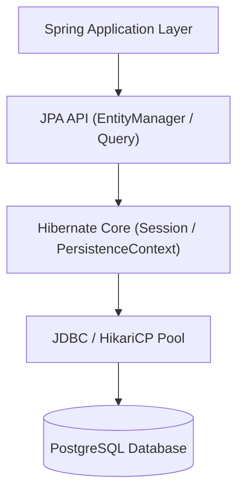
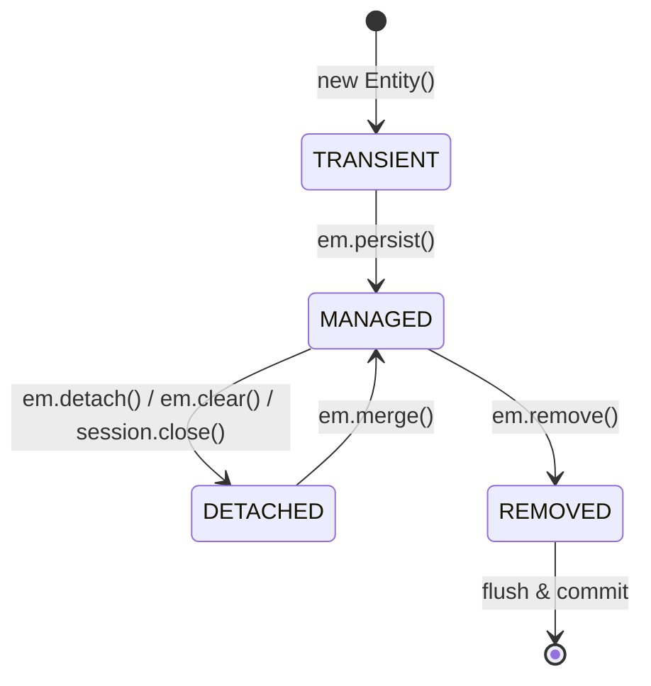

# JPA / Hibernate Core Concepts

## Overview

Jakarta Persistence (JPA) is the standard Java specification for object-relational mapping (ORM), defining interfaces such as `EntityManager`, `EntityManagerFactory`, `EntityTransaction`, and annotations (`@Entity`, `@Table`, `@Id`). Hibernate ORM is the industry-standard implementation of this specification, providing extensions such as `Session`, `StatelessSession`, second-level caching, and bytecode enhancements.



---

## 1. Entity Lifecycle States

An entity instance in JPA exists in one of four distinct states with respect to the `PersistenceContext`:



| State | DB Identity | Tracked by PersistenceContext | Dirty Checking | Description |
|---|---|---|---|---|
| **Transient** | No (usually `null`) | No | No | Freshly instantiated in memory using `new`. Has no database representation. |
| **Managed** | Yes | Yes | Yes | Associated with an active `EntityManager` session. Any mutation to fields is automatically synchronized to the DB upon flush. |
| **Detached** | Yes | No | No | Was once managed, but its `EntityManager` was closed, cleared (`em.clear()`), or detached (`em.detach()`). Mutations are ignored unless reattached via `em.merge()`. |
| **Removed** | Yes | Yes (marked) | Scheduled | Marked for deletion via `em.remove()`. SQL `DELETE` is issued during flush. |

---

## 2. Primary Key Generation Strategies

Configured via `@GeneratedValue(strategy = GenerationType...)`:

| Strategy | Mechanism | JDBC Batching Support | Best Used For |
|---|---|---|---|
| **`IDENTITY`** | Uses DB auto-increment column (e.g. `SERIAL` / `BIGSERIAL`). Requires immediate SQL `INSERT` on `em.persist()` to fetch the ID. | **No** (Disables write-behind batching) | Legacy schemas or databases without sequences (MySQL/MariaDB). |
| **`SEQUENCE`** | Uses database sequences (`CREATE SEQUENCE`). Allows Hibernate to pre-fetch blocks of IDs in memory (`allocationSize`). | **Yes** (Full batching support) | High-throughput enterprise schemas (PostgreSQL, Oracle). |
| **`TABLE`** | Uses a dedicated locking database table to emulate sequences. | High lock contention overhead | Portability across databases lacking native sequence support (rarely used). |
| **`AUTO`** | Delegates strategy choice to the database dialect. | Depends on dialect | Prototyping. |

---

## 3. Association Mappings and Fetch Defaults

JPA defines association mappings between entities. Each association has a default fetch strategy defined by the JPA specification:

| Annotation | Default FetchType | Recommended Production Setting | Reason |
|---|---|---|---|
| `@ManyToOne` | **`EAGER`** | **`FetchType.LAZY`** | Default `EAGER` causes cascading single-table joins and N+1 queries. |
| `@OneToOne` | **`EAGER`** | **`FetchType.LAZY`** | Bidirectional `@OneToOne` with `mappedBy` cannot be lazily loaded without bytecode enhancement. |
| `@OneToMany` | **`LAZY`** | **`FetchType.LAZY`** | Collections should always be lazily loaded to avoid huge memory footprints. |
| `@ManyToMany` | **`LAZY`** | **`FetchType.LAZY`** | Avoid unbounded Cartesian products. |

> [!WARNING]
> JPA's default `FetchType.EAGER` on `@ManyToOne` and `@OneToOne` is an architectural hazard. Always explicitly declare `fetch = FetchType.LAZY`.

---

## 4. Cascades vs Orphan Removal

Cascade types dictate how entity state transitions propagate from a parent entity to its associated children:

| Cascade / Feature | Propagation Trigger | Usage Guideline |
|---|---|---|
| `CascadeType.PERSIST` | `em.persist(parent)` | Ideal for parent-child aggregate boundaries. |
| `CascadeType.MERGE` | `em.merge(parent)` | Propagates detached merge state. |
| `CascadeType.REMOVE` | `em.remove(parent)` | Use **only** on strictly owned parent-child `@OneToMany` relationships (e.g. `Order -> OrderItem`). **Never** on `@ManyToMany`! |
| `CascadeType.ALL` | All JPA operations | Combines all cascade types. |
| `orphanRemoval = true` | Child removed from parent collection (`parent.getChildren().remove(child)`) OR parent deleted | Ensures child records whose parent link is severed are deleted from the database. |

---

## 5. Entity `equals()` and `hashCode()` Contract

Implementing `equals()` and `hashCode()` for JPA entities requires special care because:
1. Generated primary keys (`@Id`) are `null` while an entity is in the **Transient** state and populated only upon persist/flush. If `hashCode()` uses `id`, adding a transient entity to a `HashSet` before persisting it causes `hashSet.contains(entity)` to fail after persist because the hash bucket changes.
2. Hibernate wraps entities in runtime dynamic proxies (`HibernateProxy`) for lazy loading. Using `this.getClass() != o.getClass()` or direct field access (`o.email`) bypasses the proxy and returns `null` or `false`.

### Recommended Implementations:

#### Approach A: Natural Business Key (Recommended)
Use unique, immutable business attributes (e.g. `email`, `isbn`, `uuid`, `username`):
```java
@Override
public final boolean equals(Object o) {
    if (this == o) return true;
    if (o == null) return false;
    Class<?> oEffectiveClass = o instanceof HibernateProxy proxy
            ? proxy.getHibernateLazyInitializer().getPersistentClass()
            : o.getClass();
    Class<?> thisEffectiveClass = this instanceof HibernateProxy proxy
            ? proxy.getHibernateLazyInitializer().getPersistentClass()
            : this.getClass();
    if (thisEffectiveClass != oEffectiveClass) return false;
    UserAccount that = (UserAccount) o;
    return email != null && Objects.equals(email, that.email);
}

@Override
public final int hashCode() {
    return email != null ? Objects.hash(email) : getClass().hashCode();
}
```

#### Approach B: Stable Class-level HashCode with ID Equality
If no natural business key exists, return a constant `hashCode()` (e.g. `getClass().hashCode()`) and compare non-null IDs in `equals()`.

---

## 6. FlushModeType Semantics

Flushing synchronizes the in-memory `PersistenceContext` state with the underlying relational database by issuing SQL `INSERT`, `UPDATE`, and `DELETE` statements.

- **`FlushModeType.AUTO` (Default):** Hibernate automatically flushes before executing any JPQL/Criteria query whose target tables overlap with modified managed entities, and immediately before transaction commit.
- **`FlushModeType.COMMIT`:** Flushes only upon transaction commit. Queries executed during the transaction may read stale database state if modifications haven't been manually flushed.
