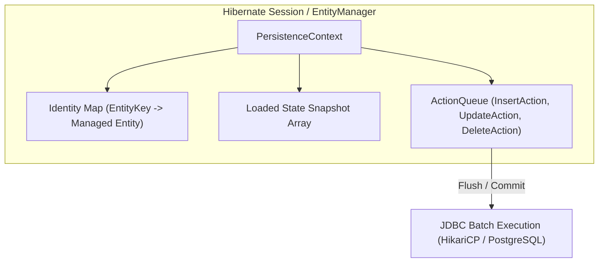
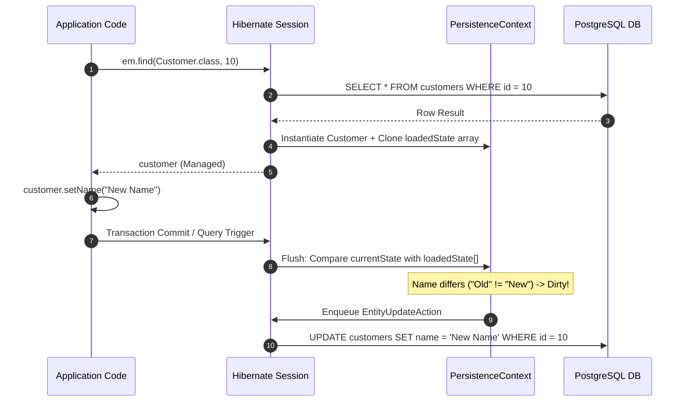
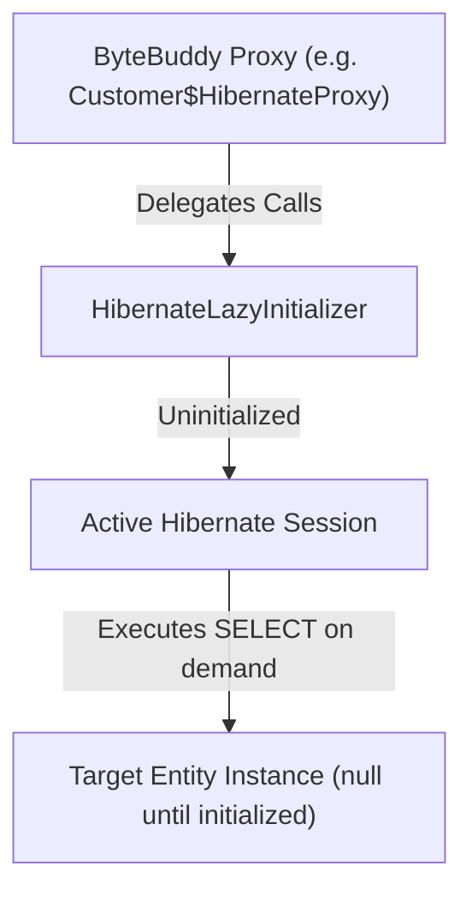
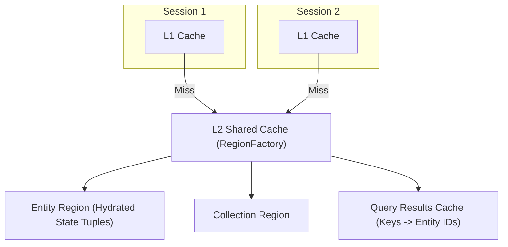

# JPA / Hibernate Internals

## 1. PersistenceContext and Identity Map

At the core of every active Hibernate `Session` (or JPA `EntityManager`) is the `PersistenceContext`. It functions as an **Identity Map** and transactional write-behind cache.



### Key Responsibilities:
1. **Repeatable Entity Identity:** Calling `em.find(User.class, 1L)` multiple times within the same session returns the exact same Java object reference (`obj1 == obj2`).
2. **First-Level Cache:** Prevents duplicate SQL `SELECT` queries for entities already loaded by primary key in the current session.
3. **Action Queue:** Collects database write operations (`EntityInsertAction`, `EntityUpdateAction`, `EntityDeleteAction`, `CollectionUpdateAction`) and defers execution until flush time, enabling SQL batching and topological statement ordering.

---

## 2. Dirty Checking Mechanism

Hibernate does not require explicit `save()` or `update()` calls on managed entities. Instead, it relies on automatic dirty checking during flush.



### Snapshot Comparison vs Bytecode Enhancement
1. **Default Snapshot Comparison:** When an entity is loaded, Hibernate allocates an `Object[]` array containing the initial values of all persistent properties. At flush time, Hibernate performs an element-by-element equality check between the current entity fields and the loaded snapshot array.
2. **Bytecode Enhancement:** Using the `hibernate-enhance-maven-plugin` or `hibernate-enhance-gradle-plugin`, Hibernate instruments entity bytecode to inject dirty tracking flags directly into setters. When a setter is called, a bitmask or boolean dirty flag is flipped, eliminating the CPU and memory overhead of copying and comparing snapshot arrays.

---

## 3. Proxy Initialization and Lazy Loading

When accessing a lazy relationship (e.g. `@ManyToOne(fetch = FetchType.LAZY)`), Hibernate does not initialize the target entity immediately. Instead, it injects a dynamic proxy (generated via **ByteBuddy**).



### How `LazyInitializationException` Happens
1. When `customer.getContracts()` is called within an active transaction, the proxy's `HibernateLazyInitializer` invokes `session.getImmediateLoadAccess().load()` to execute SQL and populate the target collection.
2. When the transaction finishes, Spring's `TransactionInterceptor` closes the `EntityManager` session, detaching all entities and unbinding the database connection.
3. If application or presentation code subsequently invokes `customer.getContracts().size()` on the detached entity, the `HibernateLazyInitializer` detects that `session == null` or `session.isClosed()` and throws:
   `org.hibernate.LazyInitializationException: could not initialize proxy - no Session`

---

## 4. Second-Level (L2) Cache Architecture

Unlike the 1st-level cache (which is bound to a single thread/session), the 2nd-level cache is shared across all sessions in a `SessionFactory` (application level) or clustered across multiple nodes (Ehcache, Infinispan, Hazelcast).



> [!IMPORTANT]
> The L2 Cache does **not** store managed Java entity instances (to avoid concurrency bugs and mutability issues). Instead, it stores disassembled "hydrated state" arrays (primitives, strings, dates). When an entity is resolved from L2, a new managed entity instance is reconstructed inside the caller's L1 cache.

---

## 5. JDBC Batching and Topological Action Queue

To maximize write performance, Hibernate collects mutations in the `ActionQueue` and executes them using JDBC `PreparedStatement.addBatch()` and `executeBatch()`.

### Prerequisites for Efficient Batching:
```properties
spring.jpa.properties.hibernate.jdbc.batch_size=50
spring.jpa.properties.hibernate.order_inserts=true
spring.jpa.properties.hibernate.order_updates=true
spring.jpa.properties.hibernate.jdbc.batch_versioned_data=true
```

1. **`order_inserts` / `order_updates`:** Without ordering, inserting interleaved entities (e.g. `Order1`, `Item1`, `Order2`, `Item2`) breaks JDBC batches because the SQL statement changes on every iteration (`INSERT INTO orders` vs `INSERT INTO items`). Enabling ordering groups operations of the same type together (`Order1`, `Order2` -> Batch 1; `Item1`, `Item2` -> Batch 2).
2. **Disabling `IDENTITY`:** Using `@GeneratedValue(strategy = GenerationType.IDENTITY)` forces Hibernate to execute immediate SQL `INSERT` statements to obtain generated IDs, completely disabling the JDBC batch queue. Use `GenerationType.SEQUENCE` with `allocationSize = 50`.
