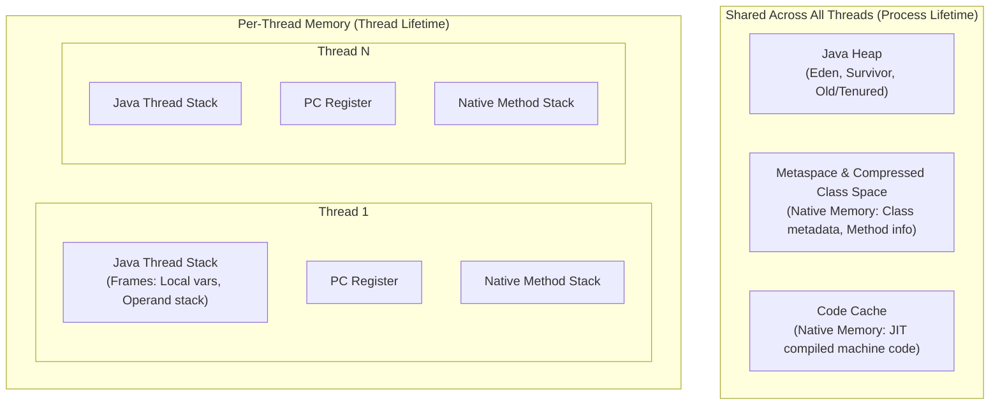

# JVM Concepts

## JVM, JRE, and JDK

The Java platform is layered into runtime and developer tools:

- **JVM (Java Virtual Machine):** The abstract computing machine and execution engine that loads,
  verifies, compiles, and executes bytecode. It manages runtime memory and interacts directly with
  the host operating system.
- **JRE (Java Runtime Environment):** The runtime distribution containing the JVM plus core Java SE
  libraries required to run Java applications. (Deprecated as a standalone bundle since Java 9; modern
  deployments package custom modular runtimes via `jlink`).
- **JDK (Java Development Kit):** The full developer toolchain including the compiler (`javac`),
  debugger (`jdb`), archiver (`jar`), disassembler (`javap`), and diagnostic profilers (`jcmd`, `jfr`).

## Runtime data areas

The JVM divides memory into per-thread and shared runtime data areas:



### 1. Java Heap
Shared memory storing all object instances and arrays. Reclaimed automatically by the Garbage Collector.
Divided into Young Generation (Eden, S0, S1) and Old (Tenured) Generation in generational collectors.

### 2. Metaspace
Off-heap native memory (since Java 8 replacing PermGen) storing runtime class metadata, method descriptors,
annotations, and constant pool resolution data. Controlled via `-XX:MaxMetaspaceSize`.

### 3. Java Thread Stacks
Per-thread memory allocating a new stack frame for each method invocation. Each frame contains local
variables, operand stack, and reference links. Sized via `-Xss` (default 1 MB on 64-bit platforms).

### 4. Code Cache
Native memory holding machine code generated by the JIT (Just-In-Time) compiler.

### 5. Native / Direct Memory
Off-heap memory allocated via `Unsafe.allocateMemory` or `ByteBuffer.allocateDirect()`, commonly used in
high-throughput I/O frameworks (e.g., Netty). Sized via `-XX:MaxDirectMemorySize`.

## Object allocation, TLABs, and escape analysis

Object creation in Java follows an optimized allocation hierarchy:

1. **Escape Analysis:** The JIT compiler determines whether an object escapes the current thread or method scope.
   - If an object does **not** escape, the JIT can perform **scalar replacement** (deconstructing the object
     into primitive fields stored in CPU registers or stack frames) and **lock elision**.
2. **TLAB (Thread-Local Allocation Buffer):** If heap allocation is required, the thread allocates inside
   its dedicated TLAB within Eden using a single pointer-bump instruction without global locks.
3. **Shared Eden:** If an object exceeds available TLAB space, allocation falls back to synchronized Eden allocation.
4. **Direct Old Generation:** Large objects or arrays exceeding humongous thresholds bypass Eden and are allocated directly in Old Gen.

```java
--8<-- "modules/02-jvm/src/examples/java/lab/jvm/examples/AllocationDemo.java"
```

## JIT compilation and tiered execution

HotSpot uses **Tiered Compilation** to balance immediate application startup with long-term peak performance:

- **Tier 0 (Interpreter):** Interprets bytecode directly; gathers invocation and branch profiling counters.
- **Tier 1–3 (C1 Client Compiler):** Compiles bytecode into native code quickly with simple optimizations and profiling instrumentation.
- **Tier 4 (C2 Server Compiler / Graal):** Uses profiling metadata to generate heavily optimized machine code (inlining, loop unrolling, devirtualization, vectorization).
- **Deoptimization:** When optimistic assumptions (e.g., class hierarchy or branch profile) are invalidated by class loading, HotSpot triggers an **uncommon trap** and falls back to the interpreter.

```java
--8<-- "modules/02-jvm/src/examples/java/lab/jvm/examples/BytecodeDemo.java"
```

## Garbage collection and the generational hypothesis

The **Weak Generational Hypothesis** observes that:
1. Most objects die shortly after allocation.
2. Objects that survive multiple collections tend to persist for a long time.

### HotSpot Collectors in Java 21

| Collector | Memory Architecture | Target Workload | STW Pauses | Tuning Flag |
|---|---|---|---|---|
| **Serial GC** | Single-threaded young/old | Tiny heaps, single CPU, CLI tools | Full STW | `-XX:+UseSerialGC` |
| **Parallel GC** | Multi-threaded generational | Batch processing, maximum throughput | STW pauses proportional to live data | `-XX:+UseParallelGC` |
| **G1 GC** (Default) | Region-based generational | General backend services, balanced throughput/latency | Soft target pauses (`-XX:MaxGCPauseMillis=200`) | `-XX:+UseG1GC` |
| **ZGC** | Region-based, colored pointers, load barriers | Low-latency microservices (<1ms pause), large heaps (up to 16TB) | Sub-millisecond STW | `-XX:+UseZGC -XX:+ZGenerational` |
| **Shenandoah** | Region-based, Brooks/load-reference barriers | Ultra-low pause microservices | Low single-digit ms STW | `-XX:+UseShenandoahGC` |

### GC Roots and Reachability

An object is garbage-collected only when it is no longer reachable from any **GC Root**:
- Local variables and parameters on active thread stacks.
- Active Java threads (`java.lang.Thread`).
- Static variables on classes loaded by system/live class loaders.
- JNI (Java Native Interface) global and local references.

```java
--8<-- "modules/02-jvm/src/examples/java/lab/jvm/examples/GcRootsDemo.java"
```

## Error taxonomy: OOM and StackOverflow

| Error | Root Cause | Key Diagnostic / Flag |
|---|---|---|
| **`OutOfMemoryError: Java heap space`** | Retained objects exceed `-Xmx` (leak or insufficient sizing) | `-XX:+HeapDumpOnOutOfMemoryError`, JFR, heap dump dominator tree |
| **`OutOfMemoryError: Metaspace`** | Dynamic class loading, uncollected ClassLoaders, proxy generation | `jcmd <pid> VM.classloader_stats`, `-XX:MaxMetaspaceSize` |
| **`OutOfMemoryError: Direct buffer memory`** | Off-heap Netty/NIO direct allocations exceed limit | `-XX:MaxDirectMemorySize`, `jcmd <pid> VM.native_memory` |
| **`OutOfMemoryError: unable to create native thread`** | OS thread limit reached or native virtual memory exhausted | `ulimit -u`, `/proc/sys/kernel/threads-max`, `-Xss` reduction |
| **`OutOfMemoryError: GC overhead limit exceeded`** | >98% time spent in GC recovering <2% heap | Profile allocation hot paths, increase heap or eliminate retention |
| **`StackOverflowError`** | Deep/infinite recursion or large stack frames exceeding `-Xss` | Inspect recursive stack traces, `-Xss` |

## Container memory dynamics

Inside Docker or Kubernetes containers, JVM must detect and respect cgroup limits:

- By default, Java 21 calculates heap limits as a percentage of container RAM via `-XX:MaxRAMPercentage` (default ~25% without explicit flags).
- **Total Process Memory $\ne$ `-Xmx`**. Total container memory consumption is:
  $$\text{Container Memory} = \text{Heap} + \text{Metaspace} + \text{CodeCache} + (\text{Threads} \times \text{StackSize}) + \text{DirectMemory} + \text{JVM Native Overhead}$$
- Setting `-Xmx` equal to the container memory limit leads to the Linux kernel **OOMKiller** terminating the process with exit code 137 without a JVM heap dump.

```java
--8<-- "modules/02-jvm/src/examples/java/lab/jvm/examples/ContainerMemoryDemo.java"
```

## Diagnostic commands

Key JDK diagnostic tools for production incidents:

```bash
# Disassemble bytecode with constant pool and line numbers
javap -c -v -p path/to/Target.class

# Inspect class allocation histogram of live objects
jcmd <pid> GC.class_histogram

# Inspect Metaspace and ClassLoader hierarchy
jcmd <pid> VM.classloader_stats

# Record 60-second Java Flight Recording with allocation profiles
jcmd <pid> JFR.start name=profile duration=60s filename=incident.jfr settings=profile

# Trigger immediate on-demand heap dump
jcmd <pid> GC.heap_dump /tmp/heap.hprof
```

## Related

- [Internals](internals.md)
- [Code review](code-review.md)
- [Production scenarios](production.md)
