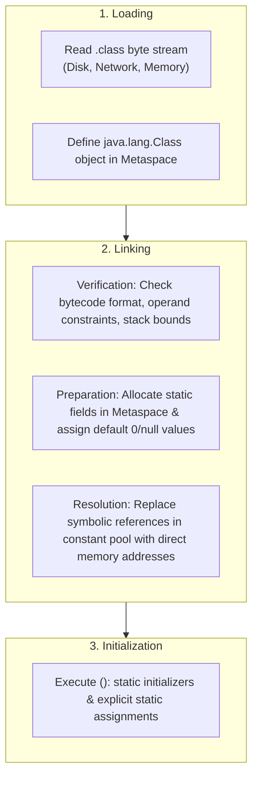
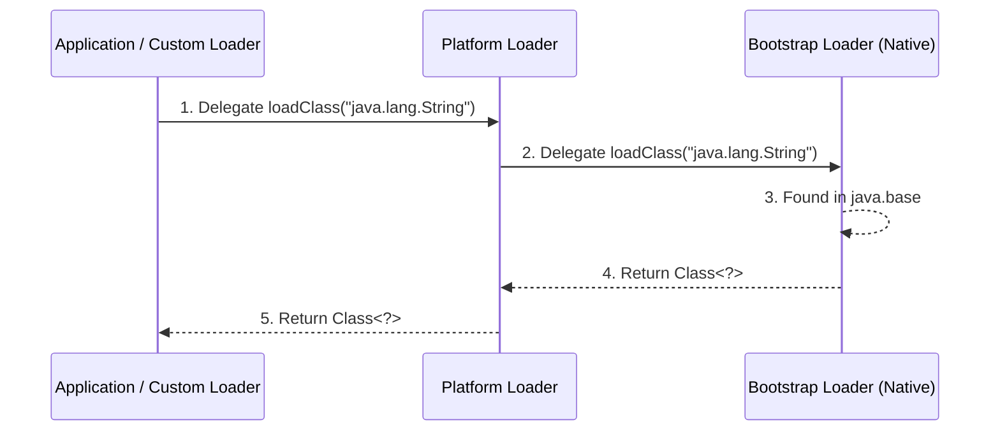
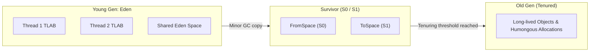

# JVM Internals

## Class loading and lifecycle

Class execution progresses through distinct phases governed by the JVM specification:



### Class initialization triggers

A class is **initialized** only upon its first active use:
- Creating a new instance (`new`).
- Accessing or modifying a static field (except `static final` compile-time constants).
- Invoking a static method.
- Invocation via reflection (`Class.forName` with `initialize = true`).
- Initializing a direct subclass.

```java
--8<-- "modules/02-jvm/src/examples/java/lab/jvm/examples/ClassInitializationDemo.java"
```

### Class loader hierarchy and parent delegation

HotSpot uses parent delegation to enforce system class isolation and prevent class spoofing:

1. **Bootstrap ClassLoader:** Written in native C++; loads core classes (`java.base`, `java.lang.*`). Represented as `null` in Java reflection.
2. **Platform ClassLoader:** Loads platform modules and extensions (`java.sql`, `java.xml`).
3. **Application (System) ClassLoader:** Loads classes from application classpath and module path.
4. **Custom ClassLoader:** Custom plugin, OSGi, or dynamic class loaders.

```java
--8<-- "modules/02-jvm/src/examples/java/lab/jvm/examples/ClassLoaderDemo.java"
```



### ClassLoader leaks in modular applications

A `ClassLoader` holds references to every `Class<?>` it loaded; each `Class<?>` holds static fields and
a reference back to its `ClassLoader`. If any static field, thread, or `ThreadLocal` on a long-lived parent
loader retains a reference to an object from a child loader, the entire child loader and all its loaded
classes remain pinned in Metaspace.

```java
--8<-- "modules/02-jvm/src/examples/java/lab/jvm/examples/ClassLoaderLeakDemo.java"
```

## Bytecode execution and stack frames

The JVM execution engine is a **stack-based virtual processor**. When a method is called, a new **Stack Frame**
is pushed onto the executing thread's stack:

- **Local Variable Array:** Indexed array storing parameters (`this` at index 0 in instance methods) and local variables.
- **Operand Stack:** LIFO workspace where bytecode instructions push operands, perform arithmetic, and pop results.
- **Frame Data:** Pointers to the runtime constant pool, method return addresses, and exception tables.

```java
--8<-- "modules/02-jvm/src/examples/java/lab/jvm/examples/BytecodeDemo.java"
```

Disassembling the class file reveals operand stack manipulations:

```bash
javap -c -v lab.jvm.examples.BytecodeDemo
```

## JIT optimizations and deoptimization

The HotSpot JIT (C2/Graal) applies aggressive runtime optimizations based on profile-guided feedback:

1. **Method Inlining:** Replaces small method call instructions (`invokevirtual`) with the callee's body, eliminating frame push/pop overhead and enabling cross-method optimizations.
2. **Escape Analysis & Scalar Replacement:** Traces object references to prove non-escaping scope, allocating object fields directly in CPU registers or stack frames.
3. **Monomorphic Inline Caching & Devirtualization:** Specializes dynamic call sites when profiling reveals that 99%+ invocations hit a single concrete receiver type.
4. **Loop Unrolling & Vectorization:** Unrolls loop bodies and uses SIMD CPU instructions (AVX-512) for parallel array calculations.
5. **Deoptimization & Uncommon Traps:** When a new class is loaded that invalidates monomorphic assumptions (polymorphism introduced), C2 emits a deoptimization trap, rewinds machine code to the interpreter, and recompiles with updated profile data.

## Generational GC algorithms and mechanics



### Tri-color marking

Concurrent garbage collectors (G1, ZGC, Shenandoah) track object reachability via tri-color abstraction:

- **White:** Unvisited objects. At the end of marking, white objects are dead garbage.
- **Grey:** Visited objects whose outgoing field references have not yet been fully scanned.
- **Black:** Visited objects whose outgoing field references are completely scanned. Black objects are guaranteed alive.

### Remembered Sets (RSet) and Card Tables

To collect the Young Generation without scanning the entire multi-gigabyte Old Generation:
- The heap is divided into 512-byte memory **Cards**.
- When an Old Generation object writes a reference to a Young Generation object, a JIT-compiled **Write Barrier** marks the card as **dirty** in the **Card Table**.
- During Minor GC, the collector scans only dirty cards in the Card Table / Remembered Set (RSet) as supplemental GC roots.

### Safepoints and thread coordination

During operations requiring global consistency (STW pause phases, heap dumps, thread dumps, revoking biased locks):
- The JVM issues a **Safepoint Request**.
- Every compiled method contains periodic **Safepoint Poll** instructions (e.g., at method return and loop back-edges).
- Threads poll the safepoint page; upon detecting a safepoint, each thread saves its register state and halts in a safe execution state.
- Long-running uncounted loops (loops without safepoint checks in older JVMs) can cause **Safepoint Timeouts** and latency spikes.

## JVM specification vs HotSpot implementation

| Aspect | JVM Specification Guarantee | HotSpot Implementation Detail |
|---|---|---|
| **Memory Areas** | Mandates Heap, Stack, Method Area, PC Register | Implements Method Area as off-heap Metaspace; separates Code Cache |
| **Object Allocation** | Specifies `new` creates object instance | Uses TLABs, scalar replacement, card tables, and tenuring thresholds |
| **Garbage Collection** | Automatic memory reclamation required; algorithms unspecified | G1, ZGC, Shenandoah, Parallel GC with tri-color marking & SATB write barriers |
| **Bytecode Execution** | Bytecode instruction set semantics | Tiered compilation (Interpreter $\to$ C1 $\to$ C2), deoptimization traps |

## Related

- [Concepts](concepts.md)
- [Code review](code-review.md)
- [Production](production.md)
