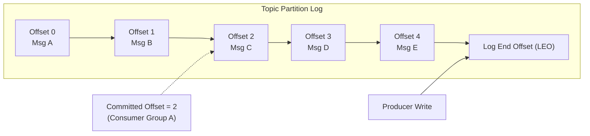
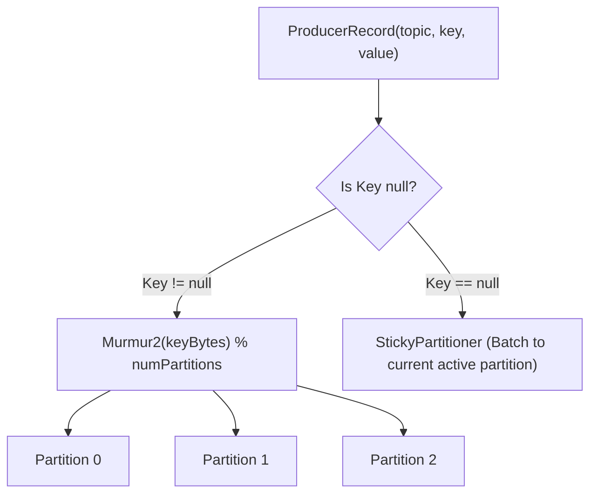
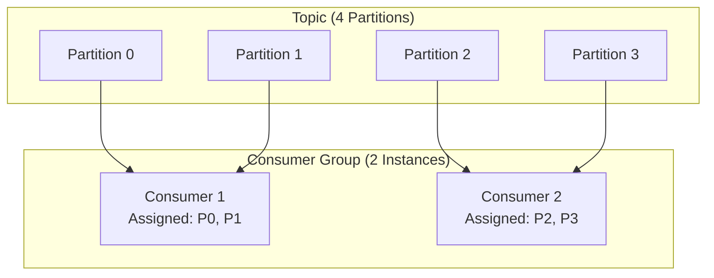
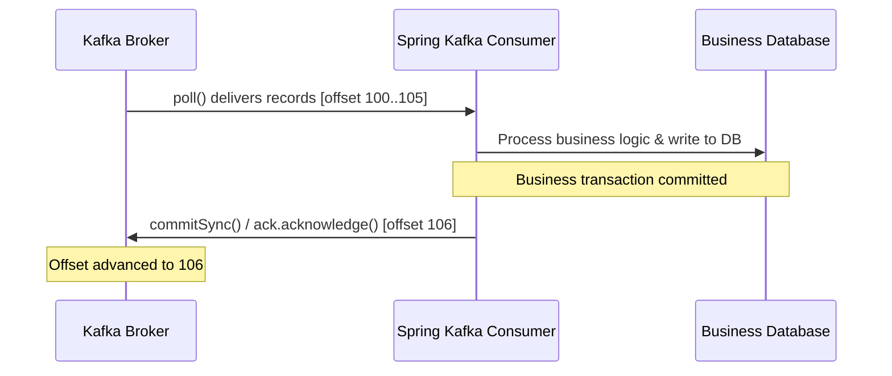
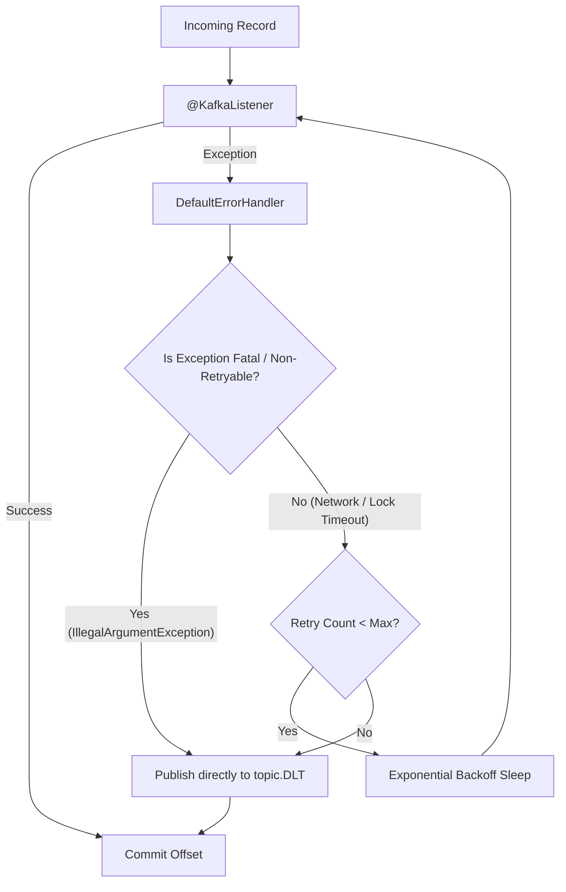
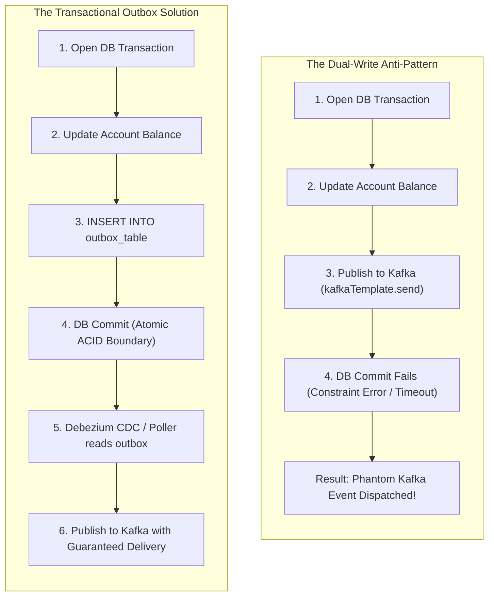

# Kafka Concepts & Architecture

Kafka departs fundamentally from traditional message brokers (such as RabbitMQ or ActiveMQ). Instead of maintaining transient queues where messages are discarded once acknowledged, Kafka organizes data into distributed, append-only, durable **commit logs**.

---

## 1. The Distributed Commit Log

In Kafka, a **topic** is a logical stream of events. Each topic is partitioned into one or more **partitions**. A partition is an immutable, ordered sequence of records continuously appended to disk:

### Characteristics

- **Append-Only Immutability**: Records cannot be updated or deleted in place. Every write appends to the log end.
- **Sequential Disk I/O**: Sequential writes eliminate disk head seek times, allowing Kafka to achieve gigabyte-per-second write throughput even on rotational storage and cloud block storage.
- **Deterministic Addressing**: Every record within a partition is uniquely identified by a 64-bit integer called its **offset**.
- **Retention Without Deletion**: Records persist based on time (`log.retention.hours`) or size (`log.retention.bytes`), independent of whether they have been read by consumers.

---

## 2. Topics, Partitions, and Key Hashing

Partitions serve as the atomic unit of scalability and parallelism in Kafka.

- **Keyed Records**: When a key is supplied, Kafka computes `Utils.toPositive(Utils.murmur2(keyBytes)) % numPartitions`. The identical key is guaranteed to map to the identical partition as long as partition count remains constant.
- **Null Keys**: Since Kafka 2.4, the default partitioner uses sticky batching. It routes unkeyed records to a chosen partition until the batch size or `linger.ms` is reached, then rotates to another partition, dramatically improving throughput.
- **The Ordering Invariant**: Kafka guarantees message ordering **only within a single partition**. If an application requires chronological event processing for a customer or order, that entity identifier **must** be provided as the message key.

---

## 3. Producer Durability and Acks

The producer configuration `acks` determines how many partition replicas must acknowledge receipt before a publish operation is considered successful:

| Setting | Durability Guarantee | Latency | Data Loss Risk |
|---|---|---|---|
| `acks=0` | None (fire-and-forget) | Lowest | Extreme: dropped silently if broker drops packet or crashes |
| `acks=1` | Partition leader writes to local disk | Low | Moderate: leader crash before replication causes silent data loss |
| `acks=all` (`-1`) | Leader and all `min.insync.replicas` commit | Moderate | Zero data loss as long as `min.insync.replicas` is satisfied |

### Producer Idempotence (`enable.idempotence=true`)

When network hiccups occur while the broker is returning an acknowledgment, the producer cannot tell if the message was written or lost. If the producer retries, a non-idempotent producer writes duplicate messages to the log.

When `enable.idempotence=true` (the default since Kafka 3.0):
1. The broker assigns each producer a unique 64-bit **Producer ID (PID)** via `InitProducerId`.
2. Each record sent to a partition carries a monotonically increasing **Sequence Number**.
3. The broker checks the incoming sequence number against its in-memory table. If `incoming_seq <= last_committed_seq`, the broker silently ignores the duplicate record while returning success to the producer.

---

## 4. Consumer Groups and Partition Balancing

A **consumer group** coordinates a set of consumers to process records from a topic in parallel:

- **1:1 Assignment Rule**: A single partition can be consumed by at most **one** consumer instance within the same consumer group at any time.
- **Over-Provisioning Limit**: If consumer group instances exceed the number of partitions in a topic, surplus instances remain idle with zero assigned partitions.
- **Independent Groups**: Multiple distinct consumer groups read the exact same topic independently at their own reading pace with distinct committed offsets.

---

## 5. Offset Commit Semantics

Consumers maintain a committed offset representing the highest point in the log they have successfully processed:

- **At-Most-Once Delivery**: Committing the offset *before* processing completes. If the consumer crashes during processing, the record is skipped on restart.
- **At-Least-Once Delivery**: Committing the offset *after* processing completes. If the consumer crashes before committing the offset, redelivery occurs.
- **Idempotent Consumers**: Because at-least-once is the industry standard, consumers must guard against duplicate deliveries using an idempotency store (e.g. unique constraint on event ID or atomic Redis `SETNX`).

---

## 6. Error Handling and Dead Letter Topics (DLT)

Deterministic failures (such as schema validation errors or missing required fields) will fail on every subsequent attempt:

1. **Dead Letter Publishing Recoverer**: Moves exhausted or fatal records to `${topic}.DLT` with error metadata headers (`kafka_exception-message`, `kafka_original-topic`).
2. **Non-Retryable Exceptions**: Fatal business errors skip retries immediately, avoiding pointless CPU cycles and latency delays.
3. **Partition Liveness**: Routing poison pills to DLT allows the consumer offset to advance, preventing a single corrupted record from stalling an entire partition.

---

## 7. Dual-Write Hazards and the Transactional Outbox Pattern

Attempting to update a database and publish to Kafka inside an application method introduces a classic dual-write race condition:

By storing outbox records in the database within the primary business transaction, state changes and event declarations commit atomically. Downstream publication occurs safely via Change Data Capture (CDC) or reliable post-commit event listeners (`@TransactionalEventListener(phase = AFTER_COMMIT)`).
