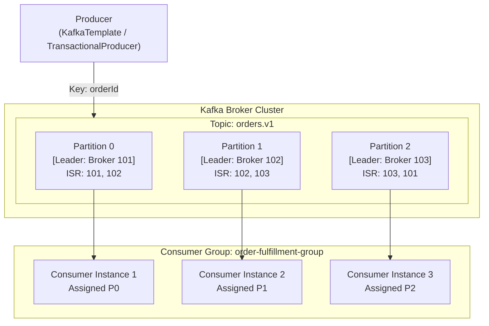

# Kafka

Apache Kafka is a distributed event streaming platform designed for high-throughput, fault-tolerant,
and low-latency real-time data pipelines and asynchronous event-driven architectures.

## Architectural Overview

Kafka decouples event producers from consumers using distributed append-only commit logs split into
partitions across a cluster of brokers:

## Key Invariants

1. **Partition Ordering Guarantee**: Kafka guarantees strict total message ordering **only within a single partition**, never across multiple partitions of a topic. All events for a specific business entity must share the same partition key.
2. **At-Least-Once Delivery**: Network retransmissions, broker leader transitions, and consumer group rebalances regularly deliver duplicate records. Consumers must be designed to be strictly idempotent using deduplication stores or natural idempotent operations.
3. **Post-Commit Offset Acknowledgment**: Consumer message offsets must be acknowledged strictly **after** business logic and downstream database writes succeed (`AckMode.MANUAL_IMMEDIATE`). Acknowledging before processing completes risks permanent message loss on worker crash.
4. **Bounded Retries with Dead Letter Topic (DLT)**: Unrecoverable errors or poison pill payloads must never retry indefinitely. Non-transient exceptions must route immediately to a Dead Letter Topic (`topic.DLT`) to prevent blocking partition progress.
5. **Poll Loop Liveness**: The consumer thread must return to invoke `KafkaConsumer.poll()` within `max.poll.interval.ms`. Heavy or long-running processing must be offloaded to background worker threads or configured with an adequate interval to prevent catastrophic rebalance storms.
6. **Transactional Outbox for Dual-Writes**: Publishing to Kafka inside an open database transaction leads to phantom events if the database rolls back. State mutations and outbox records must be saved in the same ACID transaction, followed by guaranteed post-commit publishing.

## Module Topics

| Section | Focus |
|---|---|
| [Concepts](concepts.md) | Log architecture, partitions, consumer groups, delivery semantics, error handling, transactional outbox |
| [Internals](internals.md) | Page cache sequential I/O, zero-copy `sendfile`, replication consensus & ISR, consumer group coordinator state machine |
| [Interview Questions](questions.md) | 23 questions spanning basic, intermediate, senior, and production incident scenarios |
| [Code Review](code-review.md) | 6 realistic broken examples to practice spotting Kafka concurrency and reliability bugs in PRs |
| [Solutions](solutions.md) | Production-grade implementations with design rationale and architectural trade-offs |
| [Tests](tests.md) | Testcontainers Kafka integration testing, consumer group rebalance assertions, and idempotency suites |
| [Production](production.md) | Broker cluster sizing, consumer lag monitoring, partition count planning, recovery procedures, and production checklist |
| [Exercises](exercises.md) | Hands-on exercises: Custom Idempotent Deduplication Interceptor and Exponential Backoff DLT Routing |

## Related Modules

- [Spring Transactions](../spring-transactions/index.md) — Coordinating database transaction commits with post-commit Kafka publication
- [Concurrency](../concurrency/index.md) — Multi-threaded consumer processing, thread pools, and race condition prevention
- [Testing](../testing/index.md) — Testcontainers integration testing for messaging infrastructure
