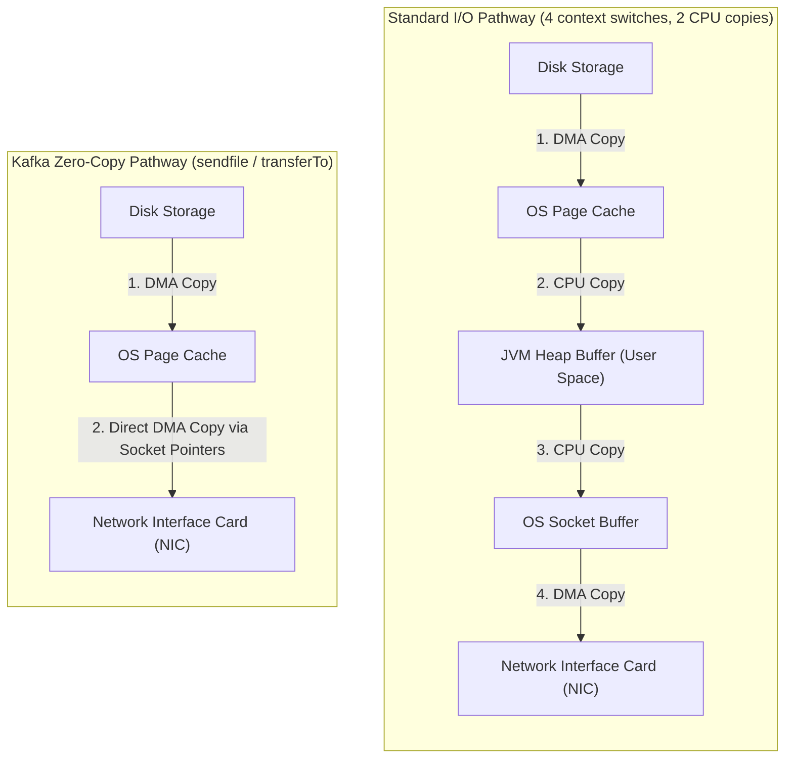
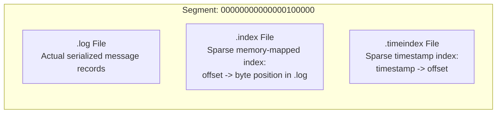
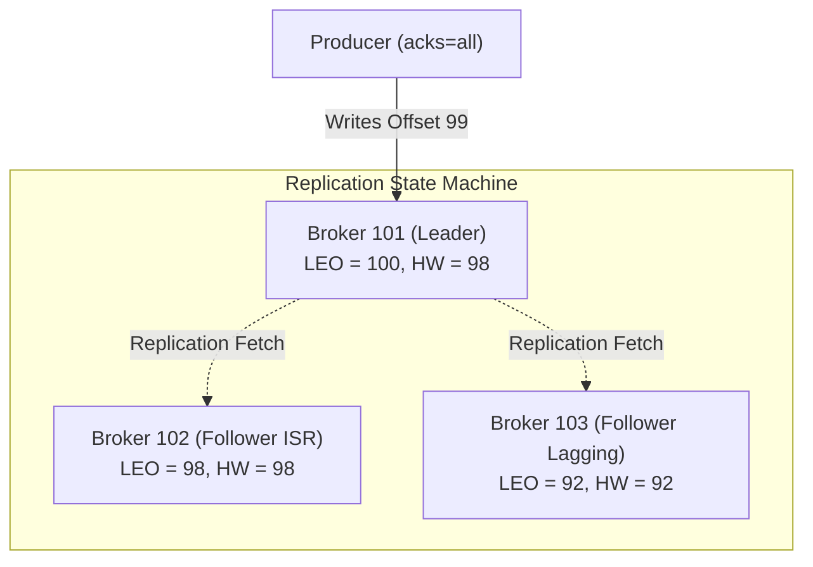
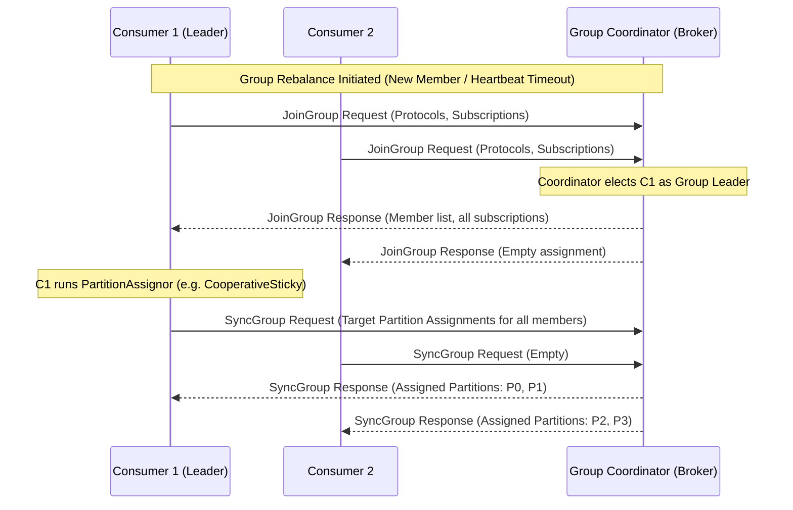
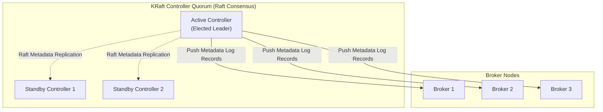

# Kafka Internals & Deep Mechanics

Understanding Kafka's internal mechanics—operating system primitives, memory management, consensus protocols, and broker-consumer coordination—is essential for diagnosing production incidents and tuning high-throughput clusters.

---

## 1. Operating System Zero-Copy Data Transfer

Traditional network servers transfer files from disk to network sockets by cycling through user space memory:

### The Mechanism

1. When a consumer requests records, Kafka executes Java's `FileChannel.transferTo()` which delegates directly to the Linux `sendfile()` system call.
2. The operating system kernel transfers data directly from the OS Page Cache into the Network Interface Card (NIC) buffer via Direct Memory Access (DMA) gather operations.
3. **Zero CPU Copies**: Data never passes into JVM user space.
4. **Zero Garbage Collection Impact**: Because payloads never allocate byte arrays on the JVM heap, Kafka brokers can serve hundreds of gigabytes of traffic per hour with negligible GC pause times and modest heap sizes (typically 6–8 GB).

---

## 2. Partition Log Segments and Index Mechanics

A partition is not a single gigantic file. Instead, it is partitioned into smaller **log segments** (default `segment.bytes = 1GB` or `segment.ms = 7 days`):

### Sparse Index Lookup

Kafka avoids storing index entries for every single record to conserve memory. Instead, it maintains a **sparse index** (`index.interval.bytes = 4096`):
1. An entry is added to `.index` only after every 4 KB of record data is written to `.log`.
2. When searching for offset `100450`, Kafka performs an in-memory binary search across the memory-mapped `.index` to find the largest indexed offset less than or equal to `100450` (e.g. offset `100400` at physical byte position `163840`).
3. Kafka seeks directly to byte `163840` in `.log` and performs a short linear scan through the remaining contiguous records until offset `100450` is reached.

---

## 3. Replication Consensus: High Watermark and Leader Epochs

Each partition has one designated **Leader** replica and zero or more **Follower** replicas:

- **Log End Offset (LEO)**: The offset of the next record to be written to a partition replica.
- **High Watermark (HW)**: The offset up to which all replicas in the In-Sync Replicas (ISR) list have replicated records. Consumers can **only** read up to the High Watermark; un-replicated records beyond HW are hidden to prevent dirty reads.
- **Leader Epoch**: Introduced in KIP-101 to replace raw High Watermark truncation during broker failovers. When a new leader is elected, it increments the Leader Epoch counter. Followers query the new leader for its end offset for that epoch rather than truncating blindly to their local HW, completely eliminating data divergence and silent record loss during hard crashes.

---

## 4. Consumer Group Rebalance Protocol

Consumer groups utilize a dedicated **Group Coordinator** broker (the broker hosting the `__consumer_offsets` partition to which the group's hash maps):

### Eager vs Cooperative Sticky Rebalancing

| Feature | Eager Rebalance (`Range`, `RoundRobin`) | Incremental Cooperative (`CooperativeStickyAssignor`) |
|---|---|---|
| **Partition Revocation** | All members revoke all partitions immediately | Only migrating partitions are revoked |
| **Cluster Processing** | Completely halts ("stop-the-world") during rebalance | Consumers continue processing unassigned partitions |
| **Rebalance Storms** | Severe: temporary slow consumer freezes entire group | Minimal: unaffected workers experience zero downtime |

---

## 5. KRaft: ZooKeeper-Free Event-Driven Metadata Quorum

Since Kafka 3.3+, Kafka uses **KRaft** (Kafka Raft Metadata Mode) to manage cluster metadata without external Apache ZooKeeper clusters:

- **Single Log Source of Truth**: Cluster state (topics, partitions, configurations, ACLs) is stored in an internal replicated Kafka topic `@metadata`.
- **Instantaneous Failover**: Standby controllers maintain the complete metadata cache in memory by tailing the active controller's log. Failover takes milliseconds instead of seconds or minutes with ZooKeeper.
- **Support for Millions of Partitions**: Eliminating ZooKeeper watches allows Kafka clusters to scale cleanly past millions of partitions.
