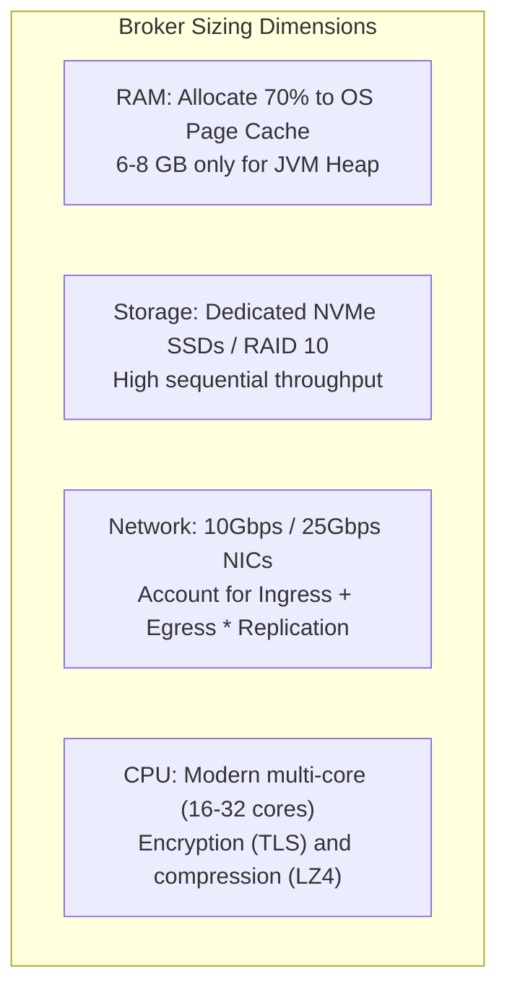

# Kafka Production Operations & Runbooks

Operating Apache Kafka and Spring Kafka applications in production requires strict capacity planning, proactive consumer lag monitoring, and tested recovery runbooks.

---

## 1. Broker Cluster Sizing & Hardware Planning

Kafka brokers are fundamentally I/O and network bound rather than compute bound.



### Memory Planning

- **Small JVM Heap**: Kafka brokers do not cache data in the Java heap. Configure `-Xms6g -Xmx6g` or `-Xms8g -Xmx8g`. Excessively large heaps (> 32 GB) risk long Stop-The-World garbage collection pauses without improving performance.
- **Maximized OS Page Cache**: Keep remaining RAM (e.g. 24–56 GB on a 64 GB node) free for the Linux kernel Page Cache to maximize zero-copy hits.

### Network Throughput Formula

Total broker network egress equals:

$$\text{Egress} = \text{Producer Ingress} \times (\text{Replication Factor} - 1) + (\text{Consumer Groups} \times \text{Ingress})$$

---

## 2. Partition Count Planning

Partition count dictates the maximum consumer concurrency for a topic.

### Sizing Rule of Thumb

$$\text{Partitions} = \max\left(\frac{\text{Target Throughput}}{\text{Single Producer Throughput}}, \frac{\text{Target Throughput}}{\text{Single Consumer Throughput}}\right)$$

- **Over-Partitioning Hazards**: Having tens of thousands of partitions per broker increases open file handle usage, lengthens leader election times during controller failover, and increases end-to-end replication latency.
- **Partition Limit**: As a baseline, keep total partitions per broker under 4,000 for standard clusters (under KRaft, clusters can scale to hundreds of thousands total).

---

## 3. Critical Monitoring Metrics & Alerts

| Metric | Target / Normal | Alert Threshold | Remediation |
|---|---|---|---|
| `UnderReplicatedPartitions` | 0 | `> 0 for > 5 min` | Investigate network partitions, failing broker disks, or GC pauses |
| `OfflinePartitionsCount` | 0 | `> 0 immediately (P1)` | Partitions have no active leader; broker crash recovery required |
| `ConsumerLag` (`records.lag`) | Constant / minimal | `> 5000 or monotonic climb` | Scale consumer instances, optimize consumer DB writes, fix slow downstream APIs |
| `RebalanceRate` | 0 during steady state | `> 1 per hour` | Check `max.poll.interval.ms`, GC pauses, or switch to `CooperativeStickyAssignor` |
| `JvmGcPause` | `< 50ms` | `> 5000ms` | Migrate to Generational ZGC; tune memory allocations |

---

## 4. Production Runbooks

### Runbook 1: Consumer Group Rebalance Storm

**Symptoms**: Zero messages consumed, logs flooded with `CommitFailedException` and `Marking the coordinator dead`.

1. **Identify the Slow Consumer**:
   ```bash
   kafka-consumer-groups.sh --bootstrap-server <broker>:9092 --describe --group <group-id> --state
   ```
2. **Diagnose Thread Stalls**: Check thread dumps for listeners blocked on external HTTP calls or database deadlocks exceeding `max.poll.interval.ms`.
3. **Immediate Mitigation**:
   - Temporarily increase `max.poll.interval.ms` (e.g. from 300,000ms to 900,000ms).
   - Decrease `max.poll.records` (e.g. from 500 to 50).
   - Deploy `CooperativeStickyAssignor` to avoid global partition revocations.

### Runbook 2: Poison Pill Partition Stall

**Symptoms**: Consumer lag accumulates rapidly on exactly one partition while other partitions continue processing normally.

1. **Locate Failing Offset**:
   ```bash
   kafka-consumer-groups.sh --bootstrap-server <broker>:9092 --describe --group <group-id>
   ```
2. **Inspect the Message**:
   ```bash
   kafka-console-consumer.sh --bootstrap-server <broker>:9092 --topic <topic> --partition <p> --offset <failing-offset> --max-messages 1
   ```
3. **Quarantine & Advance**:
   - If DLT is not configured, manually commit the consumer group offset past the failing record:
   ```bash
   kafka-consumer-groups.sh --bootstrap-server <broker>:9092 --group <group-id> --reset-offsets --to-offset <failing-offset + 1> --topic <topic>:<p> --execute
   ```
   - Deploy `DefaultErrorHandler` with `DeadLetterPublishingRecoverer` to permanently automate quarantine.

---

## 5. Production Readiness Checklist

- [ ] **Acks & Idempotence**: Producers configured with `acks=all` and `enable.idempotence=true`.
- [ ] **Replication Durability**: Topics configured with `replication.factor=3` and `min.insync.replicas=2`.
- [ ] **Explicit Partition Keys**: Keyed messages used whenever domain entities require causal sequence.
- [ ] **Manual Post-Processing Ack**: Consumers configured with `AckMode.MANUAL_IMMEDIATE` and offset committed strictly after DB writes.
- [ ] **Idempotent Consumers**: Deduplication store (DB unique constraint or Redis `SETNX`) guards against redeliveries.
- [ ] **Poison Pill Defense**: `DefaultErrorHandler` configured with bounded retries and `DeadLetterPublishingRecoverer`.
- [ ] **Non-Blocking Listeners**: Long-running processing offloaded to async executors; `max.poll.interval.ms` comfortably sized.
- [ ] **Cooperative Rebalancing**: Consumers configured with `CooperativeStickyAssignor`.
- [ ] **Consumer Lag Alerting**: PagerDuty alerts configured on per-partition consumer lag and rebalance rates.
