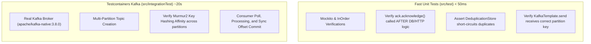

# Kafka Testing Strategy

Testing Kafka architectures requires verifying both unit-level business logic (acknowledgment timing, error propagation, deduplication guards) and real broker integration behavior (partition key distribution, consumer group rebalances, and offset commits).

---

## 1. Testing Philosophy: Fast Unit Tests vs Real Containers



- **Unit Tests (`src/test`)**: Avoid spinning up embedded brokers or Docker for verifying basic consumer/producer interactions. Mock `KafkaTemplate` and `Acknowledgment` with Mockito to assert that business logic precedes offset acknowledgment and that deduplication logic skips mutations.
- **Integration Tests (`src/integrationTest`)**: Test real partition routing and consumer group offset management against a real broker running inside Testcontainers.

---

## 2. Shared Kafka Testcontainers Singleton

Starting a Kafka container per test class incurs significant startup latency. The lab uses `SharedKafkaContainer`, spinning up a single native Kafka container shared across the JVM:

```java
--8<-- "modules/test-support/src/main/java/lab/testsupport/SharedKafkaContainer.java"
```

---

## 3. Unit Test Suites

### Safe Manual Acknowledgment Timing

```java
--8<-- "modules/14-kafka/src/test/java/lab/kafka/manualack/PaymentNotificationConsumerTest.java"
```

### Idempotent Consumer Deduplication

```java
--8<-- "modules/14-kafka/src/test/java/lab/kafka/idempotent/SafeAccountCreditConsumerTest.java"
```

### Partition Key Ordering Guarantees

```java
--8<-- "modules/14-kafka/src/test/java/lab/kafka/ordering/SafeUserEventProducerTest.java"
```

### Dead Letter Topic and Poison Pill Handling

```java
--8<-- "modules/14-kafka/src/test/java/lab/kafka/dlt/SafeOrderFulfillmentConsumerTest.java"
```

### Async Poll Liveness and Thread Offload

```java
--8<-- "modules/14-kafka/src/test/java/lab/kafka/asyncpoll/SafeReportGenerationListenerTest.java"
```

### Combined Order Orchestrator

```java
--8<-- "modules/14-kafka/src/test/java/lab/kafka/orderprocessing/SafeOrderOrchestratorTest.java"
```

---

## 4. Real Kafka Integration Test

The integration test provisions a multi-partition topic, publishes records with partition keys to verify consistent partition affinity, and polls messages to assert offset commit behavior:

```java
--8<-- "modules/14-kafka/src/integrationTest/java/lab/kafka/KafkaIntegrationTest.java"
```
