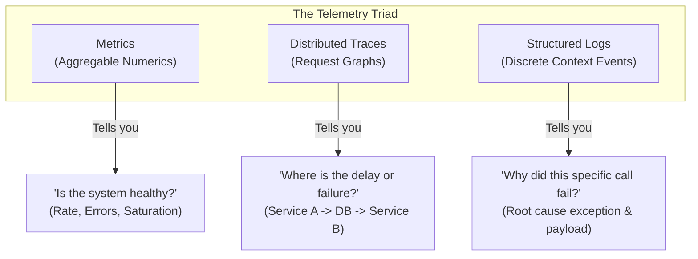
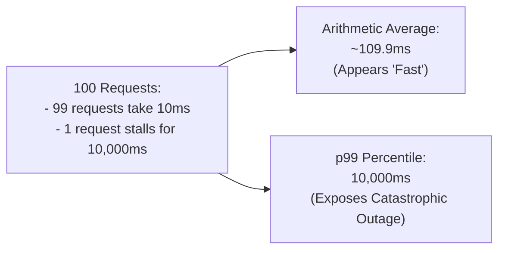
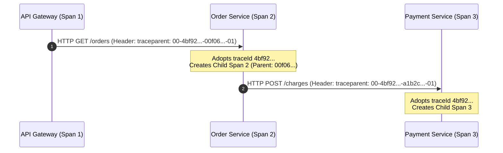

# Observability Concepts

## 1. The Three Pillars of Observability

Modern telemetry categorizes system visibility into three distinct pillars, each serving a unique diagnostic purpose:



| Dimension | Metrics | Traces | Logs |
|---|---|---|---|
| **Data Model** | Numeric time-series counters, gauges, histograms | Directed Acyclic Graph (DAG) of spans | Structured timestamped JSON events |
| **Storage Cost** | Very low (independent of request volume) | Medium (requires 1–10% head/tail sampling) | High (scales linearly with event volume) |
| **Diagnostic Power** | System health, alerting, SLA tracking | Network bottlenecks, distributed causality | Exact failure details, stack traces |

## 2. Structured Logging & Mapped Diagnostic Context (MDC)

### Why Plaintext Logging Fails
Traditional plaintext logs format arbitrary strings:
```text
2026-09-21 14:02:11.124 INFO [order-service,tr-123] c.e.OrderService : Processed order ord-999 for user usr-42 in 45ms
```
Extracting `orderId` or `duration` in Elasticsearch requires complex regular expressions. If an engineer changes whitespace or rephrases the message, log ingestion rules break.

### Structured JSON Logging
In production, log appenders (such as Logstash Logback Encoder) format log events as machine-readable JSON:
```json
{
  "@timestamp": "2026-09-21T14:02:11.124Z",
  "level": "INFO",
  "service": "order-service",
  "traceId": "4bf92f3577b34da6a3ce929d0e0e4736",
  "spanId": "00f067aa0ba902b7",
  "correlationId": "corr-ord-999",
  "message": "Order processed successfully",
  "orderId": "ord-999",
  "userId": "usr-42",
  "durationMs": 45
}
```

### Mapped Diagnostic Context (MDC)
SLF4J's `MDC` stores contextual key-value pairs in `ThreadLocal` memory. Once set at the HTTP ingress filter, every log statement emitted on that thread automatically inherits those contextual keys (`traceId`, `userId`, `clientIp`).

**The ThreadLocal Invariant**: Because thread pools reuse worker threads, any value placed in MDC **must** be cleared in a `finally` block before the thread returns to the pool:
```java
MDC.put("correlationId", correlationId);
try {
    processRequest();
} finally {
    MDC.clear();
}
```

## 3. Sensitive Data Privacy & PII Redaction

Log aggregators are shared across teams, third-party analytics, and security tools. Logging sensitive data violates regulatory frameworks (GDPR, PCI-DSS, HIPAA):

1. **Passwords & Secrets**: Raw passwords, API keys, and private tokens must never enter log statements.
2. **Bearer & JWT Tokens**: Full authentication tokens allow unauthorized session replay. Log only token presence or truncated footprints (`eyJhb...7890`).
3. **PCI-DSS Requirement 3.2**: Primary Account Numbers (PAN) must be masked so only the last 4 digits are visible (`****-****-****-1234`). Card Verification Values (CVV) must **never** be logged under any circumstances.

## 4. Micrometer Core Meter Types

Micrometer is the dimensional instrumentation facade for Spring Boot, translating application metrics into Prometheus, Datadog, or InfluxDB formats:

- **`Counter`**: A monotonically increasing numeric counter. Used for tracking event counts (requests received, items sold, errors encountered).
- **`Timer`**: Measures both short-duration event latency and throughput rate. Internally records call count, total time, and maximum latency.
- **`Gauge`**: An instantaneous snapshot of a variable's current value. Used for current queue depth, active database connections, and memory utilization.
- **`DistributionSummary`**: Tracks the distribution of non-time events (HTTP payload byte sizes, batch sizes).

## 5. Metric Cardinality Explosion

The cardinality of a metric is the total number of unique time series generated by all combinations of its tag (label) keys and values:

$$\text{Total Series} = \prod_{i=1}^{n} |V_i|$$

If a developer tags an HTTP metric with `user_id` ($100,000$ active users) and `order_id` ($1,000,000$ orders):
```java
// Anti-pattern: High-cardinality explosion
meterRegistry.counter("orders.created", "user_id", userId, "order_id", orderId).increment();
```
The application allocates over $10^{11}$ meter entries in memory:
1. `MeterRegistry`'s internal concurrent hash map balloons, consuming all tenured heap memory and triggering a JVM `OutOfMemoryError`.
2. Prometheus scraper requests to `/actuator/prometheus` take tens of seconds to serialize millions of lines, timing out and crashing TSDB indexing.

**The Golden Rule**: Metric tags must be strictly bounded, low-cardinality categorical enums (e.g. `status="SUCCESS|FAILURE"`, `method="GET|POST"`, `tier="STANDARD|PREMIUM"`). Specific entity identifiers belong in structured logs and tracing spans.

## 6. Percentiles vs Arithmetic Averages

Arithmetic means ($\bar{x} = \frac{\sum x_i}{N}$) are notoriously misleading for latency monitoring because software latency distributions are heavily skewed with fat tails:



Production SLAs and SLOs must be monitored using percentiles:
- **p50 (Median)**: Experience of the typical user.
- **p95 / p99**: Experience of users encountering disk stalls, lock contention, or slow external services.
- **p999**: Extreme tail outliers and JVM Garbage Collection pauses.

Micrometer `Timer.builder("http.requests").publishPercentiles(0.5, 0.95, 0.99)` computes quantile approximations, while `serviceLevelObjectives(...)` exports fixed histogram buckets for Prometheus `histogram_quantile()` queries.

## 7. Distributed Tracing & W3C TraceContext

Distributed tracing follows a transaction as it hops across network microservices:



### W3C TraceContext Specification
The standard propagation header `traceparent` uses a formatted 4-part string:
```text
traceparent: 00-4bf92f3577b34da6a3ce929d0e0e4736-00f067aa0ba902b7-01
             │  │                                │                │
      version┘  └─ trace-id (32 hex chars)       └─ span-id       └─ trace-flags
                                                    (16 hex chars)   (01 = sampled)
```

- **`trace-id`**: Stays identical across all services for the lifetime of the distributed transaction.
- **`span-id`**: Regenerated uniquely for each individual unit of work or remote hop.
- **`tracestate`**: Vendor-specific opaque routing metadata.
- **Baggage**: Key-value pairs propagated across network boundaries alongside trace context.

## 8. Micrometer Observation API

Introduced in Spring Framework 6 and Spring Boot 3, the `Observation` API unifies metrics and distributed tracing into a single programming model:

```java
Observation.createNotStarted("order.payment", observationRegistry)
    .lowCardinalityKeyValue("payment.method", "CARD")   // Exported to BOTH Metrics AND Tracing
    .highCardinalityKeyValue("order.id", orderId)       // Exported ONLY to Tracing (preserves metric cardinality!)
    .observe(() -> paymentClient.charge(orderId, amount));
```

Developers no longer need separate instrumentation for timers and spans; Micrometer Observation orchestrates registered `ObservationHandler` implementations automatically.

## 9. Monitoring Methodologies: RED vs USE

Different system layers require distinct monitoring approaches:

### The RED Method (Request-Driven Architectures)
Applied to HTTP APIs, gRPC services, and messaging consumers:
1. **Rate**: Requests received per second.
2. **Errors**: Requests failing per second.
3. **Duration**: Time taken by requests (percentile distributions).

### The USE Method (Resource / Infrastructure Architecture)
Applied to hardware and container infrastructure (CPU, Memory, Disks, Network, HikariCP, ThreadPools):
1. **Utilization**: Average percentage of time the resource was busy performing work.
2. **Saturation**: Extra work queued waiting for the resource when capacity is exceeded.
3. **Errors**: Count of error events or dropped work items.

## Related

- [Internals](internals.md) — Deep dive into Observation lifecycle and Prometheus scraper mechanics
- [Code Review](code-review.md) — Analyzing common observability anti-patterns
- [Solutions](solutions.md) — Production implementations and trade-offs
- [Questions](questions.md) — Senior interview questions on metrics, logs, and tracing
