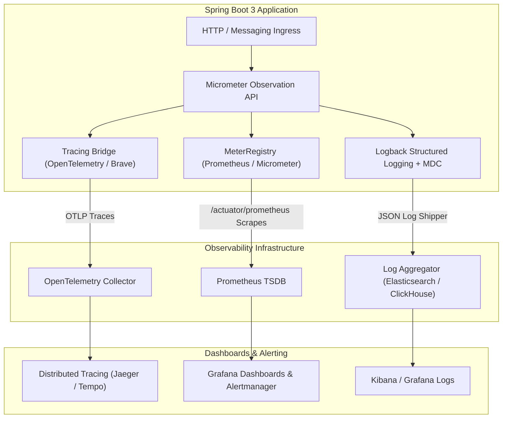

# Observability

In modern distributed microservice systems, complex failures rarely manifest as isolated, easily reproducible crashes. Observability is the capability to infer the internal health, performance, and failure states of a system solely from its external outputs: **logs**, **metrics**, and **distributed traces**.

## Architectural Overview

The unified telemetry pipeline in modern Spring Boot 3 applications using the Micrometer Observation API:

## Key Invariants

1. **The Three Pillars Serve Distinct Questions**:
   - **Metrics** tell you *that* there is a problem (high error rate, p99 latency spike, pool saturation).
   - **Traces** tell you *where* the problem is (which microservice or database query stalled the request).
   - **Logs** tell you *why* the problem happened (root cause exception stack trace, invalid payload data).
2. **Context Propagation Across Threads**: Mapped Diagnostic Context (MDC) is backed by `ThreadLocal`. Any asynchronous handoff (`ExecutorService`, `@Async`, reactive operators) loses correlation IDs unless explicitly wrapped via `TaskDecorator` or Micrometer Context Propagation.
3. **Preventing Metric Cardinality Explosion**: Meter dimensions (tags/labels) must remain strictly low-cardinality categorical attributes ($< 100$ combinations). Never add dynamic IDs (UUIDs, user IDs, emails) to meters; record them in structured logs or trace span tags instead.
4. **Preserving Causal Stack Traces**: Catching exceptions and logging only `e.getMessage()` discards line numbers, class origins, and nested root causes. Always pass the `Throwable` object as the final unformatted argument in SLF4J.
5. **Percentiles Over Averages**: Arithmetic mean latency hides severe tail latency and GC pauses. Production SLAs and SLOs must be monitored using percentile histograms (p50, p95, p99, p999) and explicit SLO duration buckets.
6. **Data Privacy and Secret Masking**: Never write passwords, bearer tokens, or full credit card numbers to application logs. Mask sensitive PII before emitting log events.

## Module Sections

| Section | Focus |
|---|---|
| [Concepts](concepts.md) | Three pillars, structured JSON logging, MDC, Micrometer core meters, Actuator, RED vs USE methods, W3C TraceContext |
| [Internals](internals.md) | Micrometer Observation lifecycle, Logback appender mechanics, Prometheus TSDB scraper internals, OTel span context |
| [Interview Questions](questions.md) | 23 interview questions spanning Basic, Intermediate, Senior, and Production Incident tiers |
| [Code Review](code-review.md) | 5 realistic broken PR reviews: leaking secrets/PII, missing async correlation, metric cardinality, swallowed errors, and missing histograms |
| [Solutions](solutions.md) | Production-grade implementations with rationale, trade-offs, and failure prevention analysis |
| [Tests](tests.md) | Unit and integration testing strategies using `SimpleMeterRegistry`, `ObservationRegistry`, and MDC assertions |
| [Production](production.md) | Real-world incident runbooks: Prometheus cardinality explosion and silent payment failures, with alerting rules |
| [Exercises](exercises.md) | Hands-on engineering challenges: async context-propagating executor and multi-tier SLO latency tracker |

## Related

- [Spring Boot](../spring-boot/index.md) — Actuator configuration, auto-configuration, and customizers
- [REST API](../rest-api/index.md) — RFC 9457 Problem Details and standardized error contracts
- [Resilience](../resilience/index.md) — Monitoring circuit breakers, rate limiters, and bulkhead saturation
- [JVM](../jvm/index.md) — Garbage collection metrics, heap sizing, and memory diagnostics
