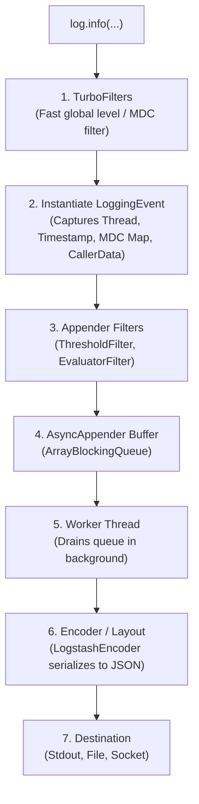
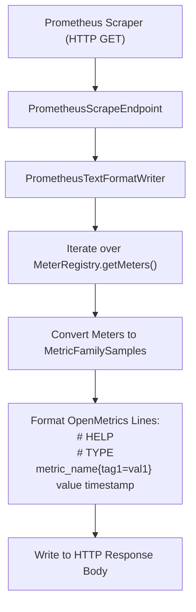

# Observability Internals

## 1. Micrometer Observation Lifecycle

The Micrometer Observation API abstracts telemetry through a strict lifecycle state machine. When an application wraps execution in an `Observation`, the following sequence executes:

```mermaid
sequenceDiagram
    autonumber
    actor App as Business Code
    participant Obs as Observation
    participant Reg as ObservationRegistry
    participant Handlers as Registered ObservationHandlers (Metrics & Tracing)

    App->>Obs: Observation.start()
    Obs->>Handlers: onStart(context)
    Note over Handlers: TracingHandler creates OpenTelemetry Span
    App->>Obs: observation.openScope()
    Obs->>Handlers: onScopeOpened(context)
    Note over Handlers: Activates Span in ThreadLocal & MDC
    App->>App: Executes Business Logic
    App->>Obs: scope.close()
    Obs->>Handlers: onScopeClosed(context)
    Note over Handlers: Deactivates Span from ThreadLocal
    App->>Obs: observation.stop()
    Obs->>Handlers: onStop(context)
    Note over Handlers: Timer records duration in MeterRegistry;<br/>TracingHandler ends and exports Span
```

### Contextual Key-Value Partitioning
The core mechanism protecting against cardinality explosion is the distinction between low and high cardinality tags in `Observation.Context`:

```java
// Low-cardinality KeyValues:
// Stored in MeterRegistry tags AND Span tags
context.addLowCardinalityKeyValue(KeyValue.of("http.status_code", "200"));

// High-cardinality KeyValues:
// Ignored by MeterRegistry; stored ONLY in Span tags and Logback MDC
context.addHighCardinalityKeyValue(KeyValue.of("order.id", "ord-98765-xyz"));
```

When `onStop()` runs:
1. `TimerObservationHandler` queries `context.getLowCardinalityKeyValues()` and registers/updates the Prometheus `Timer`. High-cardinality tags are omitted, ensuring Prometheus memory stays strictly bounded.
2. `TracingObservationHandler` queries both `getLowCardinalityKeyValues()` and `getHighCardinalityKeyValues()`, attaching the full set of attributes to the distributed tracing span.

## 2. Logback Appender Architecture & Async Buffering

When an application calls `log.info("Message {}", arg)`, Logback executes a structured filtering and dispatch pipeline:



### Synchronous vs Asynchronous Appenders
Standard `ConsoleAppender` or `FileAppender` writes log lines synchronously on the calling business thread:
- If stdout or disk I/O blocks, the business thread stalls.
- Heavy logging under high concurrency causes intense lock contention on the log stream.

`AsyncAppender` decouples the business thread:
1. When `doAppend()` is called, the event is offered to an internal `ArrayBlockingQueue` (default capacity 256).
2. A single dedicated daemon thread drains the queue and executes encoding and I/O.
3. **Queue Saturation Invariant**: By default, when the queue reaches 80% capacity (`discardingThreshold=20`), `AsyncAppender` drops events of level `TRACE`, `DEBUG`, and `INFO`, retaining only `WARN` and `ERROR` to prevent thread stalls.

## 3. Prometheus Scraper & OpenMetrics Exposition

When Prometheus scrapes the Spring Boot Actuator endpoint (`GET /actuator/prometheus`), the following engine executes:



### The Cost of High Cardinality
If an application contains $500,000$ meter series due to unconstrained tags:
1. `MeterRegistry.getMeters()` allocates millions of temporary sample objects.
2. The endpoint executes multi-megabyte string serialization in memory.
3. The HTTP scrape duration exceeds the Prometheus server's `scrape_timeout` (typically 10s), causing Prometheus to mark the instance as `DOWN` (`up == 0`) and miss scraping windows.

## 4. OpenTelemetry Context & Carrier Propagation

In distributed tracing, context propagation relies on `TextMapPropagator` implementations that inject and extract trace metadata into carrier payloads.

### Outbound HTTP Injection
When making an outbound HTTP call via `RestClient` or `WebClient`:
1. The tracing instrumentation queries the current active `Span` from `Tracer.currentSpan()`.
2. The `W3CTraceContextPropagator` formats the span context into the standard string:
   $\displaystyle \text{00-}\{\text{traceId}\}\text{-}\{\text{spanId}\}\text{-}\{\text{traceFlags}\}$
3. The propagator sets the HTTP header:
   ```text
   traceparent: 00-4bf92f3577b34da6a3ce929d0e0e4736-00f067aa0ba902b7-01
   ```

### Inbound Ingress Extraction
When the downstream microservice receives the HTTP request:
1. `TraceFilter` invokes `propagator.extract(carrier, getter)`.
2. If `traceparent` is present, it parses the remote `traceId` and parent `spanId`.
3. It creates a new local `Span` that shares the remote `traceId` and registers the incoming `spanId` as its `parentId`.
4. The local span is activated in `ThreadLocal` storage, updating Logback MDC so that logs emitted by the downstream service automatically carry the same `traceId`.

## Related

- [Concepts](concepts.md) — Three pillars, structured logging, and metric dimensions
- [Code Review](code-review.md) — Broken examples demonstrating context loss and cardinality bugs
- [Solutions](solutions.md) — Production solutions for context propagation and histograms
- [Production](production.md) — Real-world runbooks for Prometheus TSDB crashes
