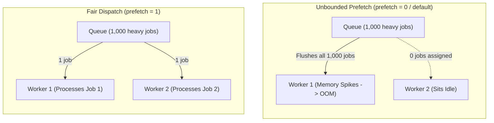

# RabbitMQ Concepts & Architecture

RabbitMQ implements the AMQP 0-9-1 protocol, providing an intelligent message routing fabric that sits between producers and consumers.

---

## 1. The AMQP 0-9-1 Model

Unlike Kafka, where producers write directly to partitioned logs, AMQP decouples message publishing from message storage:

```mermaid
flowchart LR
    Producer["Producer Application"]
    subgraph AMQP["AMQP 0-9-1 Broker (Virtual Host)"]
        Ex["Exchange"]
        B1["Binding 1"]
        B2["Binding 2"]
        Q1[("Queue A")]
        Q2[("Queue B")]
    end
    ConsumerA["Consumer A"]
    ConsumerB["Consumer B"]

    Producer -->|Publish(Exchange, RoutingKey)| Ex
    Ex -->|Matches Key| B1 --> Q1
    Ex -->|Matches Pattern| B2 --> Q2
    Q1 -->|Deliver| ConsumerA
    Q2 -->|Deliver| ConsumerB
```

- **Virtual Host (`vhost`)**: A logical grouping of exchanges, queues, and user permissions within a RabbitMQ cluster. Provides multi-tenant isolation.
- **Connection**: A heavy, long-lived TCP socket connection between client and broker.
- **Channel**: A lightweight, multiplexed virtual connection within a single TCP connection. Applications create multiple channels to publish or consume concurrently without TCP connection overhead.

---

## 2. Exchange Types and Routing Semantics

An **Exchange** receives messages from producers and examines message properties (routing keys and headers) to route copies to zero or more bound queues:

| Exchange Type | Routing Logic | Use Case |
|---|---|---|
| **Direct** | Exact string match between message routing key and binding key | Point-to-point task routing (e.g. `orders.create`) |
| **Fanout** | Broadcasts blindly to all bound queues, completely ignoring the routing key | Pub/Sub notifications, audit fanout, cache invalidation broadcast |
| **Topic** | Pattern matching with wildcards: `*` matches exactly 1 word; `#` matches 0 or more words | Event hierarchies (e.g. `europe.orders.#`, `*.payment.*`) |
| **Headers** | Matches message header key-value pairs (`x-match: all` or `any`), ignoring routing key | Multi-attribute metadata routing |

### Topic Exchange Wildcards Example

```text
Binding Key: "audit.*.login"
Matches:     "audit.user.login", "audit.admin.login"
Fails:       "audit.security.admin.login" (has two words between audit and login)

Binding Key: "audit.#"
Matches:     "audit.user", "audit.security.admin.login", "audit"
```

---

## 3. Durability and Persistence

In RabbitMQ, true durability requires coordinating three distinct layers:

1. **Durable Exchange**: Declared with `durable = true`. Survives broker reboot.
2. **Durable Queue**: Declared with `durable = true`. Queue metadata survives broker reboot.
3. **Persistent Message**: Published with `delivery_mode = 2` (or `MessageProperties.PERSISTENT_TEXT_PLAIN`). Written to disk and committed via `fsync`.

> [!WARNING]
> Publishing a message with `delivery_mode = 1` (transient) to a `durable = true` queue means that if RabbitMQ restarts, the queue survives, but all transient messages inside it are permanently erased!

---

## 4. Message Acknowledgment and Delivery Modes

RabbitMQ tracks the state of every individual message in flight:

```mermaid
sequenceDiagram
    participant Broker as RabbitMQ Broker
    participant Consumer as Worker Application

    Broker->>Consumer: basic.deliver (DeliveryTag: 101, redelivered: false)
    Note over Consumer: Executes payment & database write
    alt Processing Succeeded
        Consumer->>Broker: basic.ack(101, multiple: false)
        Note over Broker: Message purged from queue
    alt Business / Validation Failure (Deterministic Poison Pill)
        Consumer->>Broker: basic.nack(101, multiple: false, requeue: false)
        Note over Broker: Routed to Dead Letter Exchange (DLX)
    alt Transient Network Timeout
        Consumer->>Broker: basic.nack(101, multiple: false, requeue: true)
        Note over Broker: Reinserted at head of queue
    end
```

- **`AcknowledgeMode.NONE` (Auto-Ack)**: The broker acknowledges the message as soon as it transmits the bytes onto the TCP socket. Extreme risk of message loss if the consumer crashes before processing completes.
- **`AcknowledgeMode.MANUAL`**: The application controls acknowledgment timing. `channel.basicAck()` must be called strictly after database and external side-effects complete.
- **Requeue Pitfall**: Rejecting deterministically invalid messages with `requeue = true` creates an immediate 100% CPU infinite redelivery loop.

---

## 5. Dead Letter Exchanges (DLX) and Time-To-Live (TTL)

A Dead Letter Exchange (DLX) is a standard AMQP exchange configured to receive messages that cannot be processed or have expired:

```mermaid
flowchart LR
    Queue["Main Queue<br/>x-dead-letter-exchange: dlx.orders<br/>x-dead-letter-routing-key: deadletter<br/>x-message-ttl: 60000"]
    DLX{"Dead Letter Exchange<br/>(dlx.orders)"}
    DLQ[("Dead Letter Queue<br/>(dlq.orders)")]

    Queue -->|1. TTL Expiration (60s)| DLX
    Queue -->|2. basic.nack(requeue=false)| DLX
    Queue -->|3. x-max-length overflow| DLX
    DLX -->|Routing Key: deadletter| DLQ
```

- **Dead-Letter Triggers**:
  1. `basic.reject` or `basic.nack` with `requeue = false`.
  2. Message expires due to per-queue or per-message TTL (`x-message-ttl`).
  3. Queue length limit exceeded (`x-max-length` or `x-max-length-bytes`).
- **Dead-Letter Headers**: RabbitMQ annotates dead-lettered messages with an `x-death` header array containing the original queue, reason, exchange, and timestamp.

---

## 6. Prefetch Count and Fair Dispatching (`basic.qos`)

RabbitMQ pushes messages to consumers over TCP. Without flow control, it flushes all available messages to whichever worker connected first:



- **`prefetchCount = 1`**: Guarantees fair dispatch across competing consumers on slow/heavy workloads. A worker only receives a new job after acknowledging the current one.
- **`prefetchCount = 20–100`**: Recommended for high-throughput lightweight tasks, filling the network pipeline without overwhelming consumer memory.

---

## 7. Publisher Confirms and Return Callbacks

In standard AMQP publishing, `basic.publish` is asynchronous. To verify broker persistence:

1. **Publisher Confirms (`confirm-type: correlated`)**: The broker issues a `basic.ack` back to the publisher once the message is written to disk or committed across a quorum. Spring AMQP wraps this in a `CorrelationData` future.
2. **Returns Callback (`mandatory = true`)**: If a message reaches an exchange, but no queues are bound with a matching routing key, setting `mandatory = true` forces the broker to return the message via `basic.return` rather than silently discarding it.

---

## 8. Quorum Queues vs Classic Mirrored Queues

| Feature | Classic Mirrored Queues (HA) | Quorum Queues (`x-queue-type: quorum`) |
|---|---|---|
| **Consensus Algorithm** | Ad-hoc primary-replica mirroring | **Raft Consensus** |
| **Status** | Deprecated in 3.8, removed in 4.0 | **Current Production Standard** |
| **Split-Brain Behavior** | Divergent message logs during network partitions | Safe: requires majority quorum ($N/2 + 1$) |
| **Cluster Rolling Upgrades** | Fragile synchronization pauses | Seamless rolling upgrades |
| **Poison Pill Detection** | Requires external headers | Native `x-delivery-count` header tracking |
