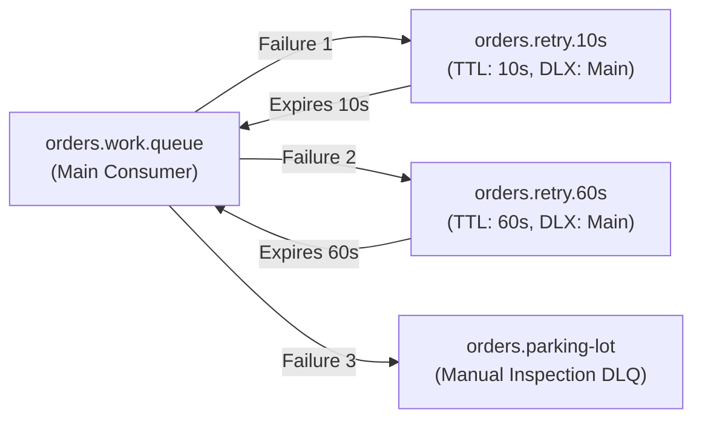

# RabbitMQ Exercises

Hands-on exercises to master advanced RabbitMQ routing topologies, exponential backoff with dead-letter exchanges, and unroutable message handling.

## Exercise 1: Multi-Stage Exponential Backoff via Dead-Letter Exchanges

### Problem

Standard consumer retries within a thread block other messages or cause infinite loops if the worker restarts. Design a non-blocking exponential backoff retry mechanism using pure RabbitMQ topology (delayed retry queues and DLX) without blocking consumer worker threads.



### Requirements

1. Declare a primary work queue `orders.work.queue`.
2. Declare two retry queues:
   - `orders.retry.10s` with `x-message-ttl = 10000` and `x-dead-letter-exchange` pointing back to the main exchange.
   - `orders.retry.60s` with `x-message-ttl = 60000` and `x-dead-letter-exchange` pointing back to the main exchange.
3. Declare a final parking lot queue `orders.parking-lot`.
4. In the consumer, inspect the `x-death` AMQP header count to determine previous failure count:
   - If count = 1, reject and route to `orders.retry.10s`.
   - If count = 2, reject and route to `orders.retry.60s`.
   - If count $\ge 3$, reject and route to `orders.parking-lot`.

??? question "Reveal solution"
    ```java
    // Configuration for Exponential Backoff Retry Queues
    @Configuration
    class RetryTopologyConfiguration {

        @Bean
        public Queue mainWorkQueue() {
            return QueueBuilder.durable("orders.work.queue").build();
        }

        @Bean
        public Queue retry10sQueue() {
            return QueueBuilder.durable("orders.retry.10s")
                    .ttl(10000)
                    .deadLetterExchange("orders.exchange")
                    .deadLetterRoutingKey("order.process")
                    .build();
        }

        @Bean
        public Queue retry60sQueue() {
            return QueueBuilder.durable("orders.retry.60s")
                    .ttl(60000)
                    .deadLetterExchange("orders.exchange")
                    .deadLetterRoutingKey("order.process")
                    .build();
        }

        @Bean
        public Queue parkingLotQueue() {
            return QueueBuilder.durable("orders.parking-lot").build();
        }
    }
    ```

    ```java
    // Consumer Logic inspecting x-death header
    @Component
    class ResilientOrderConsumer {

        private final RabbitTemplate rabbitTemplate;

        public ResilientOrderConsumer(RabbitTemplate rabbitTemplate) {
            this.rabbitTemplate = rabbitTemplate;
        }

        @RabbitListener(queues = "orders.work.queue", ackMode = "MANUAL")
        public void onOrder(
                OrderPayload payload,
                Channel channel,
                @Header(AmqpHeaders.DELIVERY_TAG) long deliveryTag,
                @Header(name = "x-death", required = false) List<Map<String, ?>> xDeath)
                throws IOException {
            try {
                processBusinessLogic(payload);
                channel.basicAck(deliveryTag, false);
            } catch (Exception ex) {
                int retryCount = extractDeathCount(xDeath);
                channel.basicAck(deliveryTag, false); // ACK original to route to next stage

                if (retryCount == 0) {
                    rabbitTemplate.convertAndSend("orders.exchange", "retry.10s", payload);
                } else if (retryCount == 1) {
                    rabbitTemplate.convertAndSend("orders.exchange", "retry.60s", payload);
                } else {
                    rabbitTemplate.convertAndSend("orders.exchange", "parking-lot", payload);
                }
            }
        }

        private int extractDeathCount(List<Map<String, ?>> xDeath) {
            if (xDeath == null || xDeath.isEmpty()) {
                return 0;
            }
            Long count = (Long) xDeath.get(0).get("count");
            return count != null ? count.intValue() : 0;
        }

        private void processBusinessLogic(OrderPayload payload) {
            // Business processing here...
        }
    }
    ```

---

## Exercise 2: Dynamic Multi-Tenant Topic Exchange with Returns Callback

### Problem

In a multi-tenant SaaS application, events must be routed dynamically based on tenant identifier and region (e.g. `tenant.{tenantId}.{region}.events`). If an unknown tenant publishes an event or if no matching consumer queue exists for that tenant/region, RabbitMQ must not silently drop the message. Configure a publisher that guarantees notification and persistent archiving of unroutable messages.

### Requirements

1. Declare a Topic exchange `saas.events.topic`.
2. Configure `RabbitTemplate` with `mandatory = true`.
3. Register a `ReturnsCallback` that captures unrouted messages (`NO_ROUTE`, code 312).
4. Persist unrouted messages to an audit archive or fallback alert channel.

??? question "Reveal solution"
    ```java
    @Configuration
    class DynamicPublisherConfiguration {

        @Bean
        public TopicExchange saasTopicExchange() {
            return new TopicExchange("saas.events.topic", true, false);
        }

        @Bean
        public RabbitTemplate returnsAwareRabbitTemplate(
                ConnectionFactory connectionFactory,
                UnroutedEventRepository unroutedRepository) {
            RabbitTemplate template = new RabbitTemplate(connectionFactory);
            template.setMandatory(true);

            template.setReturnsCallback(returned -> {
                String replyText = returned.getReplyText();
                int replyCode = returned.getReplyCode();
                String exchange = returned.getExchange();
                String routingKey = returned.getRoutingKey();
                byte[] messageBody = returned.getMessage().getBody();

                // Persist unrouted message to audit archive
                unroutedRepository.saveUnrouted(
                        exchange,
                        routingKey,
                        replyCode,
                        replyText,
                        new String(messageBody, StandardCharsets.UTF_8));
            });

            return template;
        }
    }
    ```

---

## Related

- [Concepts](concepts.md)
- [Internals](internals.md)
- [Solutions](solutions.md)
- [Tests](tests.md)
- [Production](production.md)
